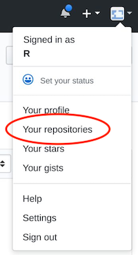
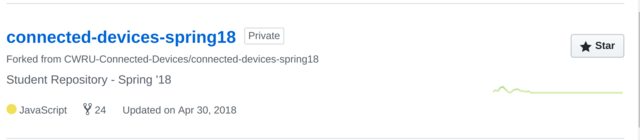
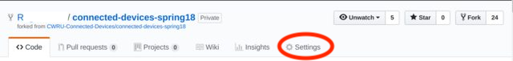
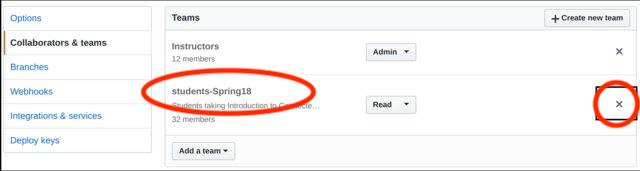

# A Note on Versions and Compatibility

This course is heavily dependent on open and closed source software, across a wide swath of technologies and platforms.  These software components are constantly being developed, modified, and improved, invariably leading to compatibility issues.  So, when there are known compatibility issues, they will be called out in the courseware like so:


Any/all of these compatibility notes should be considered temporary - a future version of a component might improve or break the system.  The goal with these notes is to document the known compatibility issues as of the time of the last edit of the Courseware.

# **IMPORTANT NOTE ON PYTHON VERSIONS**
Python has been around for many years and is an increasingly popular language for a wide variety of applications.  Several years ago, the Python community decided that some changes were required to the language to address some deficiencies with the language, and those changes would create compatibility issues with some existing applications.  The community decided that a clean break was the best path forward, and a new disctinct version of Python would be released - moving from Python2 to Python3.  [Python3 is largely the same as Python2, but has some important language changes](https://docs.python.org/3.0/whatsnew/3.0.html).  

Python 2.x (latest version is 2.7) has been on a planned end-of-life path for over ten years.  As of January 1, 2020, Python 2.7 is officilaly unsupported.  There will still be many Python2 applications running in the world, for many years, but Python2 is officially done.

Because Python2 is so ubiquitious, many systems expect it to be installed.  The Raspbian systems we will use are an example - both Python2 and Python3 are installed.

You can be sure you are using Python3 by invoking Python with

```
$ python3
```

**NOT with**

```
$ python
```

which on most systems is Python2.

**For this course, it is important to use Python3.**


## Directory Layout
* **Courseware/** - contains the text (in [Markdown](https://daringfireball.net/projects/markdown/) format), source code, graphical assets, configuration files, etc. needed for the course
* **ansible/** - contains the [Ansible](https://www.ansible.com/) (a [DevOps](https://en.wikipedia.org/wiki/DevOps) tool) "playbooks"
* **Lampi/** - contains LAMPI device related files

# GitHub Permissions

By default, your [fork](https://help.github.com/articles/fork-a-repo/) of the instructor's repo (short for repository) will be viewable by all members of your team.  Since your team includes all of the other students taking the course, this can create opportunities that tempt students to compromise their academic integrity.

To avoid this, you will need to change the permissions on your repo fork.

Follow these steps:

1. Navigate to and Sign in to your account
[github](https://github.com/) 
1. Under your profile, navigate to "Your Repositories"

1. Select your fork of the Connected Devices Repository  (e.g., `connected-devices-spring18`, `connected-devices-spring19`, `connected-devices-spring20`, etc.)

1. Click on settings (far right)

1. On the Settings page, select "Collaborators and Teams" on the Left, and click on "X" next to any team _other_ than **instructors** to remove permissions for that team (e.g., **students-spring18**)

1. DO NOT change permissions for **Instructors** as doing so will prevent your assignments from being graded.

## Recommended Git Workflow

There are many ways you can use Git for this course, depending on your comfort and experience with Git.

The overall workflow for the course is, for each chapter:

* the instructors will update the main repository on GitHub and notify the students via Slack that there is new content in that repository
* students will get those updates into their local Git repo (e.g., using `git fetch`)
* students will work on that week's assignment (and use the previous week's Ansible solution)
* students will submit their assignment for grading via a GitHub pull request

Here is a suggested workflow:

1. use `git fetch` in your local repository to get the latest from the main repository
2. create a separate branch for each week's assignment, with something like `git checkout -b assignment_01 origin/master` (which will create a new branch called _assignment\_01_ based on the current state of the _master_ branch in the _origin_ repository (GitHub) __and__ checkout that new branch)
3. do your work on the assignment branch
4. push your changes to the a branch of the same name on your fork of repository with `git push origin HEAD`
4. submit your pull request from the assignment branch

The net effect of this is that you (the student) do not make any commits to the _master_ branch, so there are never conflicts as you update your code base from the instructor codebase.

[This post shows one way to synchronize your fork with the main repository via the GitHub Web Interface.](https://github.com/KirstieJane/STEMMRoleModels/wiki/Syncing-your-fork-to-the-original-repository-via-the-browser)

## Unix Philosophy

Most of the systems we will be using this semester are Unix based.  If you are not comfortable with Unix, it might help to familiarie yourself with some of the [Unix Philosophy](https://homepage.cs.uri.edu/~thenry/resources/unix_art/ch01s06.html).


Next up: go to [Table of Contents](../../README.md)

&copy; 2015-2020 LeanDog, Inc. and Nick Barendt
