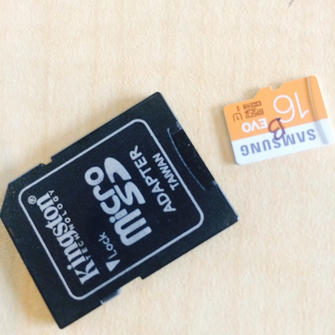
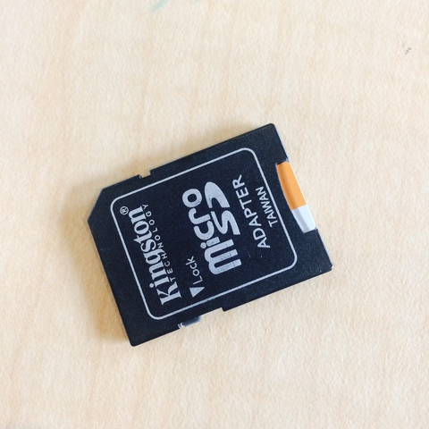

## Burning (Programming) an SD Card with the Raspbian OS

Your Raspberry Pi 3 Model B+ will need a few things to get started. The Raspberry Pi site ([https://www.raspberrypi.org/products/raspberry-pi-3-model-b-plus/](https://www.raspberrypi.org/products/raspberry-pi-3-model-b-plus/)) has great documentation and resources to help.

Rasbian is a free operating system based on Debian optimized for the Raspberry Pi hardware. (For more info about Raspbian: https://www.raspbian.org/)

For this part of the lesson, you'll need your Micro SD Card and Micro SD Adapter.  

The version of Raspbian we will use for this semester is:

**Raspbian Stretch Lite with a release date of 2019-04-08 [Zip](https://downloads.raspberrypi.org/raspbian_lite/images/raspbian_lite-2019-04-09/2019-04-08-raspbian-stretch-lite.zip) or [Torrent](https://downloads.raspberrypi.org/raspbian_lite/images/raspbian_lite-2019-04-09/2019-04-08-raspbian-stretch-lite.zip.torrent)**
with SHA256 of **03ec326d45c6eb6cef848cf9a1d6c7315a9410b49a276a6b28e67a40b11fdfcf**

> **COMPATIBILITY:** It is __critical__ that you use the exact version of Raspbian specified above!

### SD Cards

The Raspberry Pi 3 uses Micro SD cards for its filesystem.  We have to put the OS filesystem onto and SD card using our computer.

**Do not remove the SD card from your computer without disconnecting/unmounting (depending on your computer OS's terminology) or you can potentially corrupt the filesystem on the SD card.**

**Do not remove the SD card from the Raspberry Pi when the Pi is powered!  Doing so might not only corrupt the filesystem but might permanently damage the SD card!**

### Burning the SD Card

1. Put the SD card into the reader. 



2. Download the ZIP file for Raspbian from: the links above **BE SURE TO DOWNLOAD THE IMAGE REFERENCED ABOVE!**
3. After the file is done downloading, you'll need to write an image to the SD card. This is based on your computer's operating system: Linux, Mac OS, or Windows. Follow the links and subsequent instructions: [https://www.raspberrypi.org/documentation/installation/installing-images/README.md](https://www.raspberrypi.org/documentation/installation/installing-images/README.md)
  * Note: [Etcher](https://www.balena.io/etcher/) has become a popular GUI tool for "flashing" images to SD cards and works on multiple platforms.
  * Note: If using Mac, you might need to use the Unarchiver program mentioned on [https://www.raspberrypi.org/downloads/raspbian/](https://www.raspberrypi.org/downloads/raspbian/) to unzip the file due to the file sizes.
	* Note: If using Mac and not using Etcher, add "r" in front of terminal command: `diskn`, so that it's `rdiskn` (e.g., `/dev/rdisk2` or whatever disk number you SD Card shows up as). This will make things run substantially faster. 

### Enabling the Serial Console (UART)

3. We need access to the Serial Console on the Raspberry Pi.  Due to some hardware changes on the Raspberry Pi 3 required to add Bluetooth support, we need to manually enable the Serial Console port in the `config.txt` file in the `boot` partition (aka volume) of the SD card you just burned.  The `boot` partition is a FAT32 filesystem (good, old Windows/DOS format) and can be read and written by Windows, Mac, and Linux systems.  Mount the `boot` partition if it is not already and edit the `config.txt` with your favorite text editor (Notepad, vi, etc.) and add the following line at the end of the file:

    ```
    enable_uart=1
    ```

4. Save and close ```config.txt```.

### Enabling SSH Server (Daemon)

We will be connecting to the Raspberry Pi frequently over the network over the SSH protocol.  We need to enable the SSH Server (aka Daemon) on the Pi.  ([Recent Raspbian distributions disable SSH by default.](https://www.raspberrypi.org/documentation/remote-access/ssh/)).  

There are several ways to do this.  The simplest is to create an empty file named `ssh` in the `boot` partition of the SD card.  Please create an empty file named `ssh` in the `boot` partition (on a Unix system you might use the `touch` command; otherwise use your favorite text editor).

> **COMPATIBILITY:** it is possible that this ssh setting will change in the future.

###  Unmounting

Unmount the ```boot``` partition.

Now eject the disk. You are now ready to create a serial connection. 	

Next up: go to [Assembling LAMPI](../01.2_Assemble_LAMPI/README.md)

&copy; 2015-2020 LeanDog, Inc. and Nick Barendt
