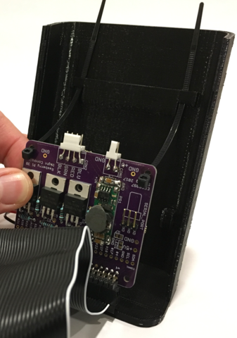
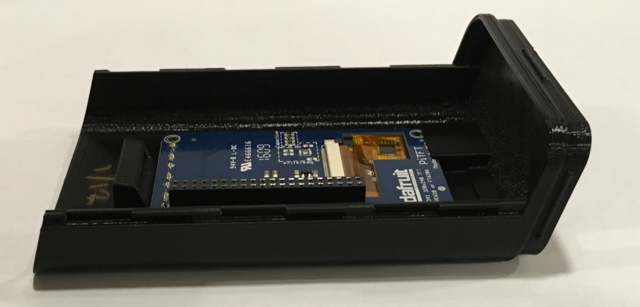
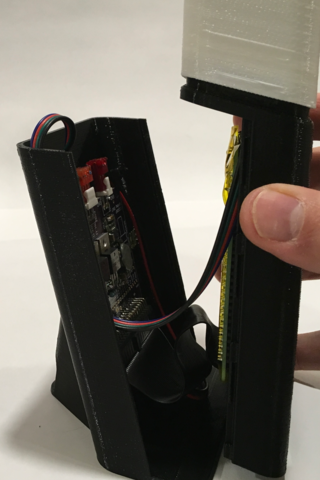

# We will assemble the LAMPI desk lamp and connect over a serial interface

## For this part of the lesson, you'll need the following from your kit:
* [Raspberry Pi 3 Model B+](https://www.raspberrypi.org/products/raspberry-pi-3-model-b-plus/)
* Flashed SD Card
* 3D Printed LAMPI parts
* Cable ties
* LED Cable Assembly
* DC Power Cable Assembly
* LAMPI Interface Board
* USB to Micro-USB Cable

You will also need:

* A software Terminal Emulator (e.g. Mac: Serial, Minicom, Screen, Windows: PuTTY)

**NOTE: the parts in your kit may appear slightly different than those in the pictures, due to small, incremental design changes in the 3D printed parts, LAMPI Interface Board, etc.**

## Assemble the Base Enclosure

### Front Panel Preparation

If the base enclosure is closed, open it by carefully sliding the front panel upwards about 3/4".  

Gently separate the front panel from the rear - they are held together by locking rails.

If they have not been removed already, we need to remove the small rectangular panels added as supports during 3D printing.  There is one large panel to remove, for the PiTFT touchscreen, and 4 smaller panels for the tactile buttons attached to the PiTFT touchscreen.

It is important to remove the large panel, first, to minimize unsupported torque on the small piece of plastic separating the touchscreen from the buttons.

Using a small screwdriver or similar tool, carefully pry the large panel loose on the "top" (edge away from the buttons).  Start with small prying motions, back and forth, on both top edges.  Gently wiggling the panel back and forth will cause it break loose without too much force.  After the panel is  freed from the top edge, gently bend it back and forth to release it from the bottom edge.

Using a small screw driver, perform a similar operation to remove each of the four panels below the touchscreen.

Set the front panel aside.

### Rear Panel Preparation

Remove the small piece of taping on the inside of the rear panel but DO NOT DISCARD THE SMALL PLASTIC RETAINING WEDGE THE TAPE IS HOLDING.

### Installing LAMPI LED Driver PCB

Here is the LAMPI Interface / LED Driver PCB.  (Detach the 2-pin DC power and 4-pin LED cables from the LED Driver PCB, if attached, by gently wiggling them free.)

Remove the narrow hex nut (may be metal or plastic) on the DC Power Barrel jack by unscrewing it and sliding it off the cable.

Insert the cable, connector-end first, through the back of the rear panel.  Seat the barrell jack into the rear panel - this is a tigh fit, and might require a small amount of finger-tip force (do not pull on the wires!).

Slide the hex nut onto the wire and tighten it onto the barrell jack, BEING SURE THAT THE BARRELL JACK IS ORIENTED LIKE THAT IN THE PICTURE BELOW BEFORE FULLY TIGHTENING. The hex nut should be failrly tight - finger tight maybe sufficient, or you might want to gently use a pair of needle nose pliers or similar.

> Be careful the hex nut goes on straight and does not cross-thread.  The hole for the DC power should be at the 12 o'clock position to ensure that the DC power plug can be inserted.

Attach the ribbon cable to the LED Driver PCB the stripe is at the same end as the numeral one ("1") silkscreened onto the PCB

Insert the two zip ties into the upper two holes (away from the end that attaches to the ribbon cable), being sure that the zip ties are oriented as shown in the pictures.

Insert the tips of the zip ties into the holes in the rear panel of the enclosure.

Insert the bottom of the PCB into the two PCB mounting slots and pull zip ties so the PCB lays flat.

Route the DC power cable up along the right edge of the PCB and plug the connector into the board - note the orientation of the connector!  The black wire must be connected on the connector edge closest to the "GND" silkscreened on the board.

Close the zip ties, being careful to capture the DC power cable with the zip tie.  You might find needle nos pliers handy for this.

Trim the excess zip tie off.

### Installing PiTFT and Raspberry Pi

Lay the front panel face down, and gently insert the top edge of the PiTFT touchscreen into the panel (the top is the edge away from the buttons), so it is under the rectangular lip.

Lay the the PiTFT touchscreen down so the buttons fit into the holes on the front panel.

Ensure that the PiTFT touchscreen is laying flat in the panel.

Insert the small plastic retaining wedge by positioning it against the PCB and gently wiggling it into the mating hole on the front panel until it is fully seated.  The small "lip" of the retaining wedge should be against the PiTFT touchscreen.

Attach the other end of the ribbon cable to the back of the PiTFT touchscreen so the white stripe is down (board edge near retaining wedge).

Fold the ribbon cable gently, so it lays flat against the PCB.

**PLEASE DOUBLE CHECK THAT YOUR RIBBON CABLE CONNECTIONS MATCH THOSE IN THE PICTURES.**

**NO, REALLY, DOUBLE CHECK.  TRIPLE CHECK. YOU CAN DESTROY THE ELECTRONICS IF THE CABLE IS NOT ATTACHED PROPERLY**

#### Installing the Raspberry Pi

**NOTE: The back of your Raspberry Pi should be covered by a piece of [Kapton&trade;](https://en.wikipedia.org/wiki/Kapton) Tape as shown in here:**

The Kapton&trade; tape piece should be approximately 50mm x 85mm (2" x 3 3/8").  It should cover the back, but not the entry to the SD card holder.  Kapton&trade; is a great insulator and dielectric (insulator) - for our purposes it prevents possible electrical short circuits between the Raspberry Pi and the LAMPI Interface Board.

**NOTE: the Kapton Tape may not appear in all pictures below, but it should be installed.**

Very carefully, being **doubly careful** to check pin alignment, insert the 40-pin header on the Raspberry Pi into the 40-pin connector on the PiTFT touchscreen.  This will effectively sandwich the ribbon cable between the Raspberry PI and the PiTFT Touchscreen.  (You may not have the nylon standoffs pictured - that is fine, just double, triple check the alingment of the pins and the connector).

Gently press the Raspberry Pi down until it is firmly seated on the PiTFT. 

You may now insert you Micro SD card into the Raspberry Pi.

> ## If you do not have the two upper 3D printed parts (the White LED Support Column and Shade), you can stop here for now - follow these instructions..

> **You can complete a partially working LAMPI here - the Raspberry Pi and touchscreen will be functional, but it will only generate light from the small, diagnostic Red Green Blue (RGB) LED mounted at the top of the interface PCB.**

> Align the front and rear panels so the locking rails mate.

> 

> Slide the front panel down and the rear up to lock them together.

> 

> 

## Upper Lamp Assembly

We will now assemble the uppper parts of LAMPI, starting with the LED strip.

## LED Column Assembly

Carefully remove the cover over the adhesive strip on the back of the LED strip.  Be sure to keep the LED strip away from anything that might get stuck to it.

Starting with the free end of the LED Strip (the end that does not have the wires attached), position the LED strip over the LED Support Column as shown in the picture.

**DO NOT PULL TOO HARD ON THE LED STRIP (the LED Strip is basically one looooong, thin printed circuit board)**

Keeping the strip taut, but not strained, carefully wrap the strip around the LED Column Support at a slight angle so that adjoining rounds of the strip are butted up against each other with little gap.

Be sure to keep the LEDs lined up - it is important that there are no LEDs down the middle of the column between the two rectangular holes.

Gently press the LED strip so the adhesive backing sticks to the LED Support Column.

**BE CAREFUL TO NOT BEND THE LED STRIP TOO SHARPLY.**

Continue wrapping the strip until the entire strip is wrapped around the LED Support Column.

Pass the LED Strip cable connector through the rectangular hole in the base of the LED Support Column.

**BE CAREFUL TO NOT BEND THE END OF THE STRIP WHERE THE WIRES ARE ATTACHED TOO SHARPLY.**

Take the long white 10" zip tie and insert it through the top hole of the LED Support Column as shown.

Bend the zip tie and route it through the bottom hole of the LED Support Column as shown.

Bend the zip tie across the other side of the LED Support Column and secure by sliding it through the clasp on the zip tie.

Tighten the zip tie until it is pretty snug.

Trim off the excess zip tie.

Wrap a second 10" white zip tie **under** the first zip tie and **above** the LED cable as shown.  To provide adequate strain relief, we want this second zip tie to tighten the LED cable directly to the LED Support Column.

Tighten the second zip tie **very tight** and trim off excess.

### Shade Assembly

Insert the LED Column Support into the Shade.

Gently snap the LED Column Support into the shade.

Insert the LED cable connector through the rectangular hole in the top of the enclosure.

Connect LED cable to the LED Driver PCB.  **BE SURE TO CONNECT THE CABLE AS SHOWN IN THE PICTURE - THE WIRE COLORS WILL CORRESPOND TO LABELS SILKSCREENED ONTO THE PCB.**

Snap the Shade onto the top of the enclosure.

Route the excess LED cable down inside the enclosure as shown.

Align the front and rear panels and slide together to complete the assembly of your LAMPI.

Next up: go to [Connecting Serial and WiFi Setup](../01.3_Connecting_Serial_and_Wifi_Setup/README.md)

&copy; 2015-2020 LeanDog, Inc. and Nick Barendt
