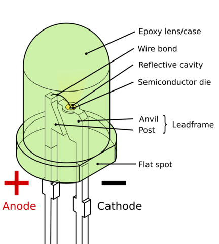
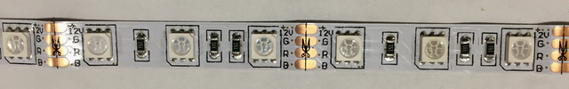
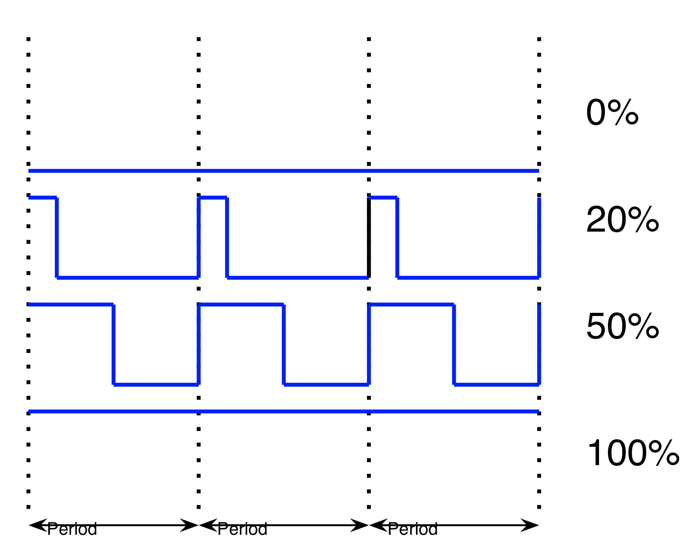

## Now it's time to set up your LAMPI to power some LEDs.

## LED (Light-emitting diode) Basics
LEDs are semiconductor devices capable of turning electrical energy into light.  

LEDs semiconductor chemistry can be varied to generate light of different wavelengths, so we can have "red", "green", "blue", "yellow", and other colors.  The LED Strips we are using have three LEDs manufactured together in a module.  The three LEDs are combined in a "common anode" arrangment, requiring only 4 wires.  The LED strips also have current limiting resistors to keep the LEDs from being destroyed.

By varying the relative intensities of the three LEDs, the hue and saturation of the combined perceived light can be adjusted to be white, being equal parts of all three, or any other color within the gamut bounded by the three source colors. 

The LED Strip we are using has a number of LED's connected along the strip in a parallel configuration so they all behave the same. (The LED Strip we are using is sometimes called an "analog" strip to differentiate it from the newer, digitally controlled LED strips).

The LED Strip we are using is generally powered from 12V.  To reduce power needs and overheating concerns, we are powering them from 9V.  

The LED Strip is fabricated in 2" sections, allowing it to be cut to length on any multiple of 2" at the copper pads.

## Pulse-Width Modulation (PWM)

[Pulse-Width Modulation (PWM)](https://en.wikipedia.org/wiki/Pulse-width_modulation) is a technique to vary the power delivered to a load connected to a digital output (e.g., a motor or LED).  The power delivered is varied by controlling how long the output is enabled - the longer the output is enabled, on average, the more power delivered.

With PWM, we typically setup a fixed frequency for a square wave, and vary the "duty cycle" - the percentage the output is on - to change the power delivered.

For example, you can see four different duty cycles in this graph: 0% (completely off), 20%, 50%, and 100% (completely on).

(recall that the period is _1 / frequency_ so a period of 1ms is 1000 Hz).

PWM is sometimes referred to as a "poor man's digital-to-analog converter" because it can allow a single digital output (a bit) to simulate an analog output.

We will be using PWM to control each color channel of our LEDs.  By varying the duty-cycle of each channel, we can change the intensity of that color from 0% (off) to 100% (full brightness).  

Next up: go to [Control LED via Python](../01.5_Control_LED_via_Python_Script/README.md)

&copy; 2015-2020 LeanDog, Inc. and Nick Barendt
