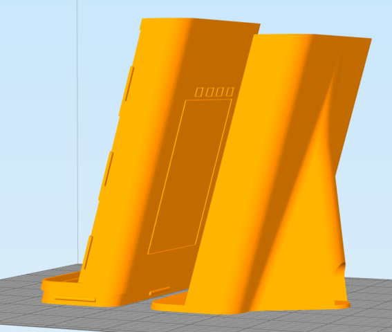

# **ALL PARTS HAVE BEEN PROVIDED, SO DISREGARD THIS SECTION AND SKIP TO THE NEXT SECTION**

# 3D Printing LAMPI 

While 3D Printing is not generally considered a core technology for the Internet of Things, it has become a fundamental prototyping technique in IoT and many other product development areas.

This very brief introduction is meant to be sufficient for students to print several parts of LAMPI.

## LAMPI parts

LAMPI is made up four 3D printed parts:

two parts for the base enclosure

one to wrap the LED strip around, a support column

and a shade to protect the LEDs and diffuse the light they generate

## 3D Printing

There are many technologies for 3D printing.  The most prevalent is [Fused Deposition Modeling (FDM)](https://en.wikipedia.org/wiki/Fused_deposition_modeling) otherwise known as [Fused Filament Fabrictaion (FFM)](https://en.wikipedia.org/wiki/Fused_filament_fabrication). FDM systems work by laying down a molten filament of material, typically a plastic, which solidifies and fuses in the pattern laid down.  By building up layers on top of each other FFM can be used to 3D Print parts.  The Makerbots in [think\[box\]](http://thinkbox.case.edu/) are FFM machines.

### 3D Modeling and Preparation

A part is designed in a 3D modeling package, such as [123D](http://www.123dapp.com/design), [Tinkercad](https://www.tinkercad.com/), and [OpenSCAD](http://www.openscad.org/), among many others.  The 3D part is then exported to an intermediate format, typically a [STereoLithography (STL)](https://en.wikipedia.org/wiki/STL_(file_format)) file (although the files are used for many other 3D printing technologies beyond [stereolithography](https://en.wikipedia.org/wiki/Stereolithography)).  An STL file represents a solid object as a tessellation of triangles, sometimes referred to as a mesh.

### Slicing

Slicing in 3D printing is the process of taking a solid model, typically in STL format, and computationally slicing it into thin layers and determining the tool path for the filament extruder to follow, along with a bunch of other details including temperatures settings.  The output of the slicing is for most FDM systems is a [G-Code](https://en.wikipedia.org/wiki/G-code) file, a general purpose numerical control programming language for controlling computerized machine tools.  There are several open source and/or free slicing programs, including [Slic3r](http://slic3r.org/) and [Cura](https://ultimaker.com/en/products/cura-software), as well as non-free slicing programs, such as [Simplify3D](https://www.simplify3d.com/).  Some 3D printers also come with their own proprietary software suite, including slicing software.

One of the key settings for slicing is the layer thickness.  On many machines this can be varied from "Coarse" (often 0.3mm) to "Fine" (often 0.1mm or 0.05mm).  Obviously, thinner (finer) layers can create a smoother part finish.  It also dramatically slows down the print time, though, so there is a compromise on print speed and quality.  For LAMPI's parts, we have focused on print speed and are fine with a rougher quality print.

### Printing

After a 3D model has been built and sliced, the output of the slicing must be fed into a 3D printer.  Before doing that, however, there typically one or more setup operations that need to be done on the 3D printer, including cleaning the print bed, possibly leveling the print bed, loading filament, etc.

### Materials

Many materials are used for FFM 3D Printing, but the most common are [Polylactic Acid (PLA)](https://en.wikipedia.org/wiki/Polylactic_acid) a low-cost and easy to print plastic and [Acrylonitrile butadiene styrene (ABS)](https://en.wikipedia.org/wiki/Acrylonitrile_butadiene_styrene) which is stronger than PLA but a little trickier to print with.

Our parts are printed in PLA.

## 3D Printing in think\[box\]

CWRU's think\[box\] has several types of 3D printing equipment.  For this class, we will use the [MakerBot](https://www.makerbot.com) printers.  think\[box\] currently has two different Makerbot models, the [MakerBot Replicator 2](http://thinkbox.case.edu/thinkbox/equipment/3dprinter/makerbotreplicator2) and the [MakerBot Gen5 aka Fith Generation](http://thinkbox.case.edu/thinkbox/equipment/3dprinter/makerbotreplicatorgen5) printers.  For our purposes they are pretty much interchangeable - the accuracy and tolerances required for our parts is pretty low. 
### Printing in think\[box\]

The kind folks at think\[box\] have created very thoughtful and detailed introductory tutorials for printing on both types of Makerbots:

* [MakerBot Replicator 2](https://docs.google.com/document/d/1bovOvGMlQyNq2EQQNcgsBCgTlX4ClBPLdSx6Z5kBMN0/view)
* [MakerBot Replicator Gen5](https://docs.google.com/document/d/1OpnSQtq4j3uOjzizgOeuGSo8i4NTcgj9UAnhQUepBNQ/edit?usp=sharing)

**PLEASE READ ONE OF THE TUTORIALS AND FOLLOW ALONG, INSTALLING THE MAKERBOT DESKTOP SOFTWARE ON YOUR COMPUTER BEFORE GOING TO THINK\[BOX\] AND SITTING DOWN AT A MAKERBOT.  IF NOT YOU WILL WASTE A SIGNIFICANT AMOUNT OF TIME ON THE PRINTER.**

When you arrive at think\[box\] you will have to find an open printer and check out a roll of PLA.

Please refer to the current [schedule](http://thinkbox.case.edu/thinkbox/access/schedule) for the hours think\[box\] is open.

### LAMPI parts

STL files for all four parts are available in the **connected-deivces/Lampi/Hardware/3DPrinting** directory.  The LAMPI base enclosure is printed in Black PLA. The two upper parts (LED Column Support and Shade) are printed in White PLA.

There are 3 files, ready to be imported into the MakerBot software:

* [Base enclosure - printed in Black PLA](../../Lampi/Hardware/3DPrinting/lampi-print-black-plate.stl)
* [LED support column - printned in White PLA](../../Lampi/Hardware/3DPrinting/lampi-print-white-led-column.stl)
* [Shade - printed in White PLA](../../Hardware/Lampi/3DPrinting/lampi-print-white-shade.stl)

Next up: go to [SSH Key Forwarding and Git](../01.7_SSH_Key_Forwarding_and_Git/README.md)

&copy; 2015-2020 LeanDog, Inc. and Nick Barendt
