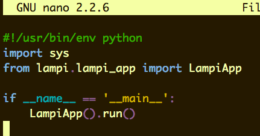

# Development in a Terminal

### Text editor
There are a number of text editors available for command line use, some better suited for code editing than others. The editors most prevalent are (arguably) `nano`, `vim`, and `emacs`. You can use whatever you are comfortable with, but for these exercises we will assume nano since it is most accessible for new users.

### Install syntax highlighting
Before we get started writing code, let's install some updated syntax highlighting. This will display the code as colored output.



This github repo contains highlighting rules for a large number of languages. Install it by running:

```
cd ~
git clone https://github.com/scopatz/nanorc.git ~/.nano
cat ~/.nano/nanorc >> ~/.nanorc
```

### Use spaces for tabs
This will configure nano to replace tabs with four spaces. Some developers prefer to use tabs, some prefer to replace tabs with spaces. There are plenty of good reasons to choose either, but most imporant when working on a team is to be consistent in code formatting. For this project we'll assume four spaces instead of tabs.
```
echo "set tabsize 4" >> ~/.nanorc
echo "set tabstospaces" >> ~/.nanorc
```

> NOTE: Python is whitespace sensitive in that it relies on indentation where other languages use curly brackets { } or other syntax to determine scope. Python files *must* have consistent indentation throughout whether it's a tab, two spaces, four spaces, or whatever you choose.

### Getting around in nano

To launch nano, simply use the command `nano`. Append the file name to edit a file: `nano <filename>`.
To view help, use **CTRL+G**.

In help, **^-** means CTRL. **M-** means ALT (META). Note that in some terminals ALT may not work until enabled in settings.

Here are some basic edit shortcuts. There are many more:
* **SELECT TEXT:** CTRL+^ *(aka CTRL+SHIFT+6)* and then move cursor to select.
* **CUT:** CTRL+K
* **PASTE:** CTRL+U
* **INDENT LINE LEFT:** ALT+{ *(aka ALT+SHIFT+[ )*
* **INDENT LINE RIGHT:** ALT+} *(aka ALT+SHIFT+] )*
* **DELETE LINE:** CTRL+K
* **DELETE CHARACTER UNDER CURSOR:** CTRL+D

Here are some basic navigation shortcuts. The more you rely on these instead of arrow keys the faster you'll be able to work.
* **JUMP TO START OF LINE:** CTRL+A
* **JUMP TO END OF LINE:** CTRL+E
* **JUMP AHEAD BY WORD:** CTRL+SPACE
* **JUMP BACK BY WORD:** ALT+SPACE
* **PAGE UP:** CTRL+V
* **PAGE DOWN:** CTRL+Y

Next up: go to [Set up PiTFT Screen](../02.2_Set_up_PiTFT_Screen/README.md)

&copy; 2015-2020 LeanDog, Inc. and Nick Barendt
