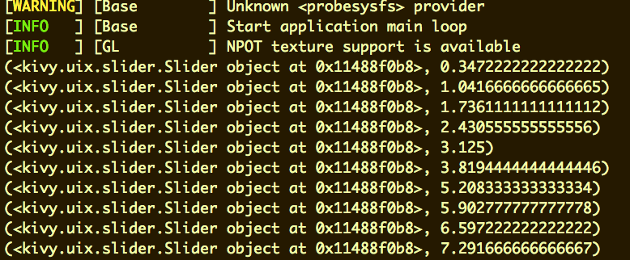
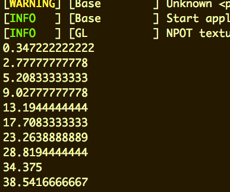
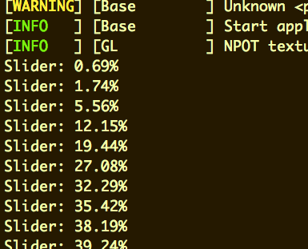
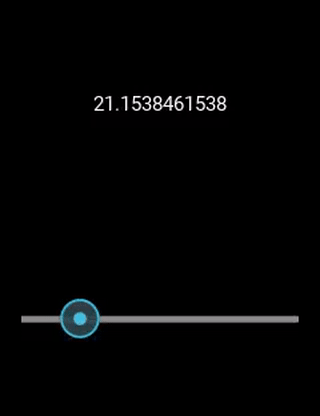
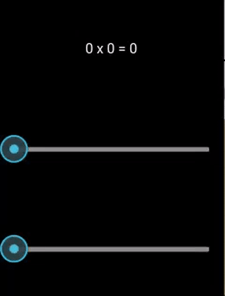

# Events and Binding

### Handling a property change
Continuing with the code from the [previous section](../02.3_Hello_Kivy/README.md) let's do something interesting when the slider changes.  

For reference, [here are the docs for the Slider control](http://kivy.org/docs/api-kivy.uix.slider.html).

There is a property called **value** that exposes the current value the slider is set to. To perform an action (i.e. run code) on a property change, we can set **on_[property name]** in the **hello.kv** file. In this case, let's print out value when it changes by setting **on_value**:

```
#:kivy 1.9

BoxLayout:
  orientation: 'vertical'
  Label:
    size_hint_y: 0.5
    text: 'Hello'
  Button:
    size_hint: None, None
    size: 100, 50
    text: 'Goodbye!'
  Slider:
    on_value: print(args)
    size_hint_y: 0.5
```

Kivy will interpret Python code and run it when value changes. **args** is a value that is available in property change handlers. Run `./main.py`, move the slider around, and see what args contains:



Property change args contain two values -- the *instance* of the widget the property is changing on, and the new value of the property. Let's just print out the new value:

```
  Slider:
    on_value: print(args[1])
```

Now we just see the value of the slider.



This is fine for simple statements but as these get more complex it's often better to run change events in python code instead of in the kv file. We want to the kv file to be an easy-to-read declaration of our UI and not be littered with multi-line Python statements.

Edit **hello_app.py**:

```
from kivy.app import App


class HelloApp(App):

    def on_slider_value_changed(self, instance, value):
        print("Slider: {:.2f}%".format(value))
```

> NOTE: We're doing some string formatting here to convert the value into a percentage. If you're curious, [here's a good read on string formatting in Python](https://pyformat.info).

Now change the **on_value** from **hello.kv** to execute our new method:

```
#:kivy 1.9

BoxLayout:
  orientation: 'vertical'
  Label:
    size_hint_y: 0.5
    text: 'Hello from Kivy'
  Button:
    size_hint: None, None
    size: 100, 50
    text: 'Goodbye!'
  Slider:
    on_value: app.on_slider_value_changed(*args)
    size_hint_y: 0.5
```

> NOTE: If you're wondering what the heck **\*args** is, [here's some additional reading](http://pythontips.com/2013/08/04/args-and-kwargs-in-python-explained/).

There are a couple magic keywords in kv files. `app` provides a reference to the app instance, which we use above to call our method. `root` gives us the root widget in the kv file (in this case, **BoxLayout**). `self` is the current widget (i.e. the widget that owns whatever property you're using self in).

Run `.\main.py` and move the slider around:



### Property Binding

One of the most powerful features in modern UI frameworks is property binding. Bindings allow you to declare a link between different elements in your user interface, and more importantly link your user interface to backing code.

#### Linking widgets to each other

Edit your **hello.kv**:

```
#:kivy 1.9

BoxLayout:
  orientation: 'vertical'
  Label:
    text: str(slider.value)
  Slider:
    id: slider
```

We want to make the label display the value from the slider. The Slider gets its **id** set to "slider", so that we can reference it elsewhere in the kv file by the name "slider". **Label.text** property is then set to **Slider.value** (but value is a float, so we convert it to a string first with `str( )`). Run `.\main.py` and move the slider back and forth. What happens?



When you reference a [Kivy property](http://kivy.org/docs/api-kivy.properties.html) in a kv file, a binding is automatically created. When the value of the property changes, anything it has been assigned to in the kv file is also updated.

#### Binding to code

Kivy cannot bind to [Python properties](https://docs.python.org/3.5/library/functions.html#property), instead it has it's own special [Kivy properties](http://kivy.org/docs/api-kivy.properties.html). Instead of the markup and the code interfacing directly, let's loosely couple them through property bindings. We're going to create an app that will display the product of two factors. Modify your `hello_app.py`:

```
from kivy.app import App
from kivy.properties import StringProperty, NumericProperty


class HelloApp(App):

    formula_text = StringProperty()
    factor1 = NumericProperty(0)
    factor2 = NumericProperty(0)

    def on_factor1(self, instance, value):
        self._update_formula_text()

    def on_factor2(self, instance, value):
        self._update_formula_text()

    def _update_formula_text(self):
        product = self.factor1 * self.factor2
        self.formula_text = "{} x {} = {}".format(self.factor1, self.factor2, product)
```

> NOTE: It is not a good idea to implement the entirety of your application in the root App object or in the entry point of your code. Actually, it is a disastrous idea that is done here only for brevity. Generally I would at very least implement each screen as it's own [Screen](http://kivy.org/docs/api-kivy.uix.screenmanager.html#kivy.uix.screenmanager.Screen) object.

Now let's bind to those properties in our **hello.kv** file:

```
#:kivy 1.9

BoxLayout:
  orientation: 'vertical'
  Label:
    text: app.formula_text
  Slider:
    min: 0
    max: 10
    step: 1
    on_value: app.factor1 = int(self.value)
  Slider:
    min: 0
    max: 10
    step: 1
    on_value: app.factor2 = int(self.value)
```

The Label binds it's text property to the app's **formula_text**. When formula_text changes, the label will be updated. The sliders go the other way -- when their value changes, the app's **factor1** and **factor2** properties will be updated. Since Slider.value provides a float, we convert it to an int first.

Run `./main.py` and move the sliders. 



Slight problem -- when the app is started, there's no text until the sliders move. Bindings don't update until the value actually changes. Let's manually update the label when the app is first shown:

```
from kivy.app import App
from kivy.properties import StringProperty, NumericProperty


class HelloApp(App):

    formula_text = StringProperty()
    factor1 = NumericProperty(0)
    factor2 = NumericProperty(0)

    def on_start(self):
        self._update_formula_text()

    def on_factor1(self, instance, value):
        self._update_formula_text()

    def on_factor2(self, instance, value):
        self._update_formula_text()

    def _update_formula_text(self):
        product = self.factor1 * self.factor2
        self.formula_text = "{} x {} = {}".format(self.factor1, self.factor2, product)
```

**on_start** and **on_stop** are methods on **App** that run at the start and stop of the application. Now run `./main.py` and you should see "0 x 0 = 0" before you move the sliders.

Next up: go to [Assignment 2](../02.5_Assignment/README.md)

&copy; 2015-2020 LeanDog, Inc. and Nick Barendt
