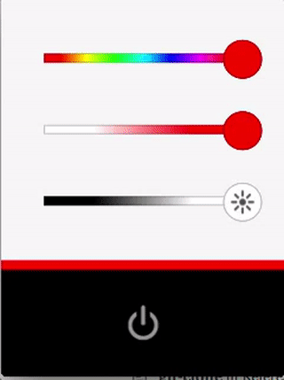

# Assignment Goals

Create a Kivy application with the following features:

* Controls the hue of the lamp color
* Controls the saturation of the lamp color
* Controls the brightness of the lamp 
* Toggles the lamp on and off
* Shows the current color of the lamp
    * on the color strip above the power button block
    * as the "accent color" on the power button (when power enabled)
* Starts up automatically when the lamp is powered on using cron.d (with a file named `3_lampiapp`), *running as the "pi" user* (not root) (the `3_` simplifies things in coming chapters)

The app should look like the following:



## Notes

* For lamp control, reference your lab from assignment one. A completed version of the previous assignment has been provided at **connected-devices/Lampi/scripts/lamp_cmd.py**.
* User input happens in HSV color space (hue, saturation, value) but needs to be converted to RGB (red, green, blue) values to control the lamp. For conversion between color systems, check out [colorsys](https://docs.python.org/3.5/library/colorsys.html) which is built into Python.
* In the HSV space, **value** isn't really useful here. When doing conversions, assume a value of 1.0 and don't confuse PWM-controlled brightness with value.
* [Kivy layouts](http://kivy.org/docs/gettingstarted/layouts.html) can be nested to build complex layouts. Try to find the simplest way to accomplish the layout you're looking for.
* Power icons have been provided for you, located in **connected-devices/Lampi/images**
* Your `main.py` should be in the **connected-devices/Lampi/** directory.  A minimal one has been provided for you.
* Your Python and Kivy files should be in **connected-devices/Lampi/lampi** or a subdirectory. This way the import statements for the custom controls will work as listed below.  A minimal `lampi.kv` `lampi_app.py` have been provided for you.
* Your LED control code should be contained in a single Python file and class.  A minimal `lamp_driver.py` has been provided for you.
* You might find [Kivy Properties](https://www.google.com/webhp?sourceid=chrome-instant&ion=1&espv=2&ie=UTF-8#q=kivy+properties), such as [NumericProperty](https://kivy.org/docs/api-kivy.properties.html#kivy.properties.NumericProperty) and [BoundedNumericProperty](https://kivy.org/docs/api-kivy.properties.html#kivy.properties.BoundedNumericProperty) handy.
* When you create a cron job for your app, don't forget they run out of `/etc/cron.d` in alphanumeric order, and that `pigpiod` needs to run first. A common convention is to prefix a number to the filenames in the order they need to be run.

Note: some students have found it convenient to develop their Kivy application on their computer (Windows, Mac OS X, Linux, etc.) and then run and test it on their LAMPI after completing the layout and UI behaviors.  See "Developing on Other Platforms" at the bottom of this document if you are interested.

## Custom controls

Pre-styled slider and button controls have been provided so that you can focus on the layout and core app logic. They are located at **connected-devices/Lampi/lampi/controls**

### ColorBox (in lampi.controls.color_box)

ColorBox is a simple widget that has a solid color fill. 

#### ColorBox Properties
* `color` - A list of R,G,B,A values.

#### ColorBox Usage

```
#:include lampi/controls/color_box.kv

ColorBox:
    color: 1.0, 0.0, 0.0, 1.0
```

### GradientSlider (in lampi.controls.gradient_slider)

GradientSlider is a slider that allows you to pick a color from a range of colors

#### GradientSlider Properties
* `colors` - A list of colors. Each color is a list of R,G,B,A values.
* `thumb_image_dark` - Dark version of icon to display on the slider thumb.
* `thumb_image_light` - Light version of icon to display on the slider thumb.

#### GradientSlider Usage

```
#:include lampi/controls/gradient_slider.kv

GradientSlider:
    colors: (0,0,0,1), (1,1,1,1)
    thumb_image_light: 'images/brightness_icon_light_small.png'
    thumb_image_dark: 'images/brightness_icon_dark_small.png'
```

### LampiToggle (in lampi.controls.lampi_toggle)

LampiToggle is a styled toggle button that shows an icon and (optional) text and uses an accent color to illuminate when toggled on.

#### LampiToggle Properties

* `image` - A path to the image to display as the button icon.
* `accent_color` - The color the icon is highlighted as when toggled on.
* `text` - Displays text under the button icon.
* `state` - A string of the control state. "normal" when toggled off, "down" when toggled on.

#### LampiToggle Usage

```
#:include lampi/controls/lampi_toggle.kv

LampiToggle:
  image: 'images/power_icon_light.png'
  accent_color: (1,0,0,1)
  text: ''
```

## Predefined Colors
So you don't have to write out all the colors in list format (1,1,1,1) some basic colors have been predefined. Import colors.kv into your kv file:

```
#:include lampi/colors.kv
```

Then you can reference some basic colors directly in your kv files: red, yellow, green, cyan, blue, magenta, black, white, offwhite, grey.

```
#:include lampi/colors.kv
#:include lampi/controls/gradient_slider.kv

GradientSlider:
    colors: red, green, blue
```

## What to Turn In

You need to turn in the following:

1. A short (a few sentences) write up from each member of the pair summarizing what they learned completing the assignment, and one thing that surprised them (good, bad, or just surprising).  This should in **connected-devices/writeup.md** in [Markdown](https://daringfireball.net/projects/markdown/) format.  You can find a template file in **connected-devices/template\_writeup.md**
2. A Git Pull Request (explained below)
3. A short video demonstrating the required behaviors emailed to the instructor.  The video should be named **[assignment 3]_[LAST_NAME_1]\_[LAST_NAME_2].[video format]**.  So, for this assignment, if your pair's last names are "Smith" and "Jones" and you record a .MOV, you would email a file named ```2_smith_jones.mov``` to the instructor.
4. A live demo at the beginning of the next class - **be prepared!**

### Git Pull Request
First, make sure you've forked **connected-devices** under your GitHub account. Do a `git checkout` on your fork and perform your assignment under that copy.

When completed, navigate to the root directory of the project. 

Checkout a new branch called **assignment\_[assignment #]\_[LAST_NAME_1]\_[LAST_NAME_2]**. So, for this assignment (2), if your pair's last names are "Smith" and "Jones", you'll run
```
git checkout -b assignment_2_smith_jones
```

Add your project and commit:
```
git add -A
git commit -m "Assignment [assignment #], Smith and Jones"
git push -u origin [branch name]
```

Navigate to [Github.com](http://Github.com), go to your fork of **connected-devices** and click the pull request button.

Please name your pull request with the same name as your branch (e.g., "assignment_2_smith_jones")

## Developing on Other Platforms (optional)

Kivy is cross-platform.  So, other than the hardware specific (LED control), you could develop the UI and logic on another platform (e.g., Windows, Linux, OSX).

Please follow the [Kivy Installation Instructions](https://kivy.org/docs/installation/installation.html) for your platform.

You can limit the window size on those platforms to match the PiTFT Touchscreen dimensions by modifying the ```~/.kivy/config.ini``` file's **height** and **width* parameters in the **[graphics]]** section to 320 and 240, respetively.


```
[graphics]
display = -1
fullscreen = 0
left = 0
maxfps = 60
multisamples = 2
position = auto
rotation = 0
show_cursor = 1
top = 0
resizable = 1
borderless = 0
window_state = visible
minimum_width = 0
minimum_height = 0
height = 320
width = 240
```


&copy; 2015-2020 LeanDog, Inc. and Nick Barendt
