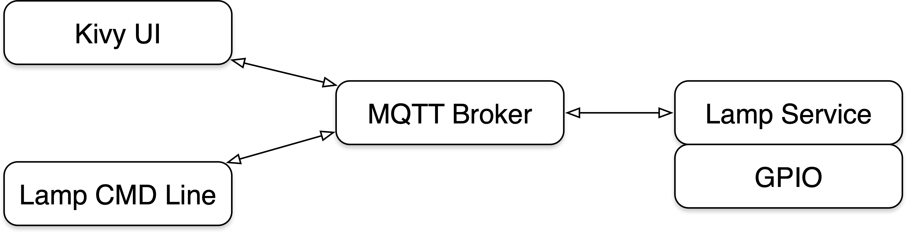

# Create a Command Line Tool

In Assignment 2, you created a touch screen UI for the desklamp using the Kivy framework, where each change to the UI (e.g., moving a slider) resulted the UI callback code changing PWM settings.  While useful, that design will limit our future choices, as the variety of interactions with the lamp grow beyond the local touchscren.

## Single Point of Truth (SPOT)

Connected devices often need to be controlled remotely, via a web interface, mobile application, or from other sources (or automated).  It is important that there be one entity that is holds the "truth" - that is, the current state of the system.  This is often referred to as Single Point of Truth, or SPOT for short.

When hardware is involved, it is important that only one piece of software is controlling that hardware - if more than one application is, for instance, directly changing the PWM settings of the desk lamp, it is easy to create confusing scenarios for the user.  

When there is more than one application that needs to interact with a shared resource, a common architectural solution is a client-server model, where there are multiple clients, but only one server that directly interacts with the shared resource (e.g., a printer server, a database server, etc.).

We will be creating a desk lamp server (or service) in the next assignment, using MQTT as the communications layer, modifying the Kivy UI to use that service, with the Mosquitto broker in the middle:



First, though, we will create our first client.

## Building Client-Server systems from scratch

One complicating aspect of building client-server systems is that you need to build both the client and server at the same time, or have a reference implementation of one or both to program and test against.  Otherwise, you run the risk of building the wrong thing, or a client that cannot communicate with the server.

We are going to start by building a client, using the mosquitto\_pub and mosquitto\_sub tools to test it as we go. 

This strategy is sometimes referred to as "Programming by Intention".

Note: for this portion of the assignment, your command-line tool will not actually be interacting with the LEDs (pigpio) - just with MQTT pub/sub.

## Command-Line Tools

The client we will build will be the first of several controlling the desk lamp.  We will start with a Unix command-line client, since these tools are relatively straight-forward to create, Python has useful libraries, and it will serve as a useful testing and diagnostic tool for us in future assignments.

Your command-line tool should be a Python script that has the Executable mode set and uses the `if __name__ == '__main__':` pattern.

## Commmand line arguments and Unix "argc, argv"

Most command-line programs need to accept command-line arguments to alter their behavior based on how the user invokes the program.

Unix programs are passed command-line parameters from the operating system (most operating systems have similar functionality).  In C programs, these are passed into the program as arguments to the *main()* function, as in:

```
int main (int argc, char *argv[])
```

where *argc* contains the number of arguments, and *argv* is a list of pointers to character strings, with each command-line flag or argument as a string.  By convention, the program name is always passed in as *argv[0]* with *argc* is always >= 1.

Since Python lists are self-describing (requiring no separate length parameter) only *argv* is needed.  It is available via the *sys* module is `sys.argv` (Note:  argc can be determined with `len(sys.argv)`.  If `len(sys.argv)` is less than 2, there are no command-line arguments, just the program name in argv[0].

## Python `argparse` libary
Python has as very useful library called [argparse](https://docs.python.org/3.5/library/argparse.html#module-argparse).  There is an excellent [argparse Tutorial](https://docs.python.org/3.5/howto/argparse.html#id1) that you should read through, executing some of the samples provided until you understand the operation.

The simplest example is:

```
import argparse
parser = argparse.ArgumentParser()
parser.parse_args()
```

That is not very useful, of course, but will serve to get your command-line tool up and running.

## Using *mosquitto_pub* and *mosquitto_sub* for testing and development

Since there are no other MQTT clients at this point, we will use mosquitto_pub to simulate messages being published by other clients, and mosquito_sub to monitor the messages that our command-line tool generates.

## MQTT Topics
For this and future assignments, we wil be using the following  MQTT topics:

* `lamp/set_config` - used to request a change to the lamp configuration
* `lamp/changed` - used to notify clients that the lamp configuration has changed

## Pub/Sub Interactions
The expected interactions for clients of our desk lamp are to request a change in the lamp configuration by publishing a message on the `lamp/set_config` topic.  

When changes to the actual hardware are made (i.e., updating PWM settings), a message will be published on the `lamp/changed` topic, notifying any clients interested in receiving those changes.  When message are published on the `lamp/changed` topic they should be published with the MQTT RETAIN flag set, so that clients subscribing to this topic can quickly receive the last known state.

So, one or more clients may publish requests to change the desk lamp configuration.  At some time later, those changes will take effect, and when they do take effect, a change notification message will be published.

## MQTT Message Payloads
All of our message payloads will be in JSON.  For the moment, we will use the same Message payload format for both requesting configuration changes and notifying clients of hardware configuration changes.

Our message payload will contain the full state of the desklamp - Hue, Saturation, Brightness, and On/Off state.  We will represent it in Python as a dictionary, with keys for *color*, *brightness*, and *on*.  The value of *color* will be  another dictionary with keys *h* and *s*, for hue and saturation, which are both floating point values.  *Brightness* will be a floating point value, and *on* will be a Boolean.  Here is an example:

```
lamp_state = {'color': {'h': 0.5, 's': 0.5}, 'brightness': 0.1, 'on': True}
```

Conveniently, this is nearly identical to the JSON representation:

```
>>> lamp_state = {'color': {'h': 0.5, 's': 0.5}, 'brightness': 0.1, 'on': True}
>>> json.dumps(lamp_state)
'{"color": {"h": 0.5, "s": 0.5}, "on": true, "brightness": 0.1}'
```

**NOTE:** do not forget to enable logging in your Paho client; also, remember to propertly encode/decode your `str` to/from `bytes`

## Assignment Part 1
Create a Unix Command-line tool, named `lamp_cmd` that has the following behaviors:
* when invoked with no arguments, outputs the current state of the desk lamp (color Hue and Saturation, Brightness, and On/Off state)
* when invoked with command-line arguments below, publishes an appropriate change request message

Command-line arguments to be supported:

* "--brightness" or "-b" and a value
* "--hue" or "-u" and a value (using "-h" as short version of "-hue" would conflict with the convention of "-h" for help)
* "--saturation" or "-s" and a value
* "--on" to turn the lamp on
* "--off" to turn the lamp off

*Note:* the values for *brightness*, *hue*, and *saturation* should be greater than or equal to 0.0 and less than or equal to 1.0.  User values outside that range should result in an error with the command-line tool exiting with a helpful message.

*Note:* testing the default behavior (no arguments, just report the current lamp state) can be done by publishing a message to the `lamp/changed` topic with *mosquitto_pub* and using the Retain option.

*Note:* testing the options that request a change to the lamp configuration can be done using *mosquitto_sub* subscribing to the `lamp/set_config` topic and inspecting the output on the screen.

*Note:* the command-line tool should not interact with *pigpio* or any other subsystem to accomplish its jobs, just MQTT pub/sub

*Note:* for convenience, leave the ".py" off the end of the filename `lamp_cmd`

*Note:* for this assignment, MQTT QoS 0 (the default with Paho) is adequate.

Next up: go to [Creating a Lamp Service](../03.6_Lamp_Service/README.md)

&copy; 2015-2020 LeanDog, Inc. and Nick Barendt
