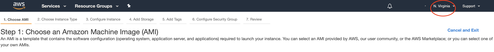

# Getting Started with EC2

Throughout these instructions we'll be bouncing between EC2, the lamp, and your host machine (i.e., your laptop). Bash commands on EC2 will be prepended with `cloud$`, commands on lamp with `lamp$`, and commands on your local machine with `host$`. Example:
```
cloud$ ifconfig
```
```
host$ ifconfig
```
```
lamp$ ifconfig
```

These represent the prompt. You should not include these with the commands you run.

## Sign up for AWS free account

1. Navigate to [http://aws.amazon.com](http://aws.amazon.com) and sign up for a new account. (Note: you will need a payment method and active phone number to complete registration)
2. When registration is completed and you are signed in, navigate to [https://console.aws.amazon.com](https://console.aws.amazon.com).

Note:  there is an [AWS Educate](https://aws.amazon.com/education/awseducate/) program that will provide you with free AWS credits.  Not needed for this course, but it might be useful for you.

## Provision an EC2 Instance
1. Navigate to [https://console.aws.amazon.com](https://console.aws.amazon.com).
1. Use the search field under "AWS Services" to search for EC2 (AWS has so many services at this point that they cannot just provide a table...)
<br/>
2. Click on **EC2**.
<br/>
3. Click on **Launch Instance**.
<br/>
4. Verify that the AWS Region in the upper-right corner is `N. Virginia` (Northern Virginia) - **this is very important for the semester _run everything in the `N. Virginia` region_.**
<br/>
4. Find the AMI for **Ubuntu Server 18.04 LTS (HVM), SSD Volume Type** - ami-04b9e92b5572fa0d1 (64-bit x86). Click **Select**.
<br/>
5. Choose an instance type of **t2.micro** and click **Review and Launch**.  This is a **Free Tier Eligible** instane type.
<br/>
6. You will be asked for a key pair to securely connect to your instance. Select **Create a new key pair**, give it a name like `eecs377`, and click **Download Key Pair**.
<br/>
7. This will create a key and download the private key on your local machine.
8. If the file saves to your computer with a **.txt** file extention, rename it to have a **.pem** extension.
9. Restrict permissions on the key. ssh will require this later.  On a Unix system:

    ```
    host$ chmod 400 <path_to_your_pem_file>
    ```

10. Click **Launch Instance**.
11. Once the instance has launched you can navigate to the **Instances** link in the left side bar to get a list of all of your instances and their state.

### Key Management
Anyone who has the private key you just downloaded can log into your EC2 instance. The first thing you should do is place it somewhere meaningful on your computer where you will remember where and what it is. Your *Downloads* folder is not an appropriate place for long-term key storage. The second thing you should do is back it up, preferably to labeled physical media such as a USB drive.

### Set Up Billing Alerts
Even on the free tier, AWS can bill you for usage over the free rate limits. I recommend you go to [https://console.aws.amazon.com/billing/](https://console.aws.amazon.com/billing/) and configure **billing alerts** that will let you know if you start getting charges on your account. If you make a mistake or start getting unexpected traffic you will be able to react quickly and avoid getting any surprising charges.

## Set up an Elastic IP address
By default, your EC2 instance will be assigned a non-static IP address. When the instance is restarted or stopped, it will lose it's public IP. To deal with this we will configure an Elastic IP so that our lamp will always have a known endpoint to talk to.

1. Navigate to [https://console.aws.amazon.com](https://console.aws.amazon.com).
2. Click on **EC2**.
3. On the left-hand side, click **Elastic IPs**.
4. Click **Allocate New Address** and confirm with **Yes, Allocate**.
<br/>
5. Once you have your Elastic IP address, select it in the list and select **Actions**, then **Associate Address**.
6. Click in the **Instance** field and select your EC2 instance. Then click **Associate**.
<br/>

## Log into EC2 Remotely

1. Open EC2 Dashboard at [https://console.aws.amazon.com/ec2/](https://console.aws.amazon.com/ec2/). Click on **Instances**.
<br/>
2. Select your newly created instance (remember, always use the `N. Virginia` region for this semester) and click **Connect**. (If your instance doesn't appear, you may be in the wrong region. Try the other US regions in the upper-right drop-down.)
<br/>
3. Follow the provided instructions for connecting to your instance via SSH. In an OSX or Linux system, you can run:

    ```
    host$ ssh -i "<path to private key>" <ec2_user>@<ec2_public_ip>
    ```

    > Note: You should be able to use the same program you used to SSH into your Raspberry Pi (PuTTY, Terminal, etc).

    > Note: The "ec2_user" for Ubuntu Server on AWS is ```ubuntu```.

4. You should now be logged in. Run `sudo apt-get update` and accept any prompts you encounter.
<br/>

Next up: go to [Set up Key Forwarding](../04.02_Set_Up_Key_Forwarding/README.md)

&copy; 2015-2020 LeanDog, Inc. and Nick Barendt
