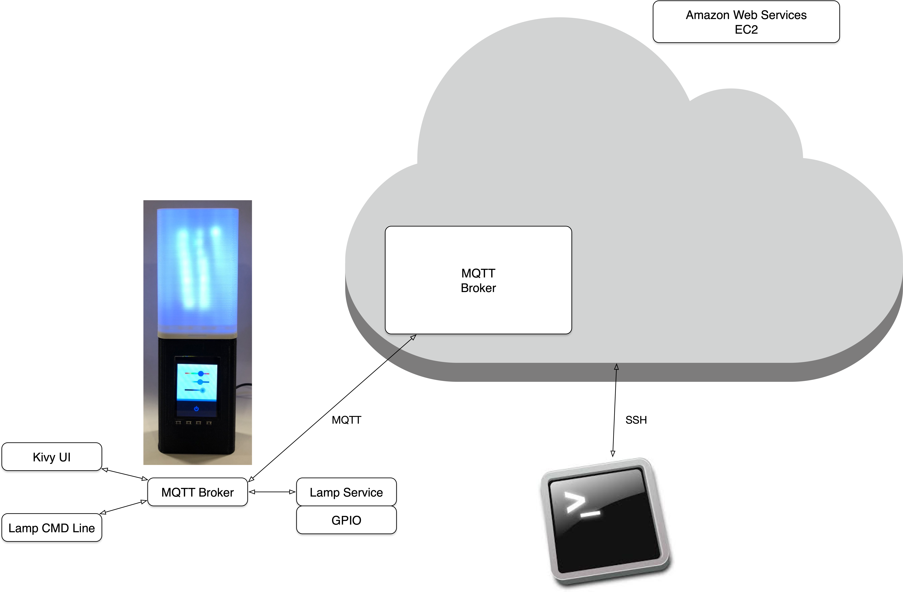
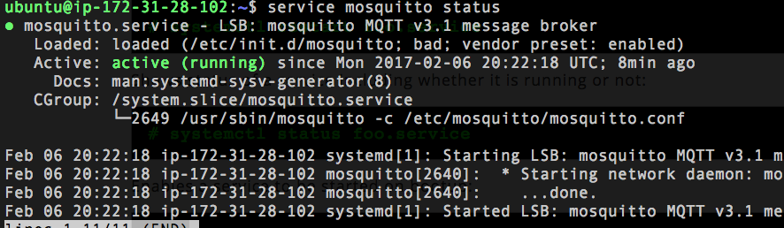
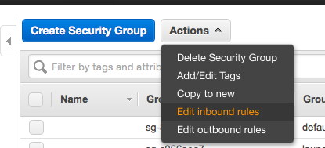
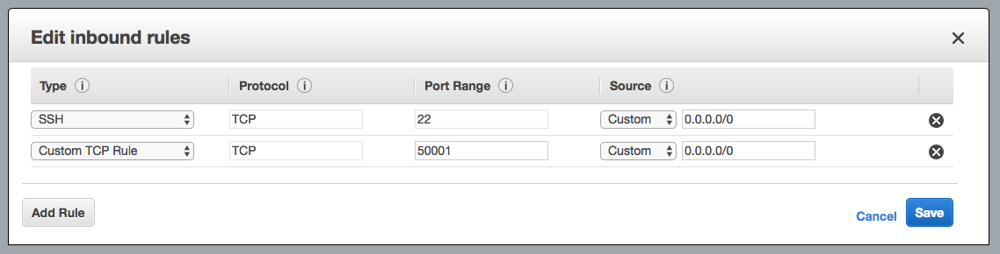
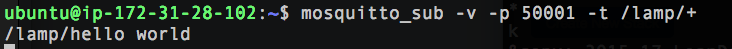

# Set up MQTT Broker on EC2

By the end of this, we'll have a system topography that looks like this:



Much like on the Raspberry Pi, we're going to set up Mosquitto as an MQTT broker for our other processes to speak to. The two brokers will be bridged over the internet so that the processes on our lamp can communicate with the web service we'll create next week.

## Installing Mosquitto

> **COMPATIBILITY:** the version of Mosquitto in the Ubuntu 18.04 repository is  1.4.15, which is current enough for our needs
> 

Log into your EC2 instance and run:

```
cloud$ sudo apt-get update
cloud$ sudo apt-get upgrade -y
cloud$ sudo apt-get install -y mosquitto mosquitto-clients
```

Then, run service to verify that mosquitto is running:

```
cloud$ service mosquitto status
```

Under **Active** you should see a status of **start/running**.
<br/>

## Change Mosquitto Port Number
Let's change the port that our Mosquitto broker is running on. The default port is an easy target and in a range that is commonly port scanned.

Log into your EC2 instance and use a text editor running as sudo to create a file in `/etc/mosquitto/conf.d` named `port.conf`, example:

```
cloud$ sudo nano /etc/mosquitto/conf.d/port.conf
```

Edit the file to add the following lines:

```
listener 50001
```

The port number value of 50001  is arbitrary (there are some rules and conventions on port numbers - picking a large value like this is generally useful for custom or temporary configurations).

By default, Mosquitto reads its configuration file in at startup from `/etc/mosquitto/mosquitto.conf` which will look something like:

```
# Place your local configuration in /etc/mosquitto/conf.d/
#
# A full description of the configuration file is at
# /usr/share/doc/mosquitto/examples/mosquitto.conf.example

pid_file /var/run/mosquitto.pid

persistence true
persistence_location /var/lib/mosquitto/

log_dest file /var/log/mosquitto/mosquitto.log

include_dir /etc/mosquitto/conf.d
```

The last line, `include_dir /etc/mosquitto/conf.d` causes it to load any file ending in `.conf` into the configuration, as if the contents of that file were in `/etc/mosquitto/mosquitto.conf` - splitting the configuration into separate files can simplify it in some cases.

Documentation on `include_dir`:

       include_dir dir
           External configuration files may be included by using the
           include_dir option. This defines a directory that will be searched
           for config files. All files that end in '.conf' will be loaded as a
           configuration file. It is best to have this as the last option in
           the main file. This option will only be processed from the main
           configuration file. The directory specified must not contain the
           main configuration file.

You can learn more about the Mosquitto configuration file with:

```
cloud$ man mosquitto.conf
```

Restart Mosquitto:

```
cloud$ sudo service mosquitto restart
```

**NOTE:** because we have explicitly added a port number, the default listener running port 1883 is no longer running.  **BE SURE TO EXPLICITLY SPECIFY THE PORT NUMBER GOING FORWARD AS 50001 (e.g., `mosquitto_pub -v -t hello -m "world" -p 50001`).**  If you do not, your tools will not be able to connect to the broker.

**NOTE:** the **mosquitto** broker does not always seem to cleanly shutdown and start new instances - to avoid getting stuck with a background copy of **mosquitto** running (with the port listener on the default port 1883), you might just want to reboot your EC2 instance at thsi point: `sudo reboot`.  You should be able to connect to it again via SSH in 5-15 seconds.

## Configure AWS for Mosquitto Traffic
You'll need to "poke a hole" in AWS Security Group configuration (firewall) to allow incoming traffic on this port.

1. Navigate to [https://console.aws.amazon.com](https://console.aws.amazon.com).
2. Click on **EC2**.
3. On the left-hand side, click **Security Groups**.
4. Select the security group for your EC2 instance (on a new account it should be the only one) and click **Actions**, **Edit inbound rules**.
<br/>
5. Click **Add Rule**.
6. Add a **Custom TCP Rule** with Port Range of **50001** and Source of **Anywhere**.
<br/>
7. Click **Save**

## Test Local Pub / Sub

Before we start sending messages over the internet, we are going to run a brief local test to ensure that everything is working correctly (this is the same test we ran on the Pi). Create two SSH session to your EC2 instance -- one for publishing and one for subscribing.

In one ssh session, run:

```
cloud$ mosquitto_sub -v -p 50001 -t lamp/+
```

In the other session, run:

```
cloud$ mosquitto_pub -p 50001 -t lamp/hello -m world
```

In the subscribing session, you should see the output `hello world`.
<br/>

## Device ID

**Device ID** is a concept we will use shortly and again later in the class. We need a unique identifier for each lamp so that we can register a lamp to a user and make sure we are not sending messags to the wrong place.

In this case, we will use the Raspberry Pi's eth0 MAC address. The MAC address is already guaranteed to be [unique](https://en.wikipedia.org/wiki/MAC_address) and cannot easily change since the Ethernet hardware is built into the Pi.

When you are asked to use the Device ID in the next step, run the following command on your Raspberry Pi to get it:

```
lamp$ cat /sys/class/net/eth0/address | sed s/://g
```

(All this does is output the eth0 MAC address (which is in *FF:FF:FF:FF:FF* format) and then pipe the output into [`sed`](http://www.grymoire.com/Unix/Sed.html#uh-0) to strip out the colon characters.)

Here is a Python function to do the same thing, returning the value as a string:

```
DEVICE_ID_FILENAME = '/sys/class/net/eth0/address'

def get_device_id():
    mac_addr = open(DEVICE_ID_FILENAME).read().strip()
    return mac_addr.replace(':', '')
```

The Device ID will something like:

```
b297ab73363f
```

## Bridging MQTT Brokers

Now we are going to connect our two Mosquitto brokers (the one running on our Raspberry Pi and the on running on our EC2 instance) across the internet. To do this, we will change the Mosquitto configuration on the **lamp**.

Please refer to the "Configuring Bridges" section of [mosquitto.conf](http://mosquitto.org/man/mosquitto-conf-5.html).

Use a text editor running as sudo to create a file at `/etc/mosquitto/conf.d`, example:

```
lamp$ sudo nano /etc/mosquitto/conf.d/bridging.conf
```

Edit the file to add the following lines:

#### connection &lt;name&gt;
Defines the start of a bridging connection. The &lt;name&gt; is used as a unique identifier for this bridge connection.

In this case, we are going to use our **device ID** as part of our client ID. Append **_broker** to the end so we can identify it from other clients on the lamp.

Here's an example:

```
connection b297ab73363f_broker
```

#### address &lt;ip_address&gt;:&lt;port&gt;
Next you need to tell the broker where to bridge to. Use your elastic IP and the port you changed earlier, like so:

```
address 10.0.30.147:50001
```

#### remote\_clientid &lt;name&gt;
The remote\_clientid &lt;name&gt; is used as a unique client ID for the broker connection. 

We will use the same value as we used for the bridge connection name (namely, your **device ID** with **_broker** appended).  Here is an example:

```
remote_clientid b297ab73363f_broker
```

#### cleansession [ true | false ]
We have not spent much time on Clean Sessions with MQTT yet.  By default, all of the client connections with Paho have been "clean" by default - that is, each time the client connects, it has to specify subscribed topics.  Each time the client connects, it gets a "clean slate", which is simple, but has some downsides.  Most importantly, any QoS 1 or 2 messages delivered to topics while it is unconnected will not be delivered.  With a "durable" (non-clean) session, the broker will store any QoS 1 or 2 messages for subscribed topics even if the client is not currently connected.  When it later connects, those messages will be delivered.

This durable connection is very useful for bridges.  In fact, Mosquitto defaults "cleansession" to False.

This can have one downside while you are learning about topic mapping, though, in that topic mappings for the bridge effectively become persistent subscriptions, and if you are not careful you can build up overlapping subscriptions during development, leading to duplicate messages.

While "cleansession" should generally be False during production, setting it to True during initial development is a good idea.

#### topic &lt;pattern&gt; &lt;direction&gt; &lt;qos&gt; &lt;local-prefix&gt; &lt;remote-prefix&gt;

Please refer to the "Configuring Bridges" section of the [mosquitto.conf](http://mosquitto.org/man/mosquitto-conf-5.html) for more insight into how topics are mapped across the bridge.

Note:  "local" refers to the broker initiating the bridge (the Pi in our case) and "remote" refers to the other broker.

Topics can be mapped in the following directions:

* _in_ - that is coming from the remote broker to the local broker
* _out_ - that is coming from the local broker to the remote broker
* _both_ - bidirectional (Note: it is tricky to avoid loops and duplicates with _both_ - just do not use it)

Our goal is to send status messages from our broker to the EC2 instance, and receive configuration requests from the EC2 instance to our broker.

We will use QoS 1 for the bridge connection - at least once delivery of messages.

When mapping topics across the bridge, the &lt;local-prefix&gt; will be replaced by &lt;remote-prefix&gt; on _out_ mappings, and vice versa on _in_ mappings. ```""``` is a special empty or null prefix.

Wildcards can be used to specify topic mappings.

Here is a simple example (do not use this!):

```
topic lamp/set_config in 1 "" ""
```

Here we are specifying that `lamp/set_config` messages be accepted from the remote broker, with no prefix changes.  This is great, except that when we publish from the EC2 instance, every lamp subscribed to `lamp/+` will receive every message for every lamp! And, every lamp's changed notification will be on the same topic!  As you can imagine, this is ... sub-optimal.

On the remote broker we will want to put all of the lamps in a distinct area of the topic hierarchy.  We will use a "devices/&lt;Device ID&gt;" remote prefix.  So outgoing topics will have that prefixed prepended, and incoming topics will have the prefix removed:

```
topic test1/+ out 1 "" devices/b297ab73363f/
topic test2/+ in 1 "" devices/b297ab73363f/
```

In this case **b297ab73363f** is my Device ID. Replace with your own.

Finally save the config file. It'll look something like this:

```
connection b297ab73363f_broker
address 10.0.21.12:50001
remote_clientid b297ab73363f_broker
topic test1/+ out 1 "" devices/b297ab73363f/
topic test2/+ in 1 "" devices/b297ab73363f/
cleansession true
```

To recap:

* **connection** begins a bridge configuration section and specifies the name for the bridge
* **address** specifies the IP address and port number for the remote broker
* **remote_clientid** provides the client ID that will show up in the $SYS topic hierarchy
* **topic** specifies the topics to be bridged
* **cleansession** specifies whether the client session should be clean or durable


*Note:* we are using the **Device ID** for two different things:

* mapping topics to/from the "devices/&lt;Device ID&gt;" topic hierarchy on the remote broker
* specifying the client ID name for the broker-to-broker connection, with "_broker" appended

Save and close the config file. Restart Mosquitto:

```
lamp$ sudo service mosquitto restart
```

*Note:* it may take a moment after restarting for the bridge to be established.  You can monitor the state of the bridge on both the Pi and EC2 Instance by subscribing to = part of the `$SYS` topic hierarchy, a special set of topics used by the MQTT broker.  See **Broker Status** in the [Mosquitto Documentation](https://mosquitto.org/man/mosquitto-8.html)

Bridge state can be found at the topic:

```
$SYS/broker/connection/<client_id>/state
```
where &lt;client_id&gt; is the _remote\_clientid_ specified.  When connected, `state` will contain a value of "1" and when disconnected a value of "0".  You can use something like:

```
mosquitto_sub -v -t \$SYS/broker/connection/+/state
```

to monitor bridge connections.

## Testing Bridging to EC2

Log into your EC2 instance. Make sure to point `mosquitto_sub` to your new port number:

```
cloud$ mosquitto_sub -v -t devices/+/test1/+ -p 50001
```

Note that `+` is a wildcard used twice in the above command.

Now, on the Raspberry Pi, publish a message:

```
lamp$ mosquitto_pub -t test1/hello -m from_pi
```

On EC2, you should see a message like the following in your terminal.

```
ubuntu@ip-172-31-28-102:~$ mosquitto_sub -v -t 'devices/+/test1/+' -p 50001
devices/b827eb08451e/test1/hello from_pi

```

Note that because of the bridging config we created above, `/test1/hello` got mapped to `devices/[device_id]/test1/hello` on the remote machine.

## Send a Message to the Lamp
On the Lamp, subscribe to the test2/ topic:

```
lamp$ mosquitto_sub -v -t test2/#
```

On EC2, publish a message to your specific device (put your Device ID in in place of `[device_id]`):

```
cloud$ mosquitto_pub -p 50001 -t devices/[device_id]/test2/hello -m from_ec2
```

It should appear on the Pi:

```
mosquitto_sub -v -t test2/#
/test2/hello from_ec2
```

Try publishing with a different device ID from EC2. It should _not_ arrive at the Pi.

Next up: go to [MQTT Wills](../04.04_Mqtt_Wills/README.md)

&copy; 2015-2020 LeanDog, Inc. and Nick Barendt
