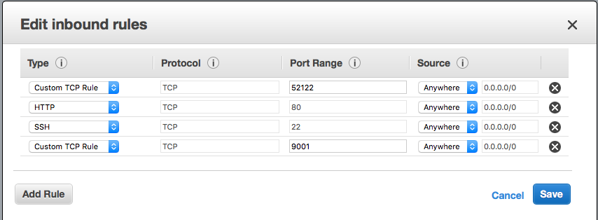
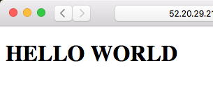

# Set up a Web Server

This week we're going to build a static website that controls Lampi but first we'll set up a web server to host our site.

There are many options for hosting a static site including [Apache](http://httpd.apache.org), [Flask](http://flask.pocoo.org), and many others. We could also simply serve the files directly from Amazon S3. 

For this class we will use [Nginx](http://nginx.org), which is fast and well-suited for serving static content, and which we will expand later to serve dynamic content..

Again, we will use `cloud$`, `host$`, and `lamp$` to differentiate console commands between the three environments.

## Install Nginx

From your EC2 instance, install the Nginx web server:

```
cloud$ sudo apt-get install -y nginx
```

If you have not already done so, clone the repository to your EC2 instance:

```
cloud$ git clone <GIT REPO URL> connected-devices
```

**NOTE:** please locate your repository in `/home/ubuntu/connected-devices` so we can have a consistent directory path for debug, grading, Ansible, etc.


Now let's make a directory to host your webpage in your repo:

```
$cloud mkdir -p ~/connected-devices/Web/static/test
```


**NOTE:** it is generally a _very_ bad idea to host web sites and files from your home directory, like we will be doing; we are doing it for simplicity and keeping all of the files within your repository.

Next, we'll configure Nginx to use your directory for hosting content. Edit **/etc/nginx/nginx.conf** so that it (only) contains:

```
user www-data;
worker_processes auto;
pid /run/nginx.pid;

events {
  worker_connections 768;
}

http {
  server {
    location / {
      include /etc/nginx/mime.types;
      root /home/ubuntu/connected-devices/Web/static;
    }
  }
  server_names_hash_bucket_size 128;
}
```

(Hint: you'll probably need to use `sudo`...)

This has a `location` tag. This will redirect all requests to search for static content in **/home/ubuntu/connected-devices/Web/static**. We also include the mime types configuration, which helps set proper content type headers when serving our web pages and related "assets".  (You can read up on [NGINX server names](http://nginx.org/en/docs/http/server_names.html) - long story short, our ec2 hostnames are very long and can cause problems for NGINX without the `server_names_hash_bucket_size` parameter.)

Restart nginx for the config changes to take effect:

```
sudo service nginx restart
```

## Add port 80 to EC2 Security Group

We need to allow HTTP traffic on port 80 so that we can view our hosted web page. Navigate to **console.aws.amazon.com** and click on **EC2**. On the left-hand side, click **Security Groups**. 

Select your security group and click **Actions**, **Edit inbound rules**. Add a rule of type **HTTP** with source **Anywhere**. Click **Save**.
<br/>

## Create a Test Page

Use your text editor to create **/home/ubuntu/connected-devices/Web/static/test/test.html** .

Make a simple page for testing:

```
<!DOCTYPE html>
<html>
  <head>
    <meta charset="utf-8">
    <title>My Test Page</title>
  </head>
  <body>
    <h1>HELLO WORLD</h1>
  </body>
</html>
```

Save this page. Open a web browser on your host machine (i.e. your laptop) and navigate to `http://[your_ec2_ip_address]/test/test.html`. You should see your page:



**Congratulations!**

Next up: go to [Creating a Basic Static Page](../05.2_Creating_a_Basic_Static_Page/README.md)

&copy; 2015-2020 LeanDog, Inc. and Nick Barendt
