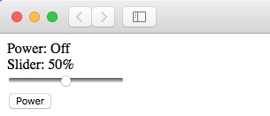

# Set up a Basic Static Page

To create a basic site there are three components that we will want to get working together.

 * HTML (HyperText Markup Language)
 * CSS (Cascading Stylesheets)
 * JavaScript

These three languages are the essential technologies of the web and are what websites use for visual styling, animation and interaction.

In this series of instructions we will learn how to define a layout that enables the user to toggle a power switch.  We will define an HTML5 slider control and learn how to subscribe to the values we are changing.   Using JavaScript we will be able to react to these events and adjust them to suit to our needs. We will then use CSS to further enhance the user experience and shape our HTML to look a bit more presentable.

## File Organization

When building our sites, we will make use of a variety of file types that will each serve a different purpose.  To help keep things straight, we are going to want arrange our files with some semblance of organization. 

Create the following directory hierarchy in the ```Web/static/test``` directory:

```
$cloud: tree -L 1 connected-devices/Web/static/test
connected-devices/Web/static/test
├── css
├── images
├── js
└── test.html

3 directories, 1 file
```

The html files reside in the root directory 'test'.  Store the media type documents and images in their respective directories by type (CSS, Images, and Javascript).  In a production environment, media files would probably not be stored like this. (They would be stored separately from the code base).  For this example however, this document structure will suffice.

## HTML Markup

At a high level, HTML is the 'framework' of webpages. It provides structure for page content and communicates web protocols with the different web browsers. Web browsers, such as Mozilla, Firefox and Chrome, consume HTML files and render them into visible or audible web pages. Additionally, HTML can be used to collect data from users, such as in forms.

To get started,  we will use HTML markup to build a basic skeleton of what the user will see.   Let's begin by opening **connected-devices/Web/static/test/test.html**. Copy and paste the following code:

```html
<!DOCTYPE html>
<html>
<head>
  <title>Basic Page Example</title>
  <meta charset="utf-8">
  <meta name="viewport" content="user-scalable=no, initial-scale=1, maximum-scale=1, minimum-scale=1, width=device-width">
  <link rel="stylesheet" type="text/css" href="/test/css/site.css">
</head>
<body>
  <main>
    <div class="labels">
      <div>
        Power: <span id="powerState">Off</span>
      </div>
      <div>
        Slider: <span id="sliderState">50</span>%
      </div>
    </div>
    <div class="sliders">
      <input id="slider" class="slider" type="range" min="0" max="100" step="1"></input>
    </div>
    <div class="colorbox"></div>
    <div class="buttons">
      <button id="power" type="button" class="btn btn-default">Power</button>
    </div>
  </main>
 <script src="http://ajax.googleapis.com/ajax/libs/jquery/3.3.1/jquery.min.js" type="text/javascript"></script>
   <script src="/test/js/page.js" type="text/javascript"></script>
</body>
</html>
```

Save this page.

Then open a web browser on your host machine (i.e. your laptop) and navigate to `http://[your_ec2_ip_address]/test/test.html`. You should now see your page:



Next up: go to [Introduction to CSS](../05.3_Introduction_to_CSS/README.md)

&copy; 2015-2020 LeanDog, Inc. and Nick Barendt
