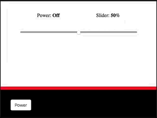
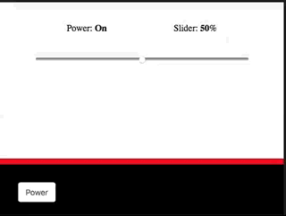

# JavaScript

JavaScript is a scripting language that is designed to make your website more dynamic.  It will allow the application to react to the user's input without forcing a complete page refresh (which tends to be slow and inefficient).  

### Debugging JavaScript in your Browser

Modern browsers have built-in support for debugging JavaScript:

* [Chrome](https://developers.google.com/web/tools/chrome-devtools/)
* [Safari](https://support.apple.com/kb/PH21491?locale=en_US)
* [General overview at w3schools covering other browsers - scroll down to 'Major Browsers' Debugging Tools'](https://www.w3schools.com/js/js_debugging.asp)

Inspectors.  Debuggers.  Consoles.

Use them.

### Goals for using JavaScript

Our goals for this JavaScript script will be to enable the application to react to a button control click as well as interact with the slider control.  We will use [`span`](https://www.w3schools.com/tags/tag_span.asp) tags to publish the state of a button **on/off**, as well as show the value off the slider's position.

### Creating an Object for this example

The first thing we will want to do is create a basic page object.


We can create the ```page.js``` file that will be used for this web page.

```
sudo touch connected-devices/Web/static/test/js/page.js
```

Open the ```page.js``` and define the page object:

```js
page = function TestPage() {
  obj = {

  };

  return obj;
}();
```

Unless you are familiar with JavaScript, the operation of the code might not be obvious.  Here's a brief summary:

* we define a `function` called `TestPage` that takes no arguments between the `{` and `}`
* the function is not only defined, but it is executed due to the `()` after the closing `}`
* the value returned by the function invocation is saved to a variable `page`
* the function returns a variable called `obj`, which is available to other JavaScript code as the global variable `page`

This will give the browser a reference to a global variable called `page`. The page variable will contain whatever functionality we define in the `obj` scope.

We can now include this into our `test.html` document and begin using it.  Save and close this document.  Open **connected-devices/Web/static/test/test.html**.  Add the following line to the **end** of the body:

```html
<body>

  ...


  <script src="/test/js/page.js" type="text/javascript"></script>

</body>
```

There are a few reasons to import your javascript at the end of the HTML document.  One important reason is to avoid not rendering your page if there is a bug when loading the page.

### Wiring Up the Power Button

To hook up the power button we will need to know a few things about the ```html``` document we will be controlling.  We will be using the ``id`` attribute of the power button and the ```id``` attribute of the span that will show the state of the button.  When the user clicks the "power button" we will simply toggle between **on** and **off**.

```js
page = function TestPage() {
  var powerBtn = 'power';
  var powerState = 'powerState';
  var isPowered = false;

  obj = {
    setPowerLabel : function(label) {
      document.getElementById(powerState).innerHTML = label;
    },

    powerOn : function () {
      console.log('.... powering on');
      obj.setPowerLabel("On");
      isPowered = true;
    },
    powerOff : function () {
      console.log('.... powering off');
      obj.setPowerLabel("Off");
      isPowered = false;
    },

    togglePower : function() {
      console.log('.... toggling power');
      if (isPowered)
        obj.powerOff();
      else
        obj.powerOn();
    },

    init : function() {
      document.getElementById(powerBtn).onclick = obj.togglePower;
    },
  };

  return obj;
}().init();
```

So... What did we just do?

We extended `TestPage` to actually return an object that we are then initailizing (note the last line changed from `}();` to `}().init();`).

We initiliaze the object with the method we defined called `init`.  This method is responsible for finding an element that has an `id` of `power` (the value stored in the `powerBtn` variable) and adds an `onclick` listener to the html control.  When that element is clicked, the method `togglePower` will be called.

We defined a method called `togglePower`.  This method is responsible for checking the flag of the `isPowered` variable.  It will call the methods `powerOn` and `powerOff` respectively.  These methods simply write the value of **On/Off** according to their function to the `span` element with the `id` of `powerState`.



We are using the `console.log()` method like we might use `print()` in Python, to output debug messages.  They will appear in the JavaScript console, if you have the developer tools open in your browser.

Note: the variables defined in the `TestPage` function (`powerBtn`, `powerState`, and `isPowered`) with [`var`](https://www.w3schools.com/js/js_variables.asp) are available to the object, even after the `TestPage` function exits due to JavaScript's support for [lexical closures](https://en.wikipedia.org/wiki/Closure_(computer_programming)).

## JQuery Introduction

JQuery is a popular Javascript library. It simplifies the syntax for finding, selecting, and manipulating all elements of a web page.

We will update our implementation to use JQuery.

First include the `JQuery` library in your HTML document:

```html
<body>

  ...


  <script src="http://ajax.googleapis.com/ajax/libs/jquery/3.3.1/jquery.min.js" type="text/javascript"></script>
  <script src="/test/js/page.js" type="text/javascript"></script>

</body>
```

Google is kind enough to host a [global content delivery network for popular JavaScript libraries](https://developers.google.com/speed/libraries/).  We will use those to simplify our lives and provide our users with a great, low-latency experience.

Generally, you access the JQuery library using `$()`.

We will update our example from above to use JQuery.  Here is the above example rewritten with JQuery:

```js
function TestPage($) {
  var powerBtn = 'power';
  var powerState = 'powerState';
  var isPowered = false;

  obj = {
    setPowerLabel : function(label) {
      $("#powerState").html(label);
    },

    powerOn : function () {
      console.log('.... powering on');
      obj.setPowerLabel("On");
      isPowered = true;
    },
    powerOff : function () {
      console.log('.... powering off');
      obj.setPowerLabel("Off");
      isPowered = false;
    },

    togglePower : function() {
      console.log('.... toggling power');
      if (isPowered)
        obj.powerOff();
      else
        obj.powerOn();
    },

    init : function() {
      $("#power").on("click", obj.togglePower);
    },
  };
  obj.init();
  return obj;
}

jQuery(TestPage);
```

So, why JQuery?  JQuery has a powerful [selector](https://api.jquery.com/category/selectors/) framework that allows developers to quickly grab and navigate various parts of the [DOM](http://www.w3schools.com/js/js_htmldom.asp).

For example, we changed this:

```js
      document.getElementById(powerBtn).onclick = obj.togglePower;
```

to this:

```js
      $("#power").on("click", obj.togglePower);
```

which most developers find more concise and easier to understand.

We also change the way our `TestPage()` function is being called - we are now using the [`jQuery()`](http://api.jquery.com/jQuery/#jQuery3) _function_.  This invocation binds our function to be executed after the DOM has finished loading - if our function executes too early (before the DOM has finished loading) we can run into issues, so this is a great, simple way to make sure everything is ready before our function runs.  [`jQuery()`](http://api.jquery.com/jQuery/#jQuery3) also passes itself in as the `$` alias, for simplicity.


### Wiring Up the Slider Control

 We will now subscribe to the slider's change event to update the `span` element with the `id` of `sliderState`.

 ```js
 function TestPage($) {

   ...

   var isPowered = false;
   var slider = 'slider';
   var sliderState = 'sliderState';

   obj = {

     ...

     togglePower : function() {
       console.log('.... toggling power');
       if (isPowered)
         obj.powerOff();
       else
         obj.powerOn();
     },

     setSliderLabel : function(label) {
       $("#sliderState").html(label);
     },

     onSliderChangedEvent : function() {
       var slide = $("#slider");
       console.log('.... slider value has changed to: ' + slide.val());
       obj.setSliderLabel(slide.val());
     },

     init : function() {
       $("#power").on("click", obj.togglePower);
       $( ".slider" ).on( "change input", obj.onSliderChangedEvent);
     },
   };
  obj.init();
  return obj;
}

jQuery(TestPage);
 ```

Again, we are using the `init` method to set up the listener to observe the slider change values.  We are going to take the value of the slider and update the `sliderState` `span` with the knob's location.

We are using the JQuery `id` selector syntax `$("#power")` to select the element with the `id` of `power`, and using the JQuery `class` selector syntax `$(".slider")` to select all elements with the class equal to `"slider"`. 



### The Result

By now you should have a file that looks something like this:

```js
function TestPage($) {
  var powerBtn = 'power';
  var powerState = 'powerState';
  var slider = 'slider';
  var sliderState = 'sliderState';
  var isPowered = false;

  obj = {

    setPowerLabel : function(label) {
      $("#powerState").html(label);
    },

    setSliderLabel : function(label) {
      $("#sliderState").html(label);
    },

    powerOn : function () {
      console.log('.... powering on');
      obj.setPowerLabel("On");
      isPowered = true;
    },
    powerOff : function () {
      console.log('.... powering off');
      obj.setPowerLabel("Off");
      isPowered = false;
    },

    togglePower : function() {
      console.log('.... toggling power');
      if (isPowered)
        obj.powerOff();
      else
        obj.powerOn();
    },

    onSliderChangedEvent : function() {
      var slide = $("#slider");
      console.log('.... slider value has changed to: ' + slide.val());
      obj.setSliderLabel(slide.val());
    },

    init : function() {
      $("#power").on("click", obj.togglePower);
      $( ".slider" ).on( "change input", obj.onSliderChangedEvent);
    },
  };
  obj.init();
  return obj;
}

jQuery(TestPage);
```

Refreshing the page in your browser will allow you to interact with the power button and slider.

We are going to make one more change to make our slider code a little more generic - we will modify our `onSliderChangedEvent` handler to take an argument (which is passed it by JavaScript, which we have been ignoring before now) - the argument is an event object that includes the `target` (the slider in this case) that allows us to access the `value` easily and concisely.  We will also get rid of a several variables we needed before, but our changes over to using JQuery now make unnecesssary.

```js
function TestPage($) {
  var isPowered = false;

  obj = {

    setPowerLabel : function(label) {
      $("#powerState").html(label);
    },

    setSliderLabel : function(label) {
      $("#sliderState").html(label);
    },

    powerOn : function () {
      console.log('.... powering on');
      obj.setPowerLabel("On");
      isPowered = true;
    },
    powerOff : function () {
      console.log('.... powering off');
      obj.setPowerLabel("Off");
      isPowered = false;
    },

    togglePower : function() {
      console.log('.... toggling power');
      if (isPowered)
        obj.powerOff();
      else
        obj.powerOn();
    },

    onSliderChangedEvent : function(inputEvent) {
      value = Number(inputEvent.target.value);
      console.log('.... slider value has changed to: ' + value);
      obj.setSliderLabel(value);
    },

    init : function() {
      $("#power").on("click", obj.togglePower);     
      $( ".slider" ).on( "change input", obj.onSliderChangedEvent);
    },
  };
  obj.init();
  return obj;
}

jQuery(TestPage);
```


### References

To better understand how [JQuery](https://jquery.org/) handles events or their implementaiton of [selector](https://api.jquery.com/category/selectors/) please checkout [w3schools](http://www.w3schools.com/jquery/jquery_examples.asp).


Next up: go to [Introduction to MQTT Websockets and Paho JS](../05.5_Introduction_to_MQTT_Websockets_and_Paho_JS/README.md)

&copy; 2015-2020 LeanDog, Inc. and Nick Barendt
