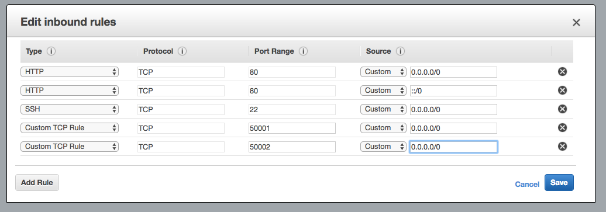

# Introduction to MQTT Websockets and Paho JS

Mosquitto supports both the connections from clients using the MQTT protocol as well as the [Websockets protocol](https://en.wikipedia.org/wiki/WebSocket).  Websockets allow you to open non-HTML network connections (sockets) with JavaScript.

## Enabling Websockets in Mosquitto

To take advantage of Mosquitto's Websockets support, we need to explicitly enable Websockets support.

To update the Mosquitto configuration to support websockets we will need to open up **/etc/mosquitto/conf.d/port.conf** and add the two lines at the end:

```
listener 50001

listener 50002
protocol websockets
```
This will keep the mosquitto service responding as it did on port `50001` with the MQTT protocol as well as responding on port `50002` for websockets connections.  Running the following command will show you the ports you have configured

Save and close the configuration file.  Mosquitto will need to be restarted for the changes to come into effect.

```
$cloud sudo service mosquitto restart
```
Run

```
$cloud netstat -a
```

which will rovide the the following type of output:

```
$cloud netstat -a
Active Internet connections (servers and established)
Proto Recv-Q Send-Q Local Address           Foreign Address         State
tcp        0      0 *:http                  *:*                     LISTEN
tcp        0      0 *:50001                 *:*                     LISTEN
tcp        0      0 *:50002                 *:*                     LISTEN
tcp        0      0 *:ssh                   *:*                     LISTEN
tcp        0      0 ip-172-31-19-10.ec2:ssh ip68-110-191-204.:41131 ESTABLISHED
tcp        0      0 ip-172-31-19-10.ec2:ssh ip68-110-191-204.:35470 ESTABLISHED
tcp        0      0 ip-172-31-19-10.e:50001 ip68-110-191-204.:46923 ESTABLISHED
tcp6       0      0 [::]:50001              [::]:*                  LISTEN
tcp6       0      0 [::]:ssh                [::]:*                  LISTEN
udp        0      0 *:bootpc                *:*

...
```

You can see that the EC2 instance is listening for `http` traffic (port 80), `ssh` (port 22), and now ports 50001 and 50002 (port numbers for well-known protocols, like `http` and `ssh`, just use the protocol name instead of listing the port number in `netstat`'s output).

### Allowing MQTT Websockets connections in EC2

We will need to modify our Security Group configuration to allow inbound connections to our new listener port `50002`.



## Installing Paho Python

Install Python `pip` on your EC2 instance.  We'll first remove any version already installed to make sure we get a recent version:

```bash
$cloud sudo apt-get purge python-pip python3-pip -y
$cloud sudo apt-get autoremove -y
```

Install `distutils` for `pip`

```bash
$cloud sudo apt-get install python3-distutils -y
```

Then we will install the most recent version:

```bash
$cloud sudo wget https://bootstrap.pypa.io/get-pip.py
$cloud sudo chmod +x get-pip.py
$cloud sudo python3 ./get-pip.py
```


Install Python Paho on your EC2 instance:

```bash
$cloud sudo pip install paho-mqtt
```

## A Simple Paho Python Test Service

Now that mosquitto has been set up to accept WebSocket connections, we can create a service to exercise the websockets connection.  This will validate our configurations and that our web page can receive and act on MQTT messages.

### Updating File Structure to add bin directory

Our test Paho python service will push notifications through the MQTT broker to test the WebSocket implementation of the web site.   Create a directory to facilitate this service.

```
$cloud cd ~/connected-devices/Web/static/test
$cloud sudo mkdir bin
```

The project should now have a file structure similar to the one outlined below.

```
$cloud: tree connected-devices/Web/static/test
connected-devices/Web/static/test
├── bin
├── css
│   └── site.css
├── images
├── js
│   └── page.js
└── test.html

4 directories, 3 files
```

Open a new document **Web/static/test/bin/service.py** and insert the following python code:

```python
#!/usr/bin/env python3

import paho.mqtt.client as mqtt
import json
import sys
import time


PORT = 50001

configuration = {}
client = mqtt.Client()

def on_connect(client, userdata, flags, rc):
    print( "... connected")

    print( "connection result: ")
    print( rc)


def on_disconnect(client, userdata, rc):
    print("... disconnected")


def go():
    i = 0
    while True:
        if i == sys.maxsize:
            i = 0

        message = json.dumps(configuration)
        print( "message: " + message)
        configuration['value'] = i
        client.publish("devices/foobar/label/changed",
                      payload = json.dumps(configuration))
        i += 1
        time.sleep(1)


if __name__ == "__main__":
    client.on_connect = on_connect
    print("... set connection listener")

    client.on_disconnect = on_disconnect
    print("... set disconnection listener")

    client.connect('localhost', port=PORT, keepalive=60)
    print( "... tried to connect")

    client.loop_start()
    print("... starting client loop")

    go()
```

Before we can run this script we need to make it executable:

```
$cloud sudo chmod +x Web/static/test/bin/service.py
```

Running the script with the following command:

```
$cloud ~/connected-devices/Web/static/test/bin/service.py
```

The script's output is verbose and should have a output like:

```
... set connection listener
... set disconnection listener
... tried to connect
... starting client loop
message: {}
... connected
connection result:
0
message: {"value": 0}
message: {"value": 1}
message: {"value": 2}
message: {"value": 3}
message: {"value": 4}
message: {"value": 5}
message: {"value": 6}
message: {"value": 7}
```

The Paho Python script will initialize and do the following things:

* define (dis)/connection handlers
* connect to the broker
* establish a client connection loop

Once the connection has been established the `go` function is called and will go into an infinite loop, enumerating over a number defined in the variable `i`.  This message will then be published on the `devices/foobar/label/changed` topic.   There will be a JSON payload that looks similar to:

```json
{
  "value" : 1234
}
```

Clients subscribing to this topic will be notified when it gets sent.

**example topic subscriptions**:

```
devices/+/label/changed
devices/+/label/+
```

## Paho JS

Paho has MQTT support for several languages, including JavaScript (with Websockets support).  Our Web interface will take advantage of that (if we did not have MQTT Websockets support in our browser, how else might we build the LAMPI UI for our browser?).

The library is available via a few sources, either to download and serve direcctly, or via a CDN.  We will use the CDN for convenience and fast page loading:

```html
<script src="https://cdnjs.cloudflare.com/ajax/libs/paho-mqtt/1.0.2/mqttws31.js" type="text/javascript"></script>
```

### Update HTML page
Open **connected-devices/Web/static/test/test.html** and update the following code:

```html
<!DOCTYPE html>
<html>
<head>
  ...
</head>
<body>
  ...

<script src="https://cdnjs.cloudflare.com/ajax/libs/paho-mqtt/1.0.2/mqttws31.js" type="text/javascript"></script>
 <script src="http://ajax.googleapis.com/ajax/libs/jquery/3.1.1/jquery.min.js" type="text/javascript"></script>
 <script src="/test/js/page.js" type="text/javascript"></script>
</body>
</html>
```

This will include the MQTT WebSockets library, making it available to use in your page.  Now we need to add an element where we can display the value of the messsages we will be receiving.  Add the following paragraph element to the sliders container as described below:

```html
<!DOCTYPE html>
<html>
<head>
  ...
</head>
<body>
  ...
  <div id="sliders">
    <input class="slider" type="range" min="0" max="100" step="1"></input>
      <p>websocket subscription value:
      <em><span id="sub_value"></span></em></p>
  </div>
  ...
</body>
</html>
```

Save and close.

### Update JavasScript to use MQTT

The JavaScript page object needs to be updated to integrate with the MQTT broker running on the EC2 instance.  We need to provide connection information and create a client.   The page can then open a connection and subscribe to topics it needs to receive.  In this example we will only be subscribing to the `devices/+/label/changed/` topic, but that is just for demonstration purposes.

Open **connected-devices/Web/static/test/js/page.js**

```js
function TestPage($) {
  const hostAddress = "FILL IN YOUR EC2 INSTANCE DNS HERE";
  const hostPort = "50002";
  const clientId = Math.random() + "_web_client";
  const deviceId = "TEST";

  var configurationState = {};
  console.log(clientId);
  var client = new Paho.MQTT.Client(hostAddress, Number(hostPort), clientId);
  var updateTimer = null;
  var isPowered = false;


  obj = {

    ...

  };
  obj.init();
  return obj;
}

jQuery(TestPage);
```

This will provide us with the information needed to establish a connection with our service:

* `hostAddress` - the  location of the EC2 instance the script will be connecting to - FILL IT IN APPROPRIATELY
* `client` - the MQTT client object for managing the connection as well as publishing or subscribing to messages
* `clientId` - required by MQTT - the Python Paho library has been automatically creating one for you so far - and it must be unique - here we are creating a random string with `Math.random()`.

Now that the connection details have been added, the Page can define the connection logic to subscribe to the topic.

```js
function TestPage($) {

  ...

  obj = {

    ...
    sendConfigChange : function() {
      configJson = JSON.stringify(configurationState);
      message = new Paho.MQTT.Message(configJson);
      message.destinationName = "devices/" + deviceId + "/test/poke_value";
      client.send(message);
    },

    scheduleConfigChange : function() {
      function onTimeout() {
        updateTimer = null;
        obj.sendConfigChange();
      }

      if(updateTimer == null) {
        updateTimer = setTimeout(onTimeout, 100);
      }
    },

    connect : function() {
      client.connect({
            onSuccess:obj.onConnect,
            onFailure:obj.onFailure,
        });
    },

    onFailure : function(response) {
      console.log(response);
    },

    onConnect : function(response) {
      client.subscribe("devices/+/label/changed");
    },

    onConnectionLost : function(responseObject) {
      if (responseObject.errorCode !== 0) {
          console.log("onConnectionLost:"+responseObject.errorMessage);
          obj.connect();
      }
    },

    onMessageArrived : function(message) {
      console.log(message);
      console.log(message.payloadString);
      configurationState = JSON.parse(message.payloadString);
      console.log(configurationState);
      obj.updateUI();
      },

    updateUI : function() {
      $("#sub_value").html(configurationState.value);
    },

    init : function() {
      client.onConnectionLost = obj.onConnectionLost;
      client.onMessageArrived = obj.onMessageArrived;
      obj.connect();

      $("#power").on("click", obj.togglePower);
      $( ".slider" ).on( "change input", obj.onSliderChangedEvent);
    },

  };
  obj.init();
  return obj;
}

jQuery(TestPage);
```

Modify the `togglePower` function to call the `sendConfigChange` function like so:

```js
    togglePower : function() {
      console.log('.... toggling power');
      if (isPowered)
        obj.powerOff();
      else
        obj.powerOn();
      obj.sendConfigChange();
    },

```

Save and close.

The page has now been updated to use MQTT.  

1. The `init` method has been updated to set an `onConnectionLost` and `onMessageArrived` listeners to manage connection problems and to delegate message subscription events.  Once these event listeners have been configured it is safe to call the `connect` method.  This will open a websocket connection to the EC2 instance.  Once a connection is established the `onConnect` method will be invoked.  This method will then tell the client to subscribe to the message it needs to update the UI with.  In the event that the connection is lost the `onConnectionLost` method will be called.   This will simply log the reason then reconnect.

1. When the `onMessageArrived` method is invoked, it will parse the payloadString and update the configuration state object reference.  It will then update the UI with the new value it received

1. When the Power Button is pressed, it will publish an MQTT message with the current power state.

## Conclusion

To see it all working togeather open two ssh sessions to the EC2 instance.  

In the first run:

```
$cloud mosquitto_sub -v -p 50001 -t devices/\#
```

This will print out the messages going through the broker.


In the other session run:

```
$cloud connected-devices/Web/static/test/bin/service.py
```

Load the page that was just updated in a browser.  

The label below the slider should be updating with the numbers that the Python script is sending.

When the Power Button is pressed, you should see an MQTT message published in the `devices/` topic hierarchy.

To summarize, we created a test service in Python to periodically publish messages to an MQTT topic.  We created a static web page with Javascript that subscribes to an MQTT topic and modifies the page based on the messages received, and can publish MQTT messages in response to user triggered events on the page..


Next up: [Assignment - Controlling Lampi from a Web UI](../05.6_Assignment/README.md)

&copy; 2015-2020 LeanDog, Inc. and Nick Barendt
