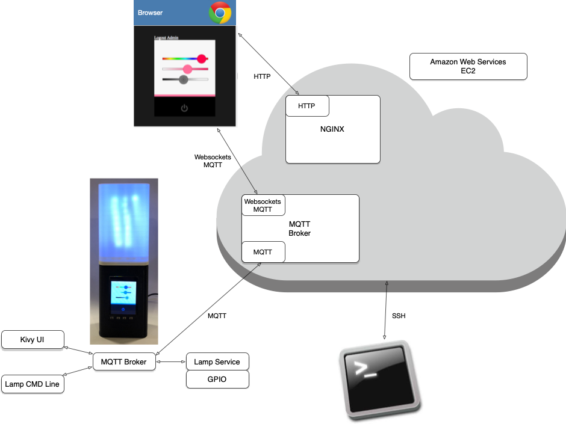
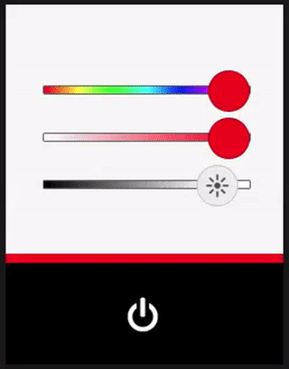

# Assignment - Controlling Lampi from a Web UI

In this assignment, you will build a Websockets based Web UI to tie into your MQTT infrastructure and control the lamp, and display the current lamp state.  This UI will replicate the UI of the touchscreen Kivy application.

The overall system architecture will look like this:



When finished, your application should look like:



(**Note:** the color of the power button **does not need** to reflect the current hue & saturation selections, like it had to for the Kivy UI.)

Supporting multiple browsers would be great, but your site should work properly in a recent version of at least one of:  

* Chrome
* Safari
* Firefox

Please use JQuery and Paho JS.

Your solution should reside within the **connected-devices/Web/static** directory, with a layout like:

```
$cloud tree connected-devices/Web/static
connected-devices/Web/static
├── css
│   ├── lampi-sliders.css
│   └── site.css
├── images
│   ├── brightness_icon_dark.png
│   ├── brightness_icon_dark_small.png
│   ├── brightness_icon_light.png
│   ├── brightness_icon_light_small.png
│   ├── power_icon_dark.png
│   └── power_icon_light.png
├── index.html
└── js
    ├── lampi.js
    ├── lampi-sliders.js
    └── tinycolor.js
```

The needed images are in the **connected-devices/Web/static/images** directory.

The following are provided in the repo:

* **connected-devices/Web/static/index.html** contains the HTML needed
* **connected-devices/Web/static/css** contains **lampi-sliders.css** (for the gradient sliders) and **site.css**
* **connected-devices/Web/static/images** contains the required images
* **connected-devices/Web/static/js** contains **lampi-sliders.css** (for the gradient sliders) and [tinycolor.js](https://github.com/bgrins/TinyColor) which you will likely find useful

Your main JavaScript file should be named **lampi.js** and reside in **connected-devices/Web/static/js**.

Creating your **lampi.js** file is the main goal of this assignment.

**NOTE:  You only need to control a single lamp for this Assignment - it is OK to hard code the lamp DeviceID in the JS code**


# What to turn in

You need to turn in the following:

1. A short (a few sentences) write up from each member of the pair summarizing what they learned completing the assignment, and one thing that surprised them (good, bad, or just surprising).  This should be in **connected-devices/writeup.md** in [Markdown](https://daringfireball.net/projects/markdown/) format.  You can find a template file in **connected-devices/template\_writeup.md**
2. A Git Pull Request
3. A short video demonstrating the required behaviors emailed to the instructor and TA.  The video should be named **[assignment 3]_[LAST_NAME_1]\_[LAST_NAME_2].[video format]**.  So, for this assignment, if your pair's last names are "Smith" and "Jones" and you record a .MOV, you would email a file named ```2_smith_jones.mov``` to the instructor.
4. A live demo at the beginning of the next class - **be prepared!**

Notes:

* All Python code should be formatted to conform to PEP8 standards. See [PEP8 documentation](https://pypi.python.org/pypi/pep8) for more info.
* the video and in-class demo should show:
    * changing the Web UI and demonstrating that the lamp and Kivy touchscreen application change accordingly
    * changing the Kivy touchscreen application and demonstrating that the lamp and Web UI change accordingly
    * please show changes to all 4 widgets in both videos:  hue, saturation, brightness, and on/off

&copy; 2015-2020 LeanDog, Inc. and Nick Barendt
