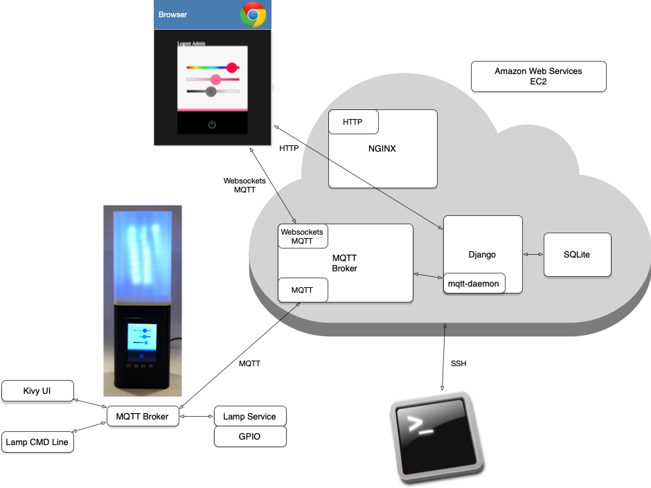
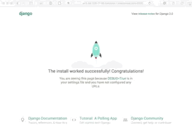

# Introduction to Web Frameworks

## Where we are going

We are going to take the solution from the last chapter and wrap it in a web framework:



## Web Frameworks

Web Frameworks, like [Python Django](https://www.djangoproject.com/) and [Ruby on Rails](http://rubyonrails.org/), are designed to solve common web development problems and make web development easier and more productive.  They allow dynamic web content - content that is created on-the-fly (as opposed to static content - files on disk).  Also, the Web Framework often behaves as the web server - responding to incoming HTTP requests and generating HTTP responses.

While they vary in how they work, many Web Frameworks support a [Model-View-Controller (MVC)](https://en.wikipedia.org/wiki/Model%E2%80%93view%E2%80%93controller) pattern, and generally provide some or all of the following features:

* *HTTP Request/Response* - handle protocol level communications details
* *URL Dispatch* - invoke particular software functions/classes based on the URL the web server receives
* *User Authentication* - login, logout, salted and hashed passwords, permissions, groups, etc.
* *Session Management* - continuity of some state across more than one HTTP transaction (e.g., cookies)
* *Templating* - generating HTML (or other textual formats, like XML or JSON) from a template file with variable substitution
* *Object-Relational Mapping (ORM)* - providing an object-oriented interface to a database (often SQL); this is also known as the [Active Record ](https://en.wikipedia.org/wiki/Active_record_pattern) design pattern; they also often provide protection against [SQL-injection attacks](https://en.wikipedia.org/wiki/SQL_injection) - see also the [W3Schools SQL injection section](https://www.w3schools.com/sql/sql_injection.asp)
* *Database Versioning/Migrations* - putting the database schema itself under version control and supporting "upgrading" and "downgrading" the database to match the current version of the application code (and ORM)

Each framework has idiosyncrasies.  After learning one framework and how it works, though, learning additional frameworks is easier.

We will be using Python's [Django](https://www.djangoproject.com/) framework for the course.

## Introduction to Django


[Django](https://www.djangoproject.com/) has a very well crafted Getting Started Tutorial that we will use as our introduction.

> **COMPATIBILITY:** Currently the Django Tutorial is for Django version 2.2.10
> **COMPATIBILITY:** Ubuntu 18.04 comes with Python 3.6.7

Please follow along with the Django Getting Started Tutorial, with the following notes, by section, on your EC2 instance.  

**PLEASE ACTUALLY FOLLOW THE TUTORIAL, BELOW STEP-BY-STEP.**  Doing so will prepare you for the assignment.

Build the tutorial project in a directory that will not cause you issues or confusion later (e.g., not in your Git repo).

The Django Tutorial has seven parts.  Read the notes below for each part **before** doing that section of the tutorial.

1. [Writing your first Django app](https://docs.djangoproject.com/en/2.2/intro/tutorial01/)

    * [Install Django](https://docs.djangoproject.com/en/2.2/topics/install/#installing-official-release) on EC2 with [pip](https://docs.djangoproject.com/en/2.2/topics/install/#installing-an-official-release-with-pip)

    ```
    sudo pip3 install django==2.2.10
    ```

    * **Note on Python 2 vs 3:**  when the tutorial indicates running the `python` command, instead use `python3`; Python 3.x is not backward compatible with Python 2.x (see [Python 2 vs Python 3](https://wiki.python.org/moin/Python2orPython3))
    * When working through the tutorial, when the URL in the tutorial is something like `http://127.0.0.1:8000` you should use your EC2 hostname instead of `127.0.0.1` in your browser (e.g., `http://<your ec2 hostname>:8000`).
    * Do not forget to open up port 8000 in your EC2 Security Group.
    * When starting the Django development server, do the following:
        * Add your EC2 Public hostname as a string in the **ALLOWED_HOSTS** list in**mysite/settings.py**
        * Listen on all Public IPs by invoking the server with `python3 manage.py runserver 0:8000`
    * When reading the tutorial, pay attention to the difference between a **Django Project** and a **Django App**.
    <br/>


2. [Databases, Models, and Migrations](https://docs.djangoproject.com/en/2.2/intro/tutorial02/)
    * While a high performance SQL server is invaluable, for the course stick to the [SQLite datbase](https://www.sqlite.org/).  Support for it is built into Python, making it trivial to use.   (You might also be curious to learn about [how widely deployed SQLite is](https://www.sqlite.org/mostdeployed.html) - the numbers are eye popping).
    * You might want to install the SQLite command-line interface `sudo apt-get install -y sqlite` (not necessary, but might be useful).
    * Make sure you understand how Primary Keys `pk` are used in Models and in queries.
  
3. [Views and Templates](https://docs.djangoproject.com/en/2.2/intro/tutorial03/)
    * Make sure you understand the URL pattern configuration and the simple regular expressions used for them.
    * Make sure you understand _Template namespacing_.  The pattern is repeated for other Django components (e.g., static files).
    * _URL namespacing_ is equally important, but different.
    
4. [Forms, POST, and Generic Views](https://docs.djangoproject.com/en/2.2/intro/tutorial04/)
    * Make sure you understand Form POST and `request.POST` and how to write code to handle POSTs..
    * Make sure you understand the basics of Generic Views.
    
5. [Automated Testing](https://docs.djangoproject.com/en/2.2/intro/tutorial05/)
    * You can **skip** this section.  Automated testing is *amazing* and you should do it, but it is beyond the scope of this course.

6. [Static Content](https://docs.djangoproject.com/en/2.2/intro/tutorial06/)
    * Make sure you understand where static files should reside within your project files (more namespacing), and how to reference them within your template files.
 
7. [Customizing the Admin Form](https://docs.djangoproject.com/en/2.2/intro/tutorial07/)
    * Make sure you understand how to add a Model to the Admin interface.

(There is no need to go to the "Advanced tutorial" that is linked to at the end of Part 7.)


Next up: go to [Creating our Django Project and App](../06.2_Creating_our_Django_Project_and_App/README.md)

&copy; 2015-2020 LeanDog, Inc. and Nick Barendt
