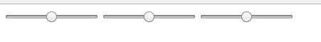

# Creating our Django Project and App

## Where we're going

We are going to build a functional, albeit minimal, Django site and application to authenticate users and allow them to remotely control their LAMPI's.

The Assignment is to build this site and application.  There are several ways to tackle this - we will start with what we have working (static pages served by 'nginx' from the previous chapter) and incrementally transform that into database-backed web site.

## Checking out the repository

Make sure you have the latest version of the Git repository checked out into the EC2 `ubuntu` user's home directory named `connected-devices`.

## Creating our Django Project

In the `connected-devices/Web` directory create our Django project named `lampisite`.

```
$cloud cd ~/connected-devices/Web
$cloud django-admin startproject lampisite
```

This will create a few files:

```
$cloud tree lampisite/
lampisite/
├── lampisite
│   ├── __init__.py
│   ├── settings.py
│   ├── urls.py
│   └── wsgi.py
└── manage.py
```

## Creating our Django Application (App)

In the `connected-devices\Web\lampisite` directory create our Django app named `lampi`.

```
$cloud cd ~/connected-devices/Web/lampisite
$cloud python3 manage.py startapp lampi
```

This will create a few more files:

```
$cloud tree lampisite/
lampisite/
├── lampi
│   ├── admin.py
│   ├── apps.py
│   ├── __init__.py
│   ├── migrations
│   │   └── __init__.py
│   ├── models.py
│   ├── tests.py
│   └── views.py
├── lampisite
│   ├── __init__.py
│   ├── __init__.pyc
│   ├── settings.py
│   ├── settings.pyc
│   ├── urls.py
│   └── wsgi.py
└── manage.py
```

Our projecti (site) `lampisite` will contain just one app, `lampi` (plus we will use some of the built-in Django apps).

## Add our App to the Project

Just as you did in the Django Tutorial, create a simple view in our app by modifying `lampi/views.py`:

```python
from django.shortcuts import render
from django.http import HttpResponse

# Create your views here.

def index(request):
    return HttpResponse("Hello, world!")

```

and create a `urls.py` file in the `lampi` app, `lampi/urls.py`:

```python
from django.urls import path

from . import views

urlpatterns = [
    path('', views.index, name='index'),
]
```

and update `lampisite/urls.py` to 'include' `lampi.urls` with a path of `'lampi/'` and at the path `''`, and the Django Admin at a path of `'admin/'`:

```python
from django.contrib import admin
from django.urls import path, include

urlpatterns = [
    path('lampi/', include('lampi.urls')),
    path('admin/', admin.site.urls),
    path('', include('lampi.urls')),
]
```

Add `lampi` to the `INSTALLED_APPS` list in `settings.py`.

(This all follows the patterns in Part 1 of Django Tutorial).

## Test Basic Operation

Run the migrations:

```
$cloud python3 manage.py migrate
```

Go ahead and run the Django development server:

```
$cloud python3 manage.py runserver 0:8000
```

and point your browser at your EC2 instance at port 8000 at the '/lampi/' URL (e.g., something like 'http://ec2-34-199-57-78.compute-1.amazonaws.com:8000/lampi/').

You almost certainly will get an error about `DisallowedHost`.  Fix that by modifying your `settings.py` file as per the Django Tutorial (hint: `ALLOWED_HOSTS`).

Do not move on until your browser is displaying `Hello, world!`.

## Serving Static Files

Make a `static` directory inside your `lampi` app directory, and a `lampi` directory inside that.  Then create subdirectories for `css`, `images`, and `js`.

```
$cloud tree lampi
lampi
├── admin.py
├── apps.py
├── __init__.py
├── __init__.pyc
├── migrations
│   └── __init__.py
├── models.py
├── static
│   └── lampi
│       ├── css
│       ├── images
│       └── js
├── tests.py
├── urls.py
├── urls.pyc
├── views.py
└── views.pyc
```

Make a `templates` directory inside your `lampi` app directory, and a `lampi` directory inside that.

```
tree lampi
lampi
├── admin.py
├── apps.py
├── __init__.py
├── __init__.pyc
├── migrations
│   └── __init__.py
├── models.py
├── static
│   └── lampi
│       ├── css
│       ├── images
│       └── js
├── templates
│   └── lampi
├── tests.py
├── urls.py
├── urls.pyc
├── views.py
└── views.pyc
```

Copy all of the files from `~/connected-devices/Web/static` `css`, `images`, and `js` into their matching directory in `~/connected-devices/Web/lampisite/lampi/static/lampi`.

Copy the `index.html` from `~/connected-devices/Web/static` to `~/connected-devices/Web/lampisite/lampi/templates/lampi/`

Your project directory should look like this:

```
tree
.
├── db.sqlite3
├── lampi
│   ├── admin.py
│   ├── admin.pyc
│   ├── apps.py
│   ├── apps.pyc
│   ├── __init__.py
│   ├── __init__.pyc
│   ├── migrations
│   │   ├── __init__.py
│   │   └── __init__.pyc
│   ├── models.py
│   ├── models.pyc
│   ├── static
│   │   └── lampi
│   │       ├── css
│   │       │   ├── lampi-sliders.css
│   │       │   └── site.css
│   │       ├── images
│   │       │   ├── brightness_icon_dark.png
│   │       │   ├── brightness_icon_dark_small.png
│   │       │   ├── brightness_icon_light.png
│   │       │   ├── brightness_icon_light_small.png
│   │       │   ├── power_icon_dark.png
│   │       │   └── power_icon_light.png
│   │       └── js
│   │           ├── lampi.js
│   │           ├── lampi-sliders.js
│   │           ├── mqttws31.js
│   │           └── tinycolor.js
│   ├── templates
│   │   └── lampi
│   │       └── index.html
│   ├── tests.py
│   ├── urls.py
│   ├── urls.pyc
│   ├── views.py
│   └── views.pyc
├── lampisite
│   ├── __init__.py
│   ├── __init__.pyc
│   ├── settings.py
│   ├── settings.pyc
│   ├── urls.py
│   ├── urls.pyc
│   ├── wsgi.py
│   └── wsgi.pyc
└── manage.py
```

Modify `lampi/static/lampi/js/lampi.js` to set your Device ID at the top of the file in `deviceId`.

Modify your `lampi/views.py` file to serve up the `index.html` file:

```python
from django.shortcuts import render
from django.http import HttpResponse

# Create your views here.

def index(request):
    return render(request, 'lampi/index.html')
```

You should get three unstyled sliders in your browser:



and a bunch of 404 errors for `css`, `images`, and `js` files in your web browser developer interface..

Modify `index.html` to use the Django `static` support within templates to load the needed files (`css`, `images`, and `js`) from the proper location (just as in [Part 6 of the Django Tutorial](https://docs.djangoproject.com/en/2.2/intro/tutorial06/)).

Do not move forward until you have a working Web UI interacting with your LAMPI device, served up by Django.


Next up: go to [06.3 Building a Consistent Looking Site with Templates](../06.3_Building_a_Consistent_Looking_Site_with_Templates/README.md)

&copy; 2015-2020 LeanDog, Inc. and Nick Barendt
