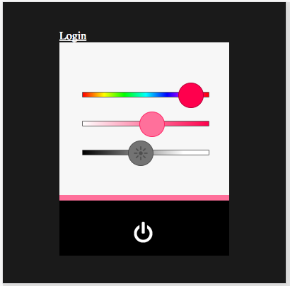
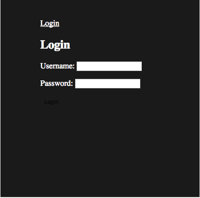
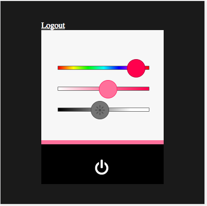
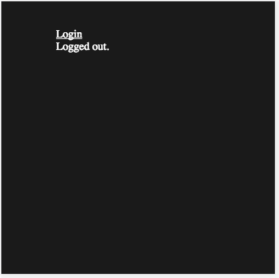
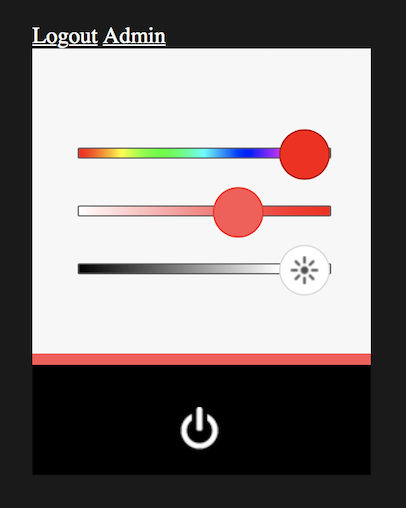
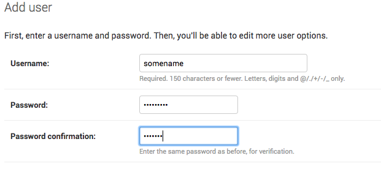

# Building a Consistent Looking Site with Templates 

We will create a base template with the common structure we want for all of our web pages.  Our web page templates will extend that base template.

Review the [Django Template Language](https://docs.djangoproject.com/en/2.2/ref/templates/language/) and [Django Template Inheritance](https://docs.djangoproject.com/en/2.2/ref/templates/language/#template-inheritance).

## Base Template

Create a file `Web/lampisite/lampi/templates/lampi/base.html` with the following contents:

```

<!DOCTYPE html>
<html>
<head>
  <title>LAMPI</title>

  <meta charset="utf-8">
  <meta name="viewport" content="user-scalable=no, initial-scale=1, maximum-scale=1, minimum-scale=1, width=device-width">

  <link rel="stylesheet" type="text/css" href=""/>

    
    

</head>
<body>
    <div id="outer-pane" class="centered-root">
        
        <p>Content Goes Here.</p>
        
    </div>
</body>
</html>
```

Now modify your `index.html` template to extend `base.html`.

You will want to include blocks for `title`, `additional_head_content` and `content`.  Your file will start with:

```



LAMPI



...
```

Make sure your `index.html` template is extending `base.html` and is working as expected before continuing.

## Modifying the Base Template and Supporting Authentication

We are going to start taking advantage of [Django's Authentication System](https://docs.djangoproject.com/en/2.2/topics/auth/default/).

Django's Authentication system handles common scenarios for authentication (a user proves who they say they are with a secret - their password) and authorization (permissions for what actions a user or group of users can take).

We will start by modifying our `base.html` template to include `Login` and `Logout` links, depending on whether a user has authenticated, or not.

Insert the following into `base.html` immediately after the `<div>` tag with the `id` of "outer-pane":

```
        <div>
            
               <a href="">Logout</a>
            
               <a href="">Login</a>
            
        </div>
```

Test your site.  You should receive a `NoReverseMatch` exception because the  the `logout` and `login` URLs have not been defined.

We can use the [built-ins provided by Django](https://docs.djangoproject.com/en/2.2/topics/auth/default/#module-django.contrib.auth.views).  

Using the [example](https://docs.djangoproject.com/en/2.2/topics/auth/default/#django.contrib.auth.login) with `from django.contrib.auth import views as auth_views` modify `lampisite/urls.py` to add URL patterns for:

* `login`, with a path of `login` using the LoginView and a name of `login`
* `logout`, with a path of `logout` using the LogoutView and a name of `logout`

Test your `index.html`. 

You should see a `Login` link (although its color is almost certainly not ideal - modify `site.css` to make links white (see [this](https://www.w3schools.com/css/css_link.asp)); **Note:** you might need to force your browser to refresh as it might be caching CSS by default).



After you fix the link color, try clicking on the `Login` link.  You will get an `TemplateDoesNotExist` exception.  We will override the default template for `login` and `logout` - modify `lampisite/urls.py` to specify [template_name](https://docs.djangoproject.com/en/2.2/topics/auth/default/#module-django.contrib.auth.views) for:

* `login` should use a template_name of `lampi/login.html`
* `logout` should use a template_name of `lampi/logout.html`

Test your `index.html` `Login` link again - you should get the same `TemplateDoesNotExist` exception, but a different template file.  Let's create the template file `lampi/templates/lampi/login.html`:


```


Login


  <h2>Login</h2>
  <form method="post">
    
    {{ form.as_p }}
    <button type="submit">Login</button>
  </form>

```

This is our first Form - the Django Auth view automatically provides a form for us (available in the `form` variable).  We need to include the `` to help prevent [Cross Site Request Forgery](https://docs.djangoproject.com/en/2.2/ref/csrf/).

The form specifies an HTTP method of `POST` and includes a submit button.

Test your `index.html` `Login` link again.  It should work, but, like the links, the text color is probably a bad choice.  Use your browser's debug tools to inspect the elements on the page and determine what types of HTML elements are being used.  Then modify your `site.css` file to make those elements white.



### Create a Django superuser

If you haven't, create a Django superuser named `admin` with a password of `iot12345` and an email address of your choice (we should not need email):

```
$cloud python3 manage.py createsuperuser
```

## Login

Test your `index.html` `Login` link again.  Login with the superuser account.

You should get a `Page not found` 404 error.  By default, Django will redirect users to a particular page after they authenticate (`accounts/profile/`).  We want users to be redirected to our `index.html` file.

Modify `lampisite/settings.py` by adding the following two settings at the end of the file:

```
LOGIN_REDIRECT_URL =  '/'
LOGIN_URL = 'login'
```

Test your `index.html`.  You should see the `Logout` link:



Test the `Logout` link.  You will find that we are missing the `logout` template.  Let's create that.  Create a `lampi/templates/lampi/logout.html` file.  It should extend the `base.html` file, with `title` and `content` blocks, and look like this:



Test `Login` and `Logout`.  

Continue testing `Login` and `Logout` until you are satisfied that they are behaving appopriately (no exceptions, no 404 errors, etc.)

## Adding Admin

It would be nice to easily get to the Admin interface.  Modify `base.html` to include a link to `admin:index` when the user is authenticated and is [a superuser](https://docs.djangoproject.com/en/2.2/ref/contrib/auth/#django.contrib.auth.models.User.is_superuser).

Verify that this works.



**NOTE:** While it would be nice to make the styling of the Django Admin match our LAMPI site, that's beyond our scope.  Jumping back and forth is a admittedly a little jarring.  You can always go to the `/` page to get back to the LAMPI site.

In the Admin interface, create a User with whatever username and password you want - create a normal user (not superuser).  



Logout.  Then Login with that new user and verify that the `Admin` link does not appear on our LAMPI site..


Next up: go to [06.4 Building a Database Model](../06.4_Building_a_Database_Model/README.md)

&copy; 2015-2020 LeanDog, Inc. and Nick Barendt
