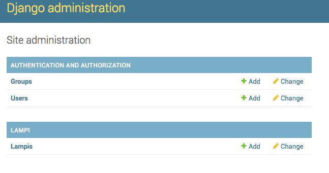
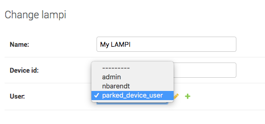
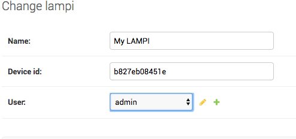

# Building a Database Model

We will create a database model for LAMPI and associate LAMPI devices with individual users.

## Creating a LAMPI Databse Model

We will use Django's ORM to create a Model and update our database schema.

Edit **lampi/models.py** and create a model class named `Lampi` with the following fields:

* `name` which is a [CharField](https://docs.djangoproject.com/en/2.2/ref/models/fields/#django.db.models.CharField) with a maximum length of 50 and a [default](https://docs.djangoproject.com/en/2.2/ref/models/fields/#default) value of `My LAMPI` - this is a friendly name for a LAMPI device
* `device_id` which is a [CharField](https://docs.djangoproject.com/en/2.2/ref/models/fields/#default) with a maximum lengthof 12, and designate it as the [primary key](https://docs.djangoproject.com/en/2.2/ref/models/fields/#primary-key) - this is the Device ID we have used before (`eth0` MAC Address) and will be unique and non-null, making it an ideal primary key
* `user` which is a [ForeignKey](https://docs.djangoproject.com/en/2.2/ref/models/fields/#foreignkey) to the [User](https://docs.djangoproject.com/en/2.2/ref/contrib/auth/#django.contrib.auth.models.User) built-in Django Auth model
* `created_at` which is a [DateTimeField](https://docs.djangoproject.com/en/2.2/ref/models/fields/#datetimefield) that automatically set the time to "now" when created

The `user` field is a [ForeignKey](https://docs.djangoproject.com/en/2.2/ref/models/fields/#foreignkey).  Django 2.2 requires an [`on_delete`](https://docs.djangoproject.com/en/2.2/ref/models/fields/#django.db.models.ForeignKey.on_delete) property on ForeignKey fields to define what should happen if/when the object the ForeignKey references is deleted.  In our chase, what should happen to a LAMPI object if the User associated with it is ever deleted from the database?  A reasonable behavior in this situation (and that we will use later) is that the LAMPI should be attached to a default, system User object (sometimes referred to as a "sentinel" object).  Add the following to your **lampi/models.py**:

```python
DEFAULT_USER = 'parked_device_user'

def get_parked_user():
    return get_user_model().objects.get_or_create(username=DEFAULT_USER)[0]
```

and define your `user` field like so:

```python
user = models.ForeignKey(User,
    on_delete=models.SET(get_parked_user))
``` 

Add a `__str__` method to your `Lampi` model class for easier debugging, like so:

```python
    def __str__(self):
        return "{}: {}".format(self.device_id, self.name)
```

When a `Lampi` model object is displayed (e.g., in a 'print()' function), that function will be called, rendering a slightly friendlier representation.

## Updating the Database

After saving your `lampi/models.py` file, you will need to run the migrations needed to update the database:

```
$cloud python3 manage.py makemigrations
$cloud python3 manage.py migrate
```

## Automatically Creating LAMPI Database Records

We can create a background process that monitors for LAMPI device MQTT broker connections and creates a new `Lampi` whenever it detects a new device.

We can build such a background process a few different ways - since it needs the full Django environment ('lampisite' project, 'lampi' app, **settings.py** to get to the proper database, etc.), we can build a small [command extension for the Django 'manage.py'](https://docs.djangoproject.com/en/2.2/howto/custom-management-commands/).

Install the Python Paho library:

```
$cloud sudo pip install paho-mqtt
```

Create a directory to hold our custom commands where Django will automaticall locate it:

```
$cloud mkdir -p lampi/management/commands
```

Then, create an empty **\_\_init\_\_.py** in 'management' and 'commands' directories:

```
$cloud touch lampi/management/__init__.py
$cloud touch lampi/management/commands/__init__.py
```

Create a file in that directory named **mqtt-daemon.py** and fill in the missing sections noted with comments for `_create_default_user_if_needed` and `_device_broker_status_change`:

```python
import re
import json
from paho.mqtt.client import Client
from django.contrib.auth.models import User
from django.core.management.base import BaseCommand
from lampi.models import *

DEFAULT_USER = 'parked_device_user'

MQTT_BROKER_RE_PATTERN = (r'\$sys\/broker\/connection\/'
                          r'(?P<device_id>[0-9a-f]*)_broker/state')


def device_association_topic(device_id):
    return 'devices/{}/lamp/associated'.format(device_id)

def get_device_id_from_broker_topic(topic):
    results = re.search(MQTT_BROKER_RE_PATTERN, topic.lower())
    return results.group('device_id')


class Command(BaseCommand):
    help = 'Long-running Daemon Process to Integrate MQTT Messages with Django'

    def _create_default_user_if_needed(self):
        # make sure the user account exists that holds all new devices
        try:
            # FILL THIS IN 
        except User.DoesNotExist:
            # FILL THIS IN - DO NOT FORGET TO SAVE THE MODEL OBJECT
            print("Created user {} to own new LAMPI devices".format(
                DEFAULT_USER))
 
    def _on_connect(self, client, userdata, flags, rc):
        self.client.message_callback_add('$SYS/broker/connection/+/state',
                                         self._device_broker_status_change)
        self.client.subscribe('$SYS/broker/connection/+/state')

    def _create_mqtt_client_and_loop_forever(self):
        self.client = Client()
        self.client.on_connect = self._on_connect
        self.client.connect('localhost', port=50001)
        self.client.loop_forever()

    def _device_broker_status_change(self, client, userdata, message):
        print("RECV: '{}' on '{}'".format(message.payload, message.topic))
        # message payload has to treated as type "bytes" in Python 3
        if message.payload == b'1':
            # broker connected
            device_id = get_device_id_from_broker_topic(message.topic)
            try:
                # FILL THIS IN 
                print("Found {}".format(device))
            except Lampi.DoesNotExist:
                # FILL THIS IN - DO NOT FORGET TO SAVE THE MODEL OBJECT
                print("Created {}".format(new_device))

    def handle(self, *args, **options):
        self._create_default_user_if_needed()
        self._create_mqtt_client_and_loop_forever()

``` 

Save the file and run `python3 manage.py --help` you should see output like this, indicating that your command has been found (under '[lampi]'):

```
Available subcommands:

[auth]
    changepassword
    createsuperuser

[django]
    check
    compilemessages
    createcachetable
    dbshell
    diffsettings
    dumpdata
    flush
    inspectdb
    loaddata
    makemessages
    makemigrations
    migrate
    sendtestemail
    shell
    showmigrations
    sqlflush
    sqlmigrate
    sqlsequencereset
    squashmigrations
    startapp
    startproject
    test
    testserver

[lampi]
    mqtt-daemon

[sessions]
    clearsessions

[staticfiles]
    collectstatic
    findstatic
    runserver
```

Make sure at least one of your LAMPI devices is running and connected to your EC2 instance's MQTT broker, and then run the service:

```
$cloud python3 manage.py mqtt-daemon
```

You should immediately see it creating the default user to own new devices and discovering your LAMPI device(s), something like the following:

```
Created user parked_device_user to own new LAMPI devices
RECV: '1' on '$SYS/broker/connection/b827eb08451e_broker/state'
Created b827eb08451e: My LAMPI
```

The default user will only be created the first time the service is run.

You can use the Django shell to easily look at the database state:

```
$cloud python3 manage.py shell
Python 2.7.12 (default, Nov 19 2016, 06:48:10)
[GCC 5.4.0 20160609] on linux2
Type "help", "copyright", "credits" or "license" for more information.
(InteractiveConsole)
>>> from lampi.models import Lampi
>>> Lampi.objects.get()
<Lampi: b827eb08451e: My LAMPI>
```

## Using Supervisor to Run the Background MQTT Daemon Process

Install Supervisor

```
$cloud sudo apt-get install -y supervisor
```

Configure Supervisor to autostart and autorestart our `mqtt-daemon` process.

Refer to our [previous section on Supervisor](../04.06_Supervisord/README.md)

## Extending the Django Admin

We need to tell the Django Admin that it should support our new `Lampi` model.  
Modify `lampi/admin.py` to register `Lampi` with the ['admin.site.register` function](https://docs.djangoproject.com/en/2.2/ref/contrib/admin/#modeladmin-objects) as in Part 7 of the Django Tutorial.

Log into the Admin interface and verify that you can see the `Lampi` model:



Using the Admin interface, change the User for the LAMPI devices to the 'admin' user:





Do not forget to Save the change.  You can quickly check the database:

```
$cloud python3 manage.py shell
>>> from lampi.models import Lampi
>>> for l in Lampi.objects.all():
...   print("{} user:{}".format(l, l.user))
...
b827eb08451e: My LAMPI user:admin

>>> from django.contrib.auth.models import User
>>> for u in User.objects.all():
...   for l in u.lampi_set.all():
...     print("{}->{}".format(u,l))
...
admin->b827eb08451e: My LAMPI
```

You can see the many-to-one relationship of `Lampi`'s to `User`'s with the `lampi_set`


Next up: go to [06.5 Updating our Web Pages to use the Database](../06.5_Updating_our_Web_Pages_to_use_the_Database/README.md)

&copy; 2015-2020 LeanDog, Inc. and Nick Barendt
