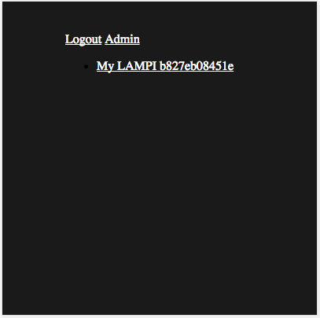
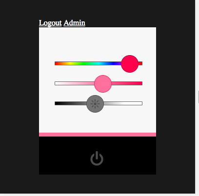

# Updating our Web Pages to use Database

Our Database now contains records for LAMPI devices that have connected to the system.  We need to remove hard-coded values, expectations for only a single LAMPI, etc., as well as wrap our views with authentication.

## Changing to Django Generic Views

Just as in Part 4 of the Django Tutorial, we will change over to using [Generic Views](https://docs.djangoproject.com/en/2.2/intro/tutorial04/#use-generic-views-less-code-is-better).

Start by modifying **lampi/views.py**:

* remove the 'index()' function
* create an 'IndexView' class that inherits from both [LoginRequiredMixin](https://docs.djangoproject.com/en/2.2/topics/auth/default/#the-loginrequired-mixin) and [TemplateView](https://docs.djangoproject.com/en/2.2/ref/class-based-views/base/#templateview)
* specify the 'template_name' as **lampi/index.html**

The [LoginRequiredMixin](https://docs.djangoproject.com/en/2.2/topics/auth/default/#the-loginrequired-mixin) will redirect non-authenticated requests to the `login` URL:

> If a view is using this mixin, all requests by non-authenticated users will be redirected to the login page or shown an HTTP 403 Forbidden error, depending on the raise_exception parameter.

Update **lampi/urls.py** to reflect the change to Generic Views (just as in the Django Tutorial).

## Dealing with 0 or more LAMPIs

When a User connects, they may have zero, one, or more than one LAMPI.  We need to modify our pages to reflect this.

Our current **index.html** file is really a detail view - it only makes sense in the context of a particular LAMPI device.  Our "index" page should really just list the devices available to that user and allow them to access those devices via a link.

Let's change our current view to reflect that it is a detail view, and the we will create a new "index" view.

Rename 'IndexView' to 'DetailView' in both **lampi/views.py** and **lampi/urls.py**
Change the template filename from **index.html** to **detail.html** and update the 'template_name' on 'DetailView'.

* change the name of the DetailView URL to `"detail"`
* change **lampi/urls.py** for the DetailView to use [`re_path`](https://docs.djangoproject.com/en/2.2/ref/urls/#re-path) instead of `path` and the string to be a "raw" string (used for regular expressions in Python) `r'device/(?P<device_id>[0-9a-fA-F]+)'` (this will allow specific LAMPIs to be addressed at URLs like 'device/b827eb08451e')
* the `device_id` captured from the URL regular expression can be accessed in your DetailView as a key word argument, which we will do below


## Creating a New Index View

Create a new class in `lampi/views.py` named 'IndexView':

* inherit from  [LoginRequiredMixin](https://docs.djangoproject.com/en/2.2/topics/auth/default/#the-loginrequired-mixin) and [ListView](https://docs.djangoproject.com/en/2.2/ref/class-based-views/generic-display/#django.views.generic.list.ListView) 
* specify the 'template_name' as **lampi/index.html** 
* define a `get_queryset()` method (like in the [Django Tutorial](https://docs.djangoproject.com/en/2.2/intro/tutorial04/#amend-views)) that returns a list of all `Lampi` objects associated with the current `User` (hint: use 'Lampi.objects.filter' and the Request object available on the View object)

Create a new template file `lampi/templates/lampi/index.html':

```





    <ul>
    
       <li><a href="">
        {{ device.name }} {{device.device_id }}</a></li>
    
    </ul>

    <p>No devices are available.</p>



```

ListView expects a list of values (a queryset), and automatically names the list variables in the context object passed to the template with the name of the model + "_list" so `lampi_list` in our case.  That's pretty clever.

If `lampi_list` is empty, we can display a friendly message.  Otherwise, we can iterate over the devices creating an unordered list.

Modify the **lampi/urls.py**

* add a namespace of 'lampi' (see the Django Tutorial)
* add a new URL path with a string of `''` for the new 'IndexView', with a name of "index"

Modify the **lampisite/urls.py**

* add a [`RedirectView`](https://docs.djangoproject.com/en/2.2/ref/class-based-views/base/#redirectview) to the end of the `urlpatterns` list that will redirect empty paths (`''`) to `'lampi:index'` - this will cause the bare URL (e.g., `http://<your ec2>` to be automatically redirected to `http://<your ec2>/lampi`).

```python
from django.views.generic.base import RedirectView

<SNIP>

urlpatterns = [

<SNIP>

    path('', RedirectView.as_view(pattern_name='lampi:index'), name='root'),
]
```

Test the site. When you open the "/" (aka root) URL, you should see a list of device Links (if you are logged in, and have at least one device associated with your account):



## Updating our LAMPI Detail View

Our DetailView



is still hard-coded for a single LAMPI Device ID (in `lampi.js`).  We need to modify the page template and the JavaScript file so that we can "inject" the proper Device ID.

Modify 'LampiView' in `lampi/views.py` to have a custom [`get_context_data()`](https://docs.djangoproject.com/en/2.2/ref/class-based-views/mixins-single-object/#django.views.generic.detail.SingleObjectMixin.get_context_data).  This will allow your view to access the `device_id` from the URL in the key word arguments (`kwargs` in Python and Django). You can use it to lookup the LAMPI Device in the database and return it in a context object with something like:
```python
def get_context_data(self, **kwargs):
    # call super class method
    context = super(DetailView, self).get_context_data(**kwargs)
    # get the device object or raise/return an HTTP 404
    #   store device object reference in the context object at a key
    #   of "device"
    context['device'] = get_object_or_404(
        Lampi, pk=kwargs['device_id'], user=self.request.user)
    # return the context object
    return context
```
* the device object is then available in the context object for your template to evaluate 


This essentially allows us to take a portion of a URL, like 'b827eb08451e' of the URL 'device/b827eb08451e', and use that to look up data in the database, and modify the view based on that data.  In this case, it is just getting the correct Device ID on a valid LAMPI associated with the current User's account.

Modify the `lampi/detail.html` template to insert some global JavaScript data at the top of the 'content' block:

```
    <script type="text/javascript">
        var window_global = {};
        window_global['device_id'] = "{{ device.device_id }}";
        window_global['mqtt'] = {'hostname': window.location.hostname,
                                'websockets_port': 50002};
    </script>
```

```"{{ device.device_id }}"``` will be replaced with the Device ID when the page is rendered.

Then modify `lampi/static/lampi/js/lampi.js` to use this global data:

```
const hostAddress = window_global['mqtt']['hostname'];
const hostPort = window_global['mqtt']['websockets_port'];
const deviceId = window_global['device_id'];
const clientId = Math.random() + "_web_client";

...
```

Use your browser's debugger to inspect the values of those values to verify that they are being set correctly.


Next up: go to [06.6 Assignment ](../06.6_Assignment/README.md)

&copy; 2015-2020 LeanDog, Inc. and Nick Barendt
