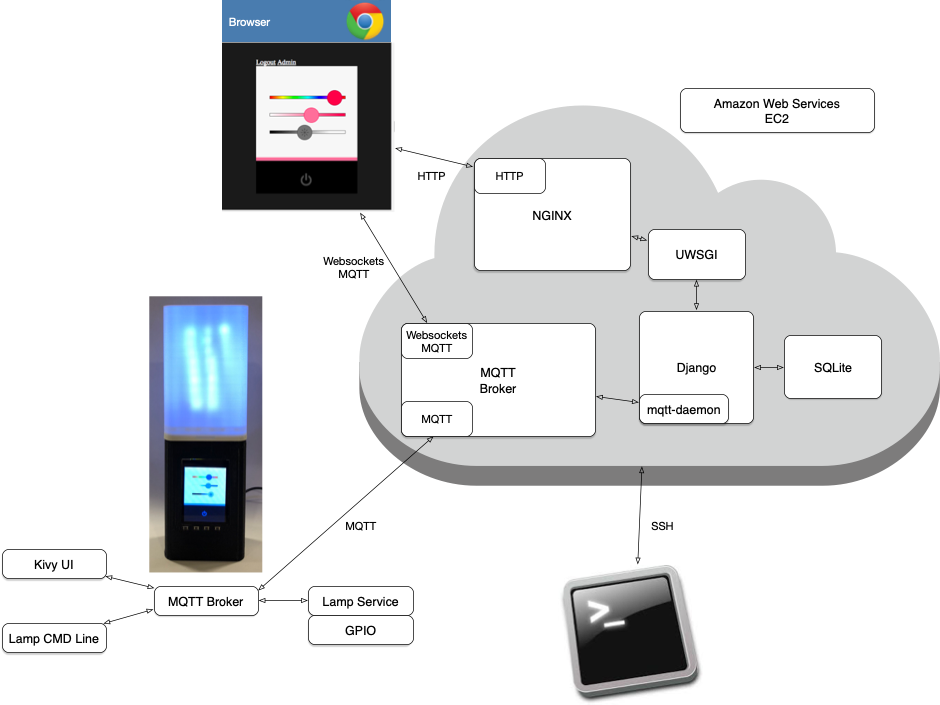
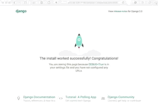
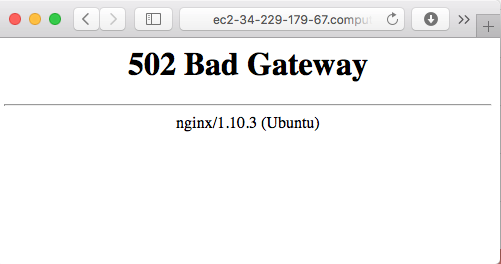

# NGINX & uWSGI & Django

In this section we will learn how to update our Web server configuration to serve a Django site with NGINX, with a production-ready deployment architecture.  The Django development server (the `runserver` command) is intended for testing, debug, and development.  Due to peformance and security issues, though, it is insufficient for a production deployment.

## uWSGI

NGINX cannot natively serve a Django site, so we will use [uWSGI](https://uwsgi-docs.readthedocs.org/en/latest/) as a [WSGI](https://en.wikipedia.org/wiki/Web_Server_Gateway_Interface) adapter between NGINX and Django. 

<br/>

### Testing with a simple Django site

We will create a simple Django project for testing.

First we are going to open up a port for testing. We'll close access to the port when we're done. Navigate to **console.aws.amazon.com**, click on **EC2**, click on **Security Groups**, and add an inbound rule to allow access to TCP port **8080**.

Next, let's make an example Django project to serve up (we will use a super-simple project to test things out, without the complexity of our LAMPI Django project - we will save that for the assignment :-).

```bash
cloud$ mkdir ~/hello_world
cloud$ cd ~/hello_world
cloud$ django-admin startproject hello_world .
cloud$ python3 manage.py migrate
cloud$ python3 manage.py createsuperuser
```

Let's make sure we can access the site using the Django development server first. Run:

```bash
cloud$ python3 manage.py runserver 0:8080
```      

Now navigate to `http://<your ec2 hostname>:8080` and ensure you see the default page:
<br/>

Stop the Django development server.

### Installing uWSGI

We need to install some dependencies before we can install uWSGI:

```bash
cloud$ sudo apt-get install build-essential python3-dev -y
```

Now we can install uWSGI, which is a Python module, so we can use `pip`:

```bash
cloud$ sudo pip3 install uwsgi
```

Now let's run our Django app using uWSGI directly (which we will not generally do, other than during development and configuration testing).

```bash
cloud$ uwsgi --http :8080 --module hello_world.wsgi
```

Again, navigate to `http://<your ec2 hostname>:8080` and ensure you see the default page:
<br/>

## Serving Static Content

During development, the Django development HTTP server is fine for serving up our static content (CSS, JS, Images, etc.).  The Django development server is not designed for high-performance, though, and is a poor choice for production.  We will want to pull all of our static content together and have NGINX serve it.  Django has built-in support for this.

To that end, modify your **settings.py** file to include the following at the end of the file:

```python
STATIC_ROOT= os.path.join(BASE_DIR, "static")
```

[STATIC\_ROOT](https://docs.djangoproject.com/en/2.1/ref/settings/#static-url) is the _absolute_ path to the where the **manage.py** **collectstatic** command will collect copies of static files for deployment.

After making those changes, run:

```bash
$cloud python3 manage.py collectstatic
```

That will find all static files within the Django project (including all installed apps) and store them in the specified directory.  It is then easy to point NGINX to serve those static files (as we will see below).

## Configure uWSGI and NGINX

**We are now going to stop using the custom port 8080 and switch to using the default HTTP port number (80).**

Download the default NGINX config file for uWSGI:

```bash
cloud$ wget https://github.com/nginx/nginx/raw/master/conf/uwsgi_params
```

and copy the file to **hello_world/uwsgi\_params**.

Next, create an app-specific NGINX configuration. In your **hello\_world**, save this as **hello\_world\_nginx.conf**, making sure to replace values where marked by the curly braces `{}` (FQDN is the Fully Qualified Domain Name for your ec2 instance - the long one, like `ec2-52-20-29-213.compute-1.amazonaws.com`):

```
# hello_world_nginx.conf

# the upstream component nginx needs to connect to
upstream django {
    server unix://{full path to your hello_world app}/hello_world.sock; 
    # example: server unix:///home/ubuntu/hello_world/hello_world.sock;
}

# configuration of the server
server {
    listen 80;
    listen [::]:80;

    server_name {server FQDN}; 
    # example: server_name ec2-52-20-29-213.compute-1.amazonaws.com;

    charset     utf-8;
    client_max_body_size 75M;

    location /static {
        alias {full path to your hello_world app}/static;
        # example: alias /home/ubuntu/hello_world/static; 
    }

    # Finally, send all non-media requests to the Django server.
    location / {
        uwsgi_pass  django;
        include     {full path to your hello_world app}/uwsgi_params; 
        # example: include /home/ubuntu/hello_world/uwsgi_params; 
    }
}
```

Now make a [symlink](https://en.wikipedia.org/wiki/Symbolic_link) for the file in /etc/nginx/sites-enabled. Note: for the `ln` command, make sure you use full file paths.

```bash
cloud$ sudo ln -s {full path to hello_world app}/hello_world_nginx.conf /etc/nginx/sites-enabled/
```

This makes the site "available" as part of NGINX's configuration.

Finally, we're going to edit our NGINX configuration to use this new conf file. We'll also remove the configuration for our static page from Week 5, since the **hello\_world\_nginx.conf** handles that.. Using `sudo`, edit **/etc/nginx/nginx.conf**.

```
user www-data;
worker_processes 4;
pid /run/nginx.pid;

events {
  worker_connections 768;
}

http {
  include /etc/nginx/mime.types;
  include /etc/nginx/sites-enabled/*.conf;
  server_names_hash_bucket_size 128;
}
```

Okay, let's stop and make sure our configuration works as expected. Run uwsgi manually for now:

```bash
cloud$ uwsgi --socket hello_world.sock --module hello_world.wsgi --chmod-socket=666 &
```

The **hello\_world.sock** is a path to a unix file socket we're using for communication (you do not need to create this, it is automatically created as needed). The **chmod-socket** command provides the appropriate permissions level for the file socket. Finally, the ampersand (**&**) at the end puts the command into the background so we can do other things in the terminal while it runs.

Let's restart NGINX so that it picks up our config changes:

```bash
cloud$ sudo service nginx restart
```

Now on your host machine navigate your browser back to `http://<your ec2 hostname>` to see the default page:
<br/>

### Troubleshooting

If you have trouble at this point, you can review the NGINX logs:

```bash
sudo tail /var/log/nginx/error.log
```

(you might also use `tail -f` to continuously monitor the log, as new lines are appended)

uWSGI is running backgrounded and should output directly to your console if there is an error.

Most errors at this point are likely to be configuration-based, so double-check those .conf files.

## Run uWSGI on startup

At this point, everything should be working except we need to run uWSGI manually, so let's get it running automatically. uWSGI has a built-in behavior to manage this called [*emperor mode*](http://uwsgi-docs.readthedocs.io/en/latest/Emperor.html). Let's create a uWSGI vassal config in the project folder (a "vassal" is uWSGI's term for a job).

In your project folder (i.e., /home/ubuntu/hello_world/), create a **hello\_world\_uwsgi.ini** replacing the values in curly braces `{}` as appropriate:

```
[uwsgi]

# the base directory (full path)
chdir           = {full project dir}
# example: chdir = /home/ubuntu/hello_world

# Django's wsgi file
module          = hello_world.wsgi

# process-related settings
master          = true
processes       = 10

# the socket (use the full path to be safe)
socket          = {full project dir}/hello_world.sock
# example: socket = /home/ubuntu/hello_world/hello_world.sock

# ... with appropriate permissions - may be needed
chown-socket=www-data:www-data
chmod-socket    = 666
uid = www-data
gid = www-data
# clear environment on exit
vacuum          = true
```

Next we will make a directory called **vassals** to host our configuration file in the **/etc/uwsgi** directory, and then symlink our ini file into this directory.

```bash
cloud$ sudo mkdir -p /etc/uwsgi/vassals
cloud$ sudo ln -s {full project dir}/hello_world_uwsgi.ini /etc/uwsgi/vassals/
```

Note all the references to **www-data** above.  **www-data** is both a user _and_ a group that the uWSGI process will be running as. We need to provide access to our project directory. We will set **www-data** as the group for the directory, then provide read / write access:

```bash
cloud$ sudo chgrp -R www-data {hello_world project path}
cloud$ sudo chmod -R g+rw {hello_world project path}
```

Oh, also, let's make sure ubuntu is part of this group or we're going to have trouble accessing this directory from here on out:

```bash
cloud$ sudo usermod -a -G www-data ubuntu
```

At this point, let's test our vassal config and ensure it is working by running uWSGI manually again and restarting nginx:

```bash
cloud$ sudo uwsgi --emperor /etc/uwsgi/vassals --uid www-data --gid www-data &
```

Now on your host machine navigate your browser back to `http://<your ec2 hostname` to see the default page:
<br/>

If you do not see the default page, but see something like:
<br/>
that error (HTTP 502 - Bad Gateway) indicates that NGINX is not able to communicate with the uWSGI process for some reason.


## Configure Supervisor

Now that you know the command to launch uWSGI in emperor mode, create a supervisor configuration that will launch it automatically. This will be part of your assignment for the week. Reference the [lesson from week 4 if needed](../04.06_Supervisord/README.md). If you haven't already installed supervisor on your EC2 instance, you can do so with `sudo apt-get install -y supervisor`.

## Conclusion

You now have a complete production quality, high-performance web server (NGINX) directly serving static content (files), plus dynamic content (your Django project) via uWSGI (well, without a production database, and without any *real* security, but you get the idea).

Next up: go to [07.2 Critical Implications of Our New Deployment Architecture](../07.2_Critical_Implications_of_Deployment_Architecture/README.md)

&copy; 2015-2020 LeanDog, Inc. and Nick Barendt
