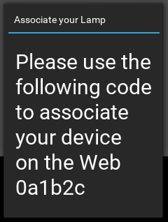

## Updating LAMPI

### Part 1 - Updating the Kivy UI

Fortunately, this has been done for you already in the assignment.  See the updated **connected-devices/Lampi/lampi/lampi_app.py**

#### MQTT / Kivy UI Behavior

The following behavior is critical to understand.

There is a new MQTT topic on the lamp `lamp/associated` that the Kivy application subscribes to.  It expects to receive JSON-encoded messages that are dictionaries of the form


| Device State | Message |
|---|---|
| **unassociated** | `{"code": "da3c72cf84e04f1ab6440132cdf0a087", "associated": false}` |
| **associated** | `{"associated": true}` |


> (where the value of 'code' is just an example value).

When a device is **unassociated** (associated with  the `parked_device_user` account), the **mqtt-daemon** will publish a message to that LAMPI's `lamp/associated` topic with a payload of the form above (with `code` having a 32 character hexadecimal string and `associated` having a value of **`false`**).  The message will be published with QoS of 2 and **retained**.

When a device has been **associated** with a user account (Django account other than the `parked_device_user` account), the Django app will publish a message to that LAMPI's `lamp/associated` topic with a payload of the form above (with `associated` having a value of **`true`**).  The message will be published with QoS of 2 and **retained**.

When **associated**, the LAMPI touchscreen behavior is exactly as it has been for previous assignments.

When **unassociated**, the LAMPI touchscreen behavior changes to displaying a [Kivy Popup](https://kivy.org/docs/api-kivy.uix.popup.html?highlight=popup#module-kivy.uix.popup) with a message and the first six characters of the `code`:
<br/>

> Note: when **unassociated** and the popup is showing, the LAMPI is unusable.  That's not ideal from a UX standpoint, but it simplifies things for the course.

#### Testing 

You can update your LAMPI wih the latest code and test this behavior by connecting (via SSH or Serial) and using the **mosquitto_pub** command (Hint: this is your first testing seam).  Probably best _not_ to use Retained messages when testing (otherwise, you have to remember to remove the retained message later).

To simulate an **unassociated** message:

```bash
mosquitto_pub -t "lamp/associated" -m '{"code": "da3c72cf84e04f1ab6440132cdf0a087", "associated": false}'
```

that should cause the popup to be displayed.

You can simulate an **associated** message:

```bash
mosquitto_pub -t "lamp/associated" -m '{"associated": true}'
```

that should cause the popup to disappear and restore the normal LAMPI UI.
<br/>

#### MQTT Topic Mapping

The `lamp/associated` topic must be mapped across the MQTT bridge so that the **mqtt-daemon** can publish messages to LAMPI.  It should be mapped with QoS of 2.

Next up: go to [Updating the Django Model and MQTT Daemon](../07.6_Updating_Django_Model_and_MQTT_Daemon/README.md)

&copy; 2015-2020 LeanDog, Inc. and Nick Barendt
