# iOS Interface Builder

### Rename View Controller

The [ViewController](https://developer.apple.com/library/archive/featuredarticles/ViewControllerPGforiPhoneOS/) is the foundation of your app. Every app has at least one view controller (most have more than one; we will stick with one for our app, trading some simplicity for an overburdened controller with too many repsonsibilities).

First off, in our project the only view controller was named, uninspiringly, "ViewController". Let's give it a more specific name. First, in the Xcode project explorer, locate **ViewController.h** and **ViewController.m**. Click once on the name of the file and wait, and it should enter edit / rename mode. Rename both to **LampiViewController.h** and **LampiViewController.m**, respectively:

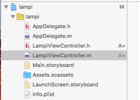

Now open each file and change the interface and implementation names to **LampiViewController**:

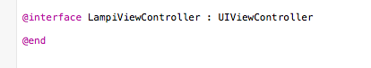

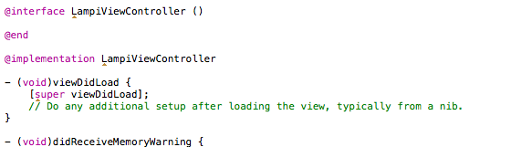

In Objective-C (as in C, and C-derived languages), source code is split into code (in **.m** files in Objective-C) and header (in **.h** files).  The headers contain constants, macros, and declarations.  In most cases, header files contain interface declarations that must be included in **.m** files, typically including the matching **.m** file (e.g., **hello.h** is declares some interfaces for clients of the **hello.m** file, and those interface declarations are also needed by **hello.m**, so it must include **hello.h**).

You have renamed your header, so make sure you open **LampiViewController.m** and fix your import statement:

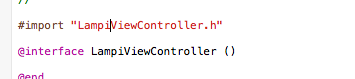

Build and run your project. It should run as before with no issues.  Any issues are likely due to a typo.

### Update Class Name

We are going to add a slider and a label to our app. When the slider changes, we will update the label (you may have seen something analogous before in this course...).

Click on **Main.storyboard** to open it. It will open the storyboard in an Interface Builder window. This is the (sort of) WYSIWYG editor for iOS views. You should see a single, empty view. First, we are going to tell the storyboard that we are going to use our custom (and renamed) view controller as the backing logic of this screen. In the left-hand pane, select "View Controller":

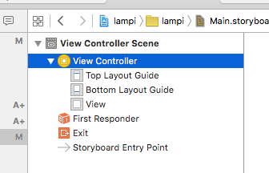

With that selected, click on the **Identity Inspector** in the right-hand pane:

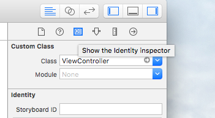

Here, you can see that the view controller's class name was set to **ViewController**. Let's update it to be **LampiViewController** and hit enter:

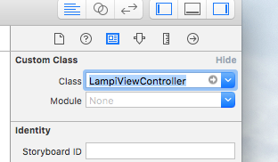

### "View as"

The default view is a size that does not necessarily give us a good sense of what it will look like on a phone. 

At the bottom of the screen, select **View as** and select a device that matches yours.  This doesn't actually change the size of the view at runtime -- that's determined by the device. Instead, this will preview the view for you at that size so you can make sure everything resizes and shifts correctly across different devices. The view should now appear closer to the size of your phone screen:

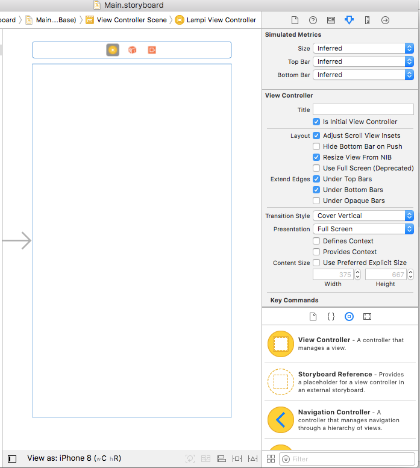

### Add Some Controls

Next we are going to add a [Slider](https://developer.apple.com/library/prerelease/ios/documentation/UIKit/Reference/UISlider_Class/) and a [Label](https://developer.apple.com/library/prerelease/ios/documentation/UIKit/Reference/UILabel_Class/) to the view. 

In the top of the pane, click on **Object Library**:

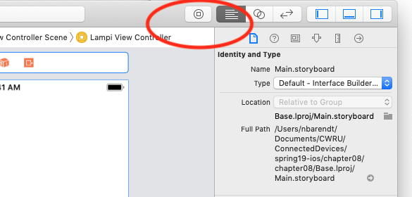

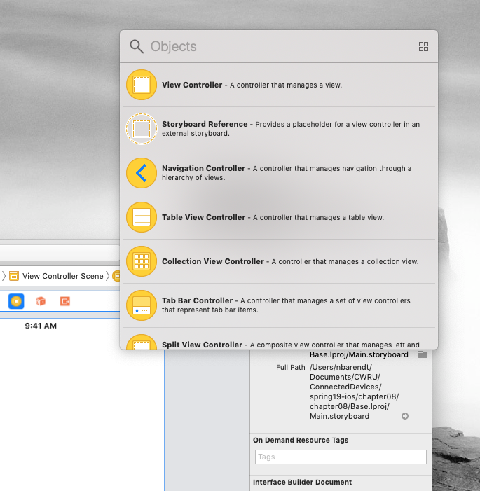

In the filter bar at the very bottom, type in "slider":

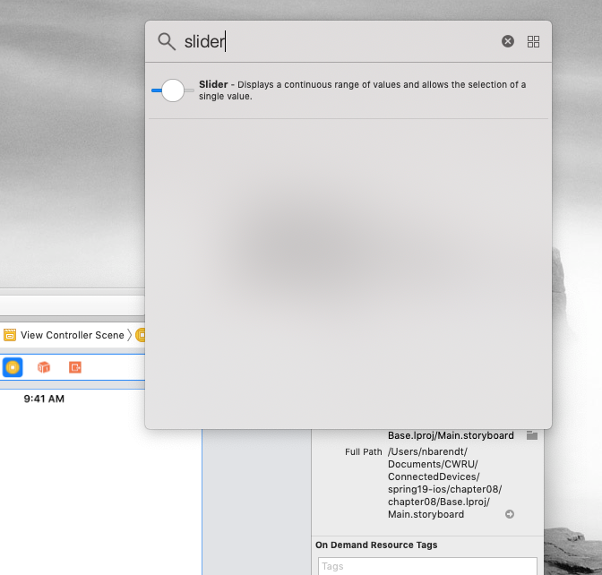

Take the Slider result and drag it into your view:

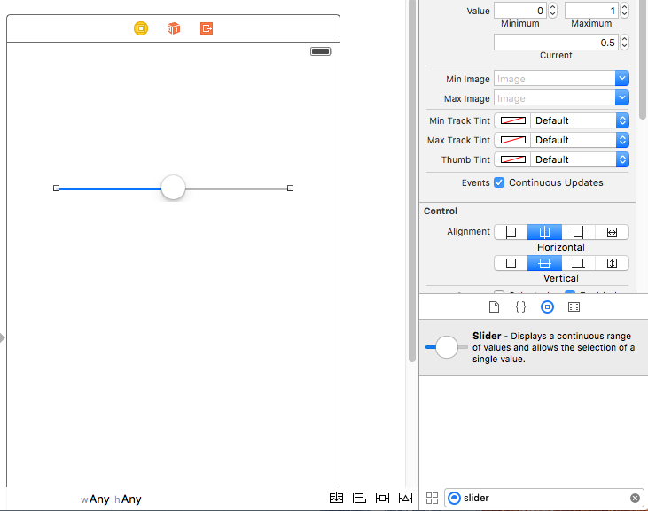

Now do the same thing for Label:

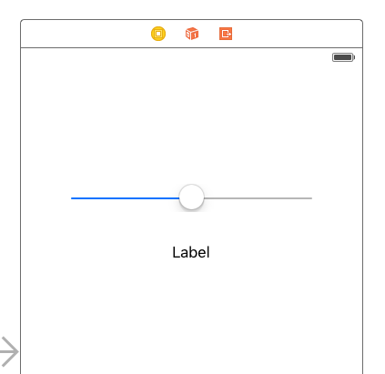

### Properties and IBOutlets

Now we need to make our slider and label accessible from code. To do this, let's start by creating properties on our LampiViewController. Open **LampiViewController.h** and insert two properties inside the interface definition:

```Objective-C
#import <UIKit/UIKit.h>

@interface LampiViewController : UIViewController

@property (nonatomic, strong) UISlider *slider;
@property (nonatomic, strong) UILabel *label;

@end
```

The syntax breakdown for a property:

* `@property` marks the start of our property delcaration.
* `(nonatomic, strong)` are property attributes -- nonatomic means we are not concerned with the property setter being thread-safe, and strong means we want the object referenced to be retained in memory.
* `UISlider` is the class.
* `slider` is the name of the property. 
* The `*` before slider means that we are declaring "a pointer to UISlider".

Open **LampiViewController.m**. In the **viewDidLoad** method, let's log the values of slider and label:

```Objective-C
#import "LampiViewController.h"

@interface LampiViewController ()
@end

@implementation LampiViewController

- (void)viewDidLoad {
    [super viewDidLoad];
    
    NSLog(@"slider: %@ \n label: %@", self.slider, self.label);
}

@end
```

`NSLog` is taking a format string and some arguments. The `@"` starts an [NSString](https://developer.apple.com/documentation/foundation/nsstring?language=objc) (which is different than a C character string).  The `%@` in the string are replaced by the arguments, in the order provided (you can use any C format specifier, but the [`%@`](https://developer.apple.com/library/content/documentation/Cocoa/Conceptual/Strings/Articles/FormatStrings.html) handles any objects).

Build and run the project. In the upper-right corner of the toolbar, show the Debug Area if it is hidden by clicking the middle button:

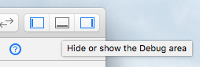

This should slide up a pane from the bottom with your debug console. Note that slider and label are currently both null:

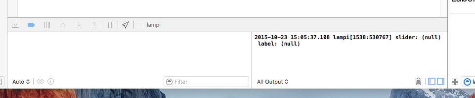

This is because we declared properties but didn't actually do anything with them. Let's fix that. To make properties accessible from Interface Builder, we need to mark them with an `IBOutlet` macro. In **LampiViewController.h**, change the properties so that they are marked with **IBOutlet**:

```Objective-C
@property (nonatomic, strong) IBOutlet UISlider *slider;
@property (nonatomic, strong) IBOutlet UILabel *label;
```

Now open **Main.storyboard**. We are going to link our controls in our view to the properties we just made. In the left-hand pane, right-click on "Horizontal Slider":

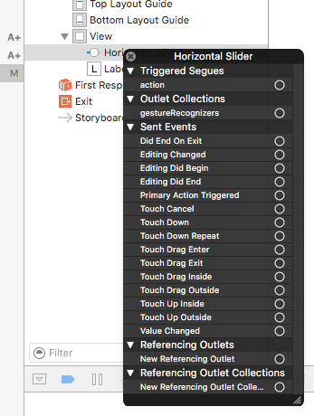

Left-click *and hold* the dot next to **New Referencing Outlet**. *Drag* to **Lampi View Controller** and click on the **slider** property:

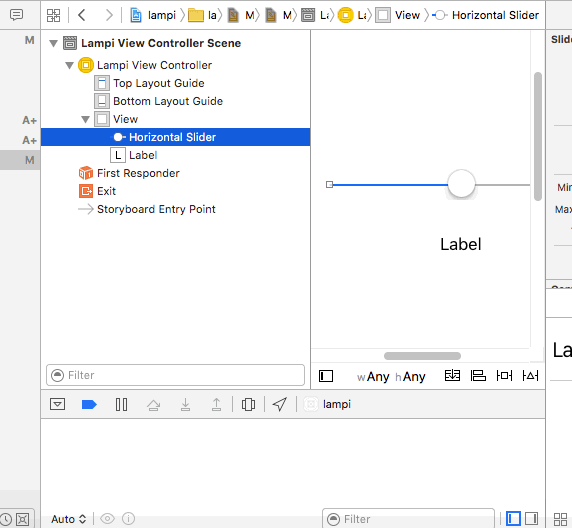

Now do the same with label. Link the **Label** in the view to the view controller's **label** property.

Build and run the project. Your slider and label properties should both be set to instances:

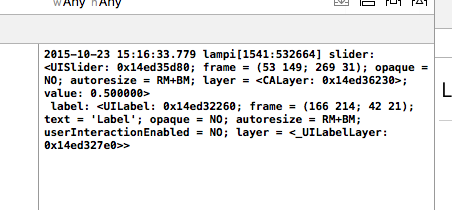

### Methods and IBActions

Now we can access our controls, which is useful, but by itself does not help us much.  We also want to do something when the slider changes. Open **LampiViewController.h** and add a method definition:

```Objective-C
#import <UIKit/UIKit.h>

@interface LampiViewController : UIViewController

@property (nonatomic, strong) IBOutlet UISlider *slider;
@property (nonatomic, strong) IBOutlet UILabel *label;

-(void)onSliderChanged:(UISlider*)sender;

@end
```

The syntax breakdown for a method:

* `-` denotes an instance method on our class. For a class method (similar to a static method), we would instead use `+`
* `(void)` is the return type - we're not returning a value
* `onSliderChanged:` is the name of our method
* `(UISlider*)sender` is our only argument. The method takes a single value, a "pointer to a UISlider" (`UISlider*`); this is referred to as a "sender"

#### Method Signatures in Objective-C

Method signatures are somewhat unique in Objective-C. In other languages, method names are usually first, followed by a list of arguments. Take a method in C#, for example:

```
void AddUserToGroup(User userToAdd, Group group) { 
  ...
}
```

Compare this to Objective-C, in which the arguments are actually interleaved with the method name:

```Objective-C
-(void) addUser:(User*)user toGroup:(Group*)group {
  ...
}
```

In the C# example, the method name is simply `AddUserToGroup`. In the Objective-C example, the method name is `addUser:toGroup:`. Each method argument in Objective-C has a colon `:` prepending it in the method name.

#### Implementation

So we've declared the method in our header, let's implement it. Open **LampiViewController.m** and add the method implementation:

```Objective-C
#import "LampiViewController.h"

@interface LampiViewController ()
@end

@implementation LampiViewController

- (void)viewDidLoad {
    [super viewDidLoad];
    
    NSLog(@"slider: %@ \n label: %@", self.slider, self.label);
}

-(void)onSliderChanged:(UISlider*)sender {
    NSLog(@"slider changed");
}

@end
```

Of course, nothing is calling your method yet. We need to mark the method with **IBAction**. This denotes that method is available to Interface Builder for linking. In both **LampiViewController.h** and **LampiViewController.m**, set the return type to IBAction:

```Objective-C
-(IBAction)onSliderChanged:(UISlider*)sender;
```

Now open **Main.storyboard**. In the left-hand pane, right-click on the slider. Under **Sent Events**, find **Value Changed** and drag the dot to **Lampi View Controller**. Link it to your `onSliderChanged:` method:

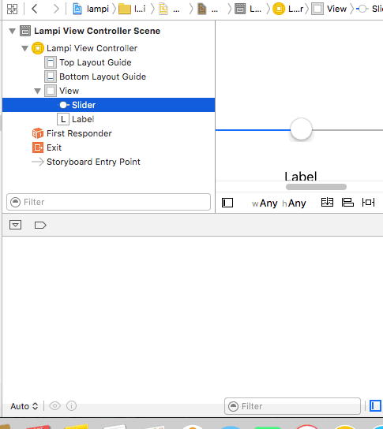

Now build and run your project. Change the slider. You should get console output:

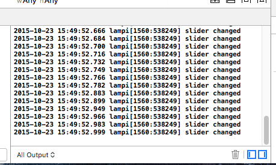

### Update Label

Finally, let's take the slider value and populate the label. In `onSliderChanged:`, let's update the label text with the slider value. Remove the `NSLog` calls and do this:

```Objective-C
-(IBAction)onSliderChanged:(UISlider*)sender {
    self.label.text = [NSString stringWithFormat:@"%.2f", self.slider.value];
}
```

In the above example, `%.2f` is a format specifier for a `double` (double-precision floating point value) variable; the `%f` if the format specifier for a `double`; the `.2` limits the displayed precision to two digits. [`self.slider.value`](https://developer.apple.com/documentation/uikit/uislider/1621346-value?language=objc) is a `float`, which is automatically converted ("cast") to the higher precision of a `double` by the compiler. If you need to format a value into a string, [here are all the format specifiers](https://developer.apple.com/library/ios/documentation/Cocoa/Conceptual/Strings/Articles/formatSpecifiers.html).

Build and run your application. Move the slider. The label should update with the value (with a range of 0.0 - 1.0):

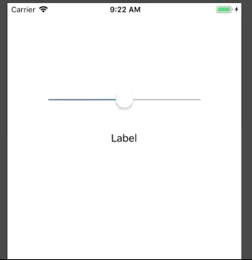

Next up: [iOS Auto Layout](../08.4_iOS_Autolayout/README.md)

&copy; 2015-2020 LeanDog, Inc. and Nick Barendt
