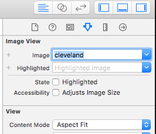

# iOS Auto Layout

## Images

We're going to add an image so we can visualize layout changes better. Download the image from [here](Images/cleveland.jpg). In Xcode, click on **Assets.xcassets**. Drag **cleveland.jpg** into the left-pane of the Assets viewer, under AppIcon:

Now we can use the image in our app. Click on **Main.storyboard**, and add an **Image View** similar to how you added the Slider and Label:

Select the Image View and in the right-hand pane, select the **Attributes Inspector** tab:

In the **Image** drop-down, select **cleveland**. In **Content Mode**, select **Aspect Fit**:

Now, reposition and size the controls so that they are stacked on top of each other.

Resize the image so that it has a height of 150.0, and is centered at the top of the phone.
Center the label and slider horizontally on the screen.

Go ahead and build and run your app. You should see this:

Now rotate your phone so that it is in landscape:

Well that doesn't look so great. 

### Autolayout

We're going to use Autolayout to anchor the controls so that they reposition and resize with the screen size and orientation. Open **Main.storyboard** and select the image. In the bottom-right-hand corner, click the **Pin** icon and pin the top, left, and right sides of the image. Also, check **Aspect Ratio**. Click **Add 4 Constraints**:

#### How to Use Autolayout

An important concept when using autolayout is that each control needs a constraint that determines x position, y position, width, and height. In this case, pinning the **top** and **left** ensured we have x and y position defined. Pinning both **left** and **right** defines what the width will be. Finally, setting **aspect ratio** ensures that width and height stay at the same ratio, so that takes care of height.

#### Fixing incorrect position

When you set autolayout constraints, if the controls are positioned incorrectly in interface builder to match the constraints, they'll be outlined in yellow and a yellow arrow icon will appear in the UI tree. You can resolve this by clicking the arrow and updating the frames to match the autolayout constraints:

You should hold off on doing this until everything in your view has constraints. Anything without constraints will end up being thrown in the upper-left-hand corner.

#### Adding constraints to the slider

Select your slider and click the **Pin** icon again. If we pin the slider to the sides, in landscape mode the slider would grow way too wide. Instead, let's lock the width and center the slider. In the **Pin** menu, pin the **width** and **top**. Y position and width are taken care of, and sliders are a fixed height, so all that's left is the x position. Let's center it in the view. Click the **Align** icon and add a constraint for **Horizontally in Container**:

Finally, let's take care of our label. First, let's center the text in the label horizontally. Select the label and in the **Attributes Inspector**, click the center alignment button:

Now, select the label. Hold **command** (⌘) and click the slider to select both. Click the **Pin** icon and add a constraint for **Equal Widths**. Click the **Align** icon and add a constraint for **Horizontal Centers**. This will keep the label centered with the slider, and keep their widths the same. Finally, deselect both controls and select *only* the label. Click the **Pin** icon again and pin the **top**. The text content of the label should determine the height so we don't need to set that.

Now go fix your frames so they match the constraints like we showed earlier:

Build and run your application. Try your app in portrait and lanscape:

If everything went well, the image will be docked to the top of the screen and resize with the screen. The label and slider will be centered horizontally and maintain their width.

Next up: [Assignment](../08.5_Assignment/README.md)

&copy; 2015-2020 LeanDog, Inc. and Nick Barendt
