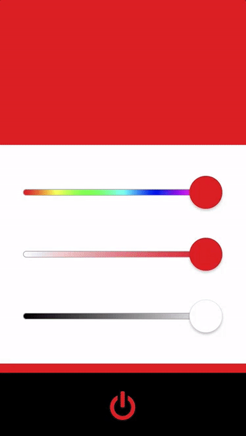

# What to Turn in

At the completion of Assignment 8, you should have an iOS application that looks and behaves like this:



Requirements:

* The application must be able to be run on an actual phone.
* You only need to worry about portrait orientation. [You should prevent the app from switching into landscape mode.](http://stackoverflow.com/questions/25822512/default-device-orientation-in-xcode-6)
* The application should support different screen sizes. Make sure you try different simulators or switch the simulated size in Interface Builder to make sure things scale correctly.
* Use [UIView](https://developer.apple.com/documentation/uikit/uiview?language=objc)s for the color blocks
* Use [UIButton](https://developer.apple.com/documentation/uikit/uibutton?language=objc) for the Power Button
* Add [application icons](https://developer.apple.com/library/content/qa/qa1686/_index.html). You can find icons already made in [Mobile/iOS/Images/AppIcon](../../Mobile/iOS/Images/AppIcon/)
* [Make the display name](https://developer.apple.com/library/ios/qa/qa1823/_index.html) LAMPI in all caps.
* The XCode Project should reside in your repository in the 'Mobile/iOS/Lampi' directory and be named 'Lampi.xcodeproj'


You need to turn in the following:

1. A short (a few sentences) write up from each member of the pair summarizing what they learned completing the assignment, and one thing that surprised them (good, bad, or just surprising).  This should in **connected-devices/writeup.md** in [Markdown](https://daringfireball.net/projects/markdown/) format.  You can find a template file in **connected-devices/template\_writeup.md**
2. A Git Pull Request
3. A short video demonstrating the required behaviors emailed to the instructor and TA.  The video should be named **[assignment 3]_[LAST_NAME_1]\_[LAST_NAME_2].[video format]**.  So, for this assignment, if your pair's last names are "Smith" and "Jones" and you record a .MOV, you would email a file named ```2_smith_jones.mov``` to the instructor.
4. A live demo at the beginning of the next class - **be prepared!**

Notes:

* Each pair must have a Mac with Xcode and an iOS device between them.
* Power icon is in [Mobile/iOS/Images/](../../Mobile/iOS/Images/).
* The stylized slider control already exists as GradientSlider in [Mobile/iOS/Controls/](../../Mobile/iOS/Controls/). It is a direct port of [the Swift implementation](https://github.com/jonhull/GradientSlider), so refer to that page for documentation on how to use the control.
* Similar to the Kivy app, you'll be doing a lot of HSV / RGB space conversions. Check out [UIColor](https://developer.apple.com/library/ios/documentation/UIKit/Reference/UIColor_Class/) for convenience methods that should help.

&copy; 2015-2020 LeanDog, Inc. and Nick Barendt
