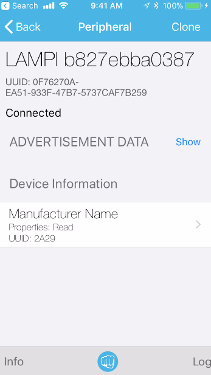
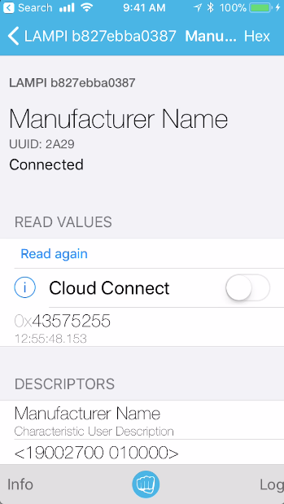

# Building a Simple BTLE GATT Service

We will now build up a simple BTLE GATT Service to illustrate how GATT Services and Characteristics work.  (Reminder, "GATT" stands for Generic Attributes, or how Centrals can interact with a Peripheral's Attributes in a general-purpose manner).

## A Simple Device Info Service

The BTLE specifications define some standard [GATT Services](https://www.bluetooth.com/specifications/gatt/services).  In addition, manufacturers are free to develop their own proprietary Services.

BTLE uses UUIDs extensively.  UUIDs are ["Universally Unique Identifiers"](https://en.wikipedia.org/wiki/Universally_unique_identifier).  They are 128-bits long and are practically unique in time and space if generated according to prescribed algorithms.

One of the defined GATT Services (see this [list](https://www.bluetooth.com/specifications/gatt/services/)) is the `Device Information Service` (see the XML descripion of the [Device Information Service](https://www.bluetooth.com/wp-content/uploads/Sitecore-Media-Library/Gatt/Xml/Services/org.bluetooth.service.device_information.xml)).  It has an "Assigned Number" (UUID) of `0x180A`.  This is a 16-bit UUID.  16-bit UUIDs (and the less-common 32-bit UUIDs) are used to reduce BTLE payload sizes down from 128-bit for frequently used values.  Only the Bluetooth SIG can define UUIDs shorter than 128-bits.

>  In reality, all UUIDs are 128-bit UUIDs, but the Bluetooth SIG defines a base UUID of `00000000-0000-1000-8000-00805F9B34FB` and draws additional UUIDs from this by replacing the first eight characters `XXXXXXXX-0000-1000-8000-00805F9B34FB`, so 16-bit and 32-bit UUIDs are really 128-bit UUIDs based on this, replacing the `X` with the shorter UUID (left padding with zeros for the 16-bit UUIDs).  So, the `0x180A` UUID is really `0000180A-0000-1000-8000-00805F9B34FB`.

The Device Information Service provides a standard way to share basic device information, such as manufacturer name, model, serial number, etc.


### Creating and Advertising a GATT Service.

We will incrementaly build up support for the Device Information Service.

Creat a new file **peripheral.js**:

```node
var child_process = require('child_process');
var device_id = child_process.execSync('cat /sys/class/net/eth0/address | sed s/://g').toString().replace(/\n$/, '');
process.env['BLENO_DEVICE_NAME'] = 'LAMPI ' + device_id;

var bleno = require('bleno');

var DeviceInfoService = require('./device-info-service');
var deviceInfoService = new DeviceInfoService( 'CWRU', 'LAMPI', '123456');

bleno.on('stateChange', function(state) {
  if (state === 'poweredOn') {
    bleno.startAdvertising('MyService', [deviceInfoService.uuid], function(err)  {
      if (err) {
        console.log(err);
      }
    });
  }
  else {
    bleno.stopAdvertising();
    console.log('not poweredOn');
  }
});

bleno.on('advertisingStart', function(err) {
  if (!err) {
    console.log('advertising...');
    //
    // Once we are advertising, it's time to set up our services,
    // along with our characteristics.
    //
    bleno.setServices([
        deviceInfoService,
    ]);
  }
});
```

You will see that we are requiring a new file **device-info-service.js**, storing the resulting module in 'DeviceInfoService' and then constructing a instance of the service, passing in a Manufacturer Name (`'CWRU'`), a Model Name (`'LAMPI'`) and a Serial Number (`'123456'`) as variables. We will create that file shortly.

Just as in our iBeacon example, we register for two `bleno` events:  `'stateChange'` and `'advertisingStart'`.  In our callback for `'stateChange'` we are calling `'startAdvertising()'` passing in a friendly service name ('MyService') a list of Service UUIDs to advertise (with only one element in the list), and an error handling callback function.

In our callback for `'advertisingStart'`, though, we call `setServices()` with our list of Service Objects.  This makes the services available, allowing BTLE Centrals can connect to the services and interact with their Characteristics.

Create a new file `device-info-service.js` in the same directory:

```node
var util = require('util');
var bleno = require('bleno');

function DeviceInfoService(manufacturer, model, serial) {
    bleno.PrimaryService.call(this, {
        uuid: '180a',
        characteristics: [
        ]
    });
}

util.inherits(DeviceInfoService, bleno.PrimaryService);

module.exports = DeviceInfoService;
``` 

We are using the NodeJS `util` module for the `inherits()` function, which is used to implement one of the class inheritance techniques used in NodeJS (if you have not looked at JavaScript/NodeJS prototype-based inheritance versus class-based inheritance, you might start [here](https://developer.mozilla.org/en-US/docs/Web/JavaScript/Guide/Details_of_the_Object_Model)).  `bleno` uses [inherits()](https://nodejs.org/docs/latest/api/util.html#util_util_inherits_constructor_superconstructor), an older and now slightly discouraged inheritance technique (newer versions of JavaScript - aka [ECMAScript](https://en.wikipedia.org/wiki/ECMAScript) have new keywords like `class` and `extend`; these different subclassing mechanisms cannot be mixed).

We are defining a constructor function for `DeviceInforService` which takes three parameters (manufacturer, model, and serial).  The `util.inherits(DeviceInfoService, bleno.PrimaryService)` call makes `DeviceInforService` a subclass of `bleno.PrimaryService`.  You will see that we use the JavaScript `this` keyword.  Confusingly for those from other programming languages, `this` is a keyword and not a variable.  If you have not programmed much in JavaScript/NodeJS you might want to refresh yourself on `this` ([here is one resource](https://github.com/getify/You-Dont-Know-JS/blob/master/this%20&%20object%20prototypes/README.md#you-dont-know-js-this--object-prototypes)).

The `bleno.PrimaryService.call()` invokes the function `bleno.PrimaryService` explicititly setting the context to `this` and passing in a dictionary of parameters, including 'uuid' and a list of characteristics.

Finally, the `module.exports = DeviceInfoService;` line controls what should be visible ("exportable") to other modules that `require()` the **device-info-service.js** module.

While we have not provided any Characteristics, you can run this:

```bash
node peripheral.js
```

If you use `LightBlue` you should see your Device show up - you can connect to it and see what information `LightBlue` is able to discover:


You can see the device is Connectable, the service name of "MyService" and a "Device Information" Service, but there is no information within the Device Information Service.  Let's fix that.

Modify `device-info-service.js` to add a Characteristic, like so:

```node
var util = require('util');
var bleno = require('bleno');

var ManufacturerCharacteristic = function(manufacturer) {
    bleno.Characteristic.call(this, {
        uuid: '2A29',
        properties: ['read'],
        descriptors: [
            new bleno.Descriptor({
               uuid: '2901',
               value: 'Manufacturer Name'
            }),
            new bleno.Descriptor({
               uuid: '2904',
               value: new Buffer([0x19, 0x00, 0x27, 0x00, 0x01, 0x00, 0x00])
            }),
        ],
        value: new Buffer(manufacturer),
    }
    )
}

util.inherits(ManufacturerCharacteristic, bleno.Characteristic);

function DeviceInfoService(manufacturer, model, serial) {
    bleno.PrimaryService.call(this, {
        uuid: '180a',
        characteristics: [
            new ManufacturerCharacteristic(manufacturer),
        ]
    });
}

util.inherits(DeviceInfoService, bleno.PrimaryService);

module.exports = DeviceInfoService;
```

### BTLE GATT Characteristics

We have created a new constructor for a Characterstic:  `'ManufacturerCharacteristic'`.  Let's review BTLE Characteristics.

BTLE GATT Services have Characteristics.  Characteristics are the various _attributes_ of the Service.  Along with a value for each Attribute (a string, a number, etc.), Characteristics also have various other metadata, including:

* a UUID (a 16-bit UUID if the Characteristic is defined by the Bluetooth SIG)
* properties (which define if the Characteristic can be read, written, or a few other capabiltities)
* Descriptors - additional information about the Characteristic

Here is the list of [Bluetooth SIG Defined Characteristics](https://www.bluetooth.com/specifications/gatt/characteristics/)

In our case, [Manufacturer Name String](https://www.bluetooth.com/wp-content/uploads/Sitecore-Media-Library/Gatt/Xml/Characteristics/org.bluetooth.characteristic.manufacturer_name_string.xml) is defined within the [Device Information Service](https://www.bluetooth.com/wp-content/uploads/Sitecore-Media-Library/Gatt/Xml/Services/org.bluetooth.service.device_information.xml) and has a UUID of `0x2A29` and is a UTF-8 string.  Further, the [Device Information Service](https://www.bluetooth.com/wp-content/uploads/Sitecore-Media-Library/Gatt/Xml/Services/org.bluetooth.service.device_information.xml) defines the [Manufacturer Name String](https://www.bluetooth.com/wp-content/uploads/Sitecore-Media-Library/Gatt/Xml/Characteristics/org.bluetooth.characteristic.manufacturer_name_string.xml) properties to be only `Read`.

We have added two Descriptors to the Characteristic.  Descriptors provide additional information about the Characteristic.  Descriptors have:

* a UUID (unsurprisingly)
* a value

Here are the Bluetooth SIG [GATT Descriptors](https://www.bluetooth.com/specifications/gatt/descriptors/).  

The two Descriptors we have added are:

* [Characteristic User Description](https://www.bluetooth.com/wp-content/uploads/Sitecore-Media-Library/Gatt/Xml/Descriptors/org.bluetooth.descriptor.gatt.characteristic_user_description.xml) with a UUID of `0x2901`; this Descriptor is used to provide a short textual description of the Characteristic for users - we have provided a value of 'Manufacturer Name'
* [Characteristic Presentation Format](https://www.bluetooth.com/wp-content/uploads/Sitecore-Media-Library/Gatt/Xml/Descriptors/org.bluetooth.descriptor.gatt.characteristic_presentation_format.xml) with a UUID of `0x2904`; this Descriptor is used to provide additional information about presenting the Characteristic value; the Descriptor value is a Buffer (see below) that indicates that the Characteristic Value is a UTF-8 string (see the [descriptor](https://www.bluetooth.com/wp-content/uploads/Sitecore-Media-Library/Gatt/Xml/Descriptors/org.bluetooth.descriptor.gatt.characteristic_presentation_format.xml) to understand what the seven byte values mean).

> NodeJS has a [Buffer](https://nodejs.org/dist/latest-v6.x/docs/api/buffer.html) class that is used for binary strings and streams.  [Buffers](https://nodejs.org/dist/latest-v6.x/docs/api/buffer.html#buffer_buffer) can be created with the `new` keyword like `var mybuf = new Buffer(3);` and the size of the Buffer is set and immutable at construction time (3 bytes long in this example).

To recap:

* GATT Services have:
    * a UUID
    * zero or more Characteristics, each of which have:
        * a UUID
        * properties ('read', 'write', etc.)
        * a value ('CWRU' or 3.14159)
        * zero or more Descriptors which have:
            * a UUID
            * a value

Clients can traverse the Service/Characteristic/Descriptor data as they discover it by interogating the Server, and then interact with the Characteristics (reading them, modifying them, etc.), using the Descriptors to provide additional information about the Characteristics.


### Testing our Device Information Service         

Run the NodeJS app:

```bash
node peripheral.js
```

and use LightBlue to discover and connect to it.

You should see the Device Information Service, like we had earlier, with the 'Manufacturer Name' Characteristic



If you drill down into the 'Manufacturer Name' Characteristic 



you will see the value of `0x43575255` ('CWRU') and you can use the 'Read again' to read the value again (since there is no way for that value to change you will always see the same result).  You will also see the two Descriptors we defined with their values.  

We can add two more Characteristics to round out our Device Information Service with [Model Number String](https://www.bluetooth.com/wp-content/uploads/Sitecore-Media-Library/Gatt/Xml/Characteristics/org.bluetooth.characteristic.model_number_string.xml) and [Serial Number String](https://www.bluetooth.com/wp-content/uploads/Sitecore-Media-Library/Gatt/Xml/Characteristics/org.bluetooth.characteristic.serial_number_string.xml) 

```node
var util = require('util');
var bleno = require('bleno');

var ManufacturerCharacteristic = function(manufacturer) {
    bleno.Characteristic.call(this, {
        uuid: '2A29',
        properties: ['read'],
        descriptors: [
            new bleno.Descriptor({
               uuid: '2901',
               value: 'Manufacturer Name'
            }),
            new bleno.Descriptor({
               uuid: '2904',
               value: new Buffer([0x19, 0x00, 0x27, 0x00, 0x01, 0x00, 0x00])
            }),
        ],
        value: new Buffer(manufacturer),
    }
    )
}

util.inherits(ManufacturerCharacteristic, bleno.Characteristic);

var ModelCharacteristic = function(model) {
    bleno.Characteristic.call(this, {
        uuid: '2A24',
        properties: ['read'],
        descriptors: [
            new bleno.Descriptor({
               uuid: '2901',
               value: 'Model Number'
            }),
            new bleno.Descriptor({
               uuid: '2904',
               value: new Buffer([0x19, 0x00, 0x27, 0x00, 0x01, 0x00, 0x00])
            }),
        ],
        value: new Buffer(model),
    }
    )
}

util.inherits(ModelCharacteristic, bleno.Characteristic);

var SerialCharacteristic = function(serial) {
    bleno.Characteristic.call(this, {
        uuid: '2A25',
        properties: ['read'],
        descriptors: [
            new bleno.Descriptor({
               uuid: '2901',
               value: 'Serial Number'
            }),
            new bleno.Descriptor({
               uuid: '2904',
               value: new Buffer([0x19, 0x00, 0x27, 0x00, 0x01, 0x00, 0x00])
            }),
        ],
        value: new Buffer(serial),
    }
    )
}

util.inherits(SerialCharacteristic, bleno.Characteristic);

function DeviceInfoService(manufacturer, model, serial) {
    bleno.PrimaryService.call(this, {
        uuid: '180a',
        characteristics: [
            new ManufacturerCharacteristic(manufacturer),
            new ModelCharacteristic(model),
            new SerialCharacteristic(serial),
        ]
    });
}

util.inherits(DeviceInfoService, bleno.PrimaryService);

module.exports = DeviceInfoService;
```

Running this should result in three Characteristics showing up:


Congratulations - you have written your first, simple BTLE GATT Service!

Next up: [09.3 Supporting Read and  Write on GATT Characteristics](../09.3_Supporting_Read_and_Write_on_GATT_Characteristics/README.md)

&copy; 2015-2020 LeanDog, Inc. and Nick Barendt
