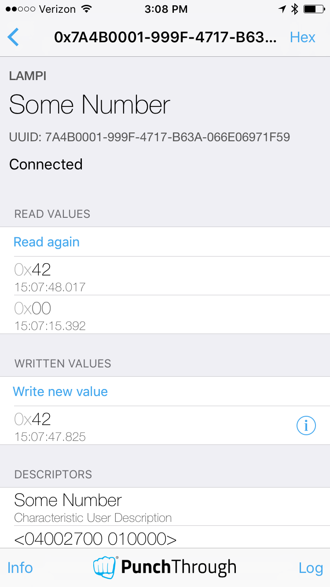

# Supporting Read and Write on GATT Characteristics

So far, our GATT Service and Characteristics are pretty boring - read only values.  We will expand our BTLE capabilties with additional Characterstic properties, but first we will need to build a little bit of infrastructure.

## Generating UUIDs

For our proprietary Services and Characteristics, we need our own 128-bit UUIDs.  You can generate these in several ways, but one simple way is to use the [Online UUID Generator](https://www.uuidgenerator.net/) to generate a Version 4 UUID.

Here is our UUID for this section:

```
7a4bbfe6-999f-4717-b63a-066e06971f59
```

By convention, we can use our UUID as a "base", similar to how the Bluetooth SIG uses a Base UUID, and then derive other UUIDs from that UUID.  We will use the two bytes represented by the four X's (remember, a byte in hexadecimal is represented by two "nibbles" of 4-bits each, 0-F):

```
7a4bXXXX-999f-4717-b63a-066e06971f59
```

## Our State Object

Let's build a simple object to hold some device state information, with one accessor method.

Create a new file `device-state.js`

```node
var util = require('util');
var events = require('events');

function DeviceState() {
    // our state variable
    this.value = 0;
}

util.inherits(DeviceState, events.EventEmitter);

DeviceState.prototype.set_value = function(new_value) {
    if( this.value !== new_value) {
        this.value = new_value % 256;
        this.emit('changed', this.value);
    }
};


module.exports = DeviceState;
```

The `set_value()` method will update the `DeviceState` `value` property with the  `new_value` passed in, if different from the current value (see [JavaScript comparison operators](https://developer.mozilla.org/en-US/docs/Web/JavaScript/Reference/Operators/Comparison_Operators) for the `!==` operator if you are unfamiliar with strict equality).   The `set_value()` method limits the maximum to 255 (0xFF) with the modulus (`% 256`).  If the value has been updated, any callbacks registered for the `'changed'` event will be invoked and passed the new value (this happens because we call `this.emit('changed', this.value)`, inherited from the [EventEmitter](https://nodejs.org/docs/latest-v8.x/api/events.html#events_class_eventemitter) parent class).


## Our Number Service

Create a new file to hold our new Service `number-service.js`:

```node
var util = require('util');
var events = require('events');
var bleno = require('bleno');

var NumberCharacteristic = function(deviceState) {
    bleno.Characteristic.call(this, {
        uuid: '7a4b0001-999f-4717-b63a-066e06971f59',
        properties: ['read'],
        descriptors: [
            new bleno.Descriptor({
               uuid: '2901',
               value: 'Some Number'
            }),
            new bleno.Descriptor({
               uuid: '2904',
               value: new Buffer([0x04, 0x00, 0x27, 0x00, 0x01, 0x00, 0x00])
            }),
        ],
    }
    )

    this.deviceState = deviceState;

}

util.inherits(NumberCharacteristic, bleno.Characteristic);

NumberCharacteristic.prototype.onReadRequest = function(offset, callback) {
    console.log('onReadRequest');
    if(offset) {
        callback(this.RESULT_ATTR_NOT_LONG, null);
    } 
    else {
        var data = new Buffer(1);
        data.writeUInt8(this.deviceState.value);
        console.log('onReadRequest returning ', data);
        callback(this.RESULT_SUCCESS, data);
        // to cause the value to change, we will create a side-effect here
        this.deviceState.value = (this.deviceState.value + 1) % 256;
    }
}

function NumberService(deviceState) {
    bleno.PrimaryService.call(this, {
        uuid: '7a4bbfe6-999f-4717-b63a-066e06971f59',
        characteristics: [
            new NumberCharacteristic(deviceState),
        ]
    });
}

util.inherits(NumberService, bleno.PrimaryService);

module.exports = NumberService;
```

Here we have created a new Service `NumberService` with our newly generated UUID, with one Characteristic `NumberCharacteristic` with a derived UUID, and the same Descriptors as we used for the Device Information Service (but with different values - a different name 'Some Number' and a different Presentation ([unsigned 8-bit integer](https://www.bluetooth.com/wp-content/uploads/Sitecore-Media-Library/Gatt/Xml/Descriptors/org.bluetooth.descriptor.gatt.characteristic_presentation_format.xml)).

We have overridden the `onReadRequest` of the `bleno.Characteristic`.  In that we do some basic error checking, and if the Characteristic is being accessed correctly (zero offset), we allocate a new [Buffer](https://nodejs.org/dist/latest-v6.x/docs/api/buffer.html#buffer_buffer), and write our state variable in as a UInt8 and invoke the callback with a Success error code and the Buffer.

## Modify our Application

Now modify `peripheral.js` like so to use our new service

```node
var child_process = require('child_process');
var device_id = child_process.execSync('cat /sys/class/net/eth0/address | sed s/://g').toString().replace(/\n$/, '');

process.env['BLENO_DEVICE_NAME'] = 'LAMPI ' + device_id;

var bleno = require('bleno');

var DeviceInfoService = require('./device-info-service');

var DeviceState = require('./device-state');
var NumberService = require('./number-service');

var deviceState = new DeviceState();

var deviceInfoService = new DeviceInfoService( 'CWRU', 'LAMPI', '123456');
var numberService = new NumberService(deviceState);

// update the deviceState value every second
setInterval( function() {deviceState.set_value(deviceState.value +1)}, 1000);


bleno.on('stateChange', function(state) {
  if (state === 'poweredOn') {
    bleno.startAdvertising('MyService', [numberService.uuid, deviceInfoService.uuid], function(err)  {
      if (err) {
        console.log(err);
      }
    });
  }
  else {
    bleno.stopAdvertising();
    console.log('not poweredOn');
  }
});

bleno.on('advertisingStart', function(err) {
  if (!err) {
    console.log('advertising...');
    //
    // Once we are advertising, it's time to set up our services,
    // along with our characteristics.
    //
    bleno.setServices([
        numberService,
        deviceInfoService,
    ]);
  }
});
```

We 'require' our new files, instantiate the Services and DeviceState variables, advertise the Service along with our Device Information Service, and add the service in the `'advertisingStart'` callback.

We added a call to `setInterval` to call our function every 1000 ms and increment the value (simulating a changing sensor value or similar).

Go ahead and run the new NodeJS application.

You should see both of our Services in `LightBlue`, including our 'Some Number' Characteristic:


If you drill into the 'Some Number' Characteristic and use the 'Read Again' mechanism a few times, you should see the value change each time (the periodic function invocation that `setInterval` configured).


## Writable Characteristics

Now, let's allow users (Bluetooth Centrals, really) to modify our 'Some Number' Characteristic.

Modify `number-service.js` and add `'write'` to the `properties` list after `'read'`.  Then add the following method after the 'onReadRequest':

```node
NumberCharacteristic.prototype.onWriteRequest = function(data, offset, withoutResponse, callback) {
    if(offset) {
        callback(this.RESULT_ATTR_NOT_LONG);
    }
    else if (data.length !== 1) {
        callback(this.RESULT_INVALID_ATTRIBUTE_LENGTH);
    }
    else {
        var new_value = data.readUInt8(0);
        this.deviceState.set_value( new_value);
        callback(this.RESULT_SUCCESS);
    }
};
```

Again, we do some basic error checking (note the incoming data length test), and then read the value out as a UInt8 (with an offset of zero in the data Buffer).

(BTW, the `RESULT_*` constants come from `bleno` but the values are defined in the [Bluetooth Specification](https://www.bluetooth.org/DocMan/handlers/DownloadDoc.ashx?doc_id=421043) and include ATT/GATT status codes - errors - like the _awesome_ "Unlikely Error -  0x0E  - The attribute request that was requested has encountered an error that was unlikely, and therefore could not be completed as requested." )

Add the following to `peripheral.js` just after constructing `numberService`:

```node
deviceState.on('changed', function(new_value) {
    console.log('changed:  value = %d', new_value);
});
```

This registers a simple callback on the 'changed' event of 'DeviceState' to print out the new value to the console, demonstrating how to listen for your own events (recall the use of `emit()` in `set_value()`).

Run the application and connect with `LightBlue`:

You will notice that "Write new value" now appears:


Try "Write new value" and enter a value in hex:


and observe the new value:



Congratulations, you have add Read and Write!

Next up: [09.4 Supporting Notify on GATT Characteristics](../09.4_Supporting_Notify_on_GATT_Characteristics/README.md)

&copy; 2015-2020 LeanDog, Inc. and Nick Barendt
