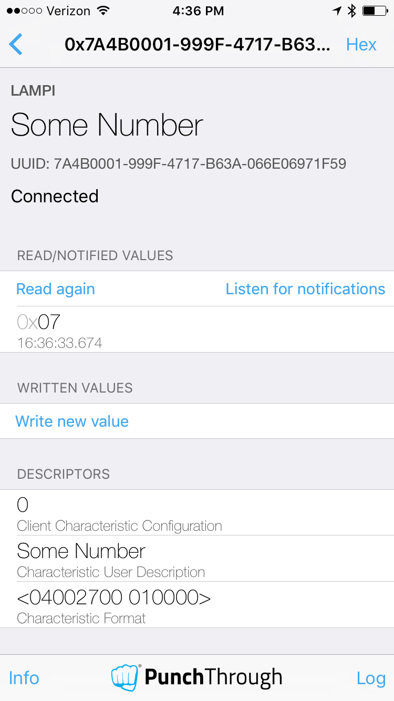
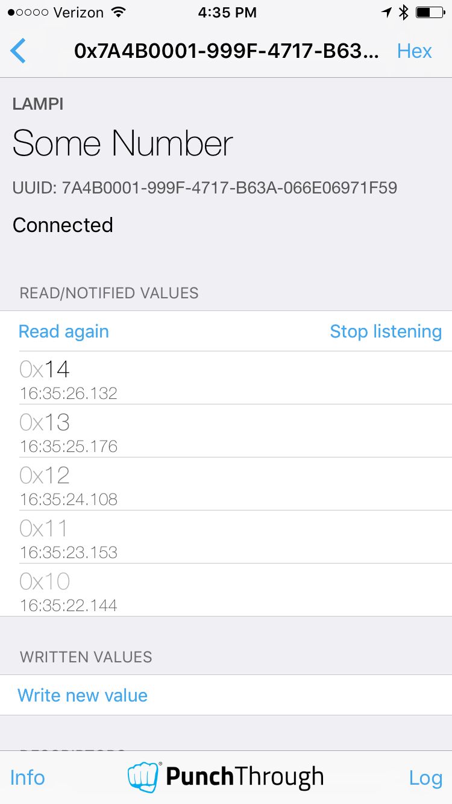

# Supporting Notify on GATT Characteristics

So we can now can create a Service with Characteristics, and the ability to read and write (modify) a non-constant (mutable) Characteristic value.  If the Characteristic represent a sensor, say a temperature reading, a Client of the service can monitor the temperature by repeatedly reading the Characteristic - this is known as polling.  While polling is a perfectly acceptable way to monitor something, it can become a performance bottleneck.  For batter-powered devices, it can also become a battery-killer.

The GATT model is analogous to reading and writing memory.  Polling (repeatedly reading) a memory location can also become a performance bottleneck.  In the hardware world, the standard solution is an interrupt - an asynchronous notification that an event of interest has occurred - typically that a new value is ready.  The BTLE equivalent of an interrupt is Notify or Indicate.

Nearly all BTLE GATT interactions are synchronous - the Client makes a request of the Server, and the Server responds.  BTLE has two asynchronous mechanisms - Notify and Indicate, though, that are Server initiated.  They rely on the Characteristic providing the [Client Characteristic Configuration](https://www.bluetooth.com/wp-content/uploads/Sitecore-Media-Library/Gatt/Xml/Descriptors/org.bluetooth.descriptor.gatt.client_characteristic_configuration.xml) to let Client's know the behaviors supported for a particular Characteristic, and then the Client modifying the Descriptor (with a write) to inform the Server that it should enable Notifications and/or Indications for the Characteristic (note, unlike the Descriptors we have seen so far, which have been read-only, this Descriptor is Client writable).

A Client can enable Notifications; when enabled, the Server will automatically send new values for the Characteristic to the Client when the value changes.  Indications are the same as Notifications, but the Server requires the Client to Acknowledge the updated value (whereas Notifications are equivalent to "fire-and-forget" or QoS 0 in MQTT).

## Adding Notify to our NumberCharacteristic

Here is an updated version of `number-service.js`:

```node
var util = require('util');
var events = require('events');
var bleno = require('bleno');

var CHARACTERISTIC_NAME = 'Some Number';

var NumberCharacteristic = function(deviceState) {
    bleno.Characteristic.call(this, {
        uuid: '7a4b0001-999f-4717-b63a-066e06971f59',
        properties: ['read', 'write', 'notify'],
        descriptors: [
            new bleno.Descriptor({
               uuid: '2901',
               value: CHARACTERISTIC_NAME
            }),
            new bleno.Descriptor({
               uuid: '2904',
               value: new Buffer([0x04, 0x00, 0x27, 0x00, 0x01, 0x00, 0x00])
            }),
        ],
    }
    )

    this.deviceState = deviceState;

    this._update = null;

    this.changed = function(new_value) {
        console.log('updated value - need to Notify?');
        if( this._update !== null ){
            var data = Buffer(1);
            data.writeUInt8(new_value, 0);
            this._update(data);
        }
    }

    this.deviceState.on('changed', this.changed.bind(this));

}

util.inherits(NumberCharacteristic, bleno.Characteristic);

NumberCharacteristic.prototype.onReadRequest = function(offset, callback) {
    console.log('onReadRequest');
    if(offset) {
        callback(this.RESULT_ATTR_NOT_LONG, null);
    }
    else {
        var data = new Buffer(1);
        data.writeUInt8(this.deviceState.value);
        console.log('onReadRequest returning ', data);
        callback(this.RESULT_SUCCESS, data);
    }
}

NumberCharacteristic.prototype.onWriteRequest = function(data, offset, withoutResponse, callback) {
    if(offset) {
        callback(this.RESULT_ATTR_NOT_LONG);
    }
    else if (data.length !== 1) {
        callback(this.RESULT_INVALID_ATTRIBUTE_LENGTH);
    }
    else {
        var new_value = data.readUInt8(0);
        this.deviceState.set_value( new_value);
        callback(this.RESULT_SUCCESS);
    }
};

NumberCharacteristic.prototype.onSubscribe = function(maxValueSize, updateValueCallback) {
    console.log('subscribe on ', CHARACTERISTIC_NAME);
    this._update = updateValueCallback;
}

NumberCharacteristic.prototype.onUnsubscribe = function() {
    console.log('unsubscribe on ', CHARACTERISTIC_NAME);
    this._update = null;
}

function NumberService(deviceState) {
    bleno.PrimaryService.call(this, {
        uuid: '7a4bbfe6-999f-4717-b63a-066e06971f59',
        characteristics: [
            new NumberCharacteristic(deviceState),
        ]
    });
}

util.inherits(NumberService, bleno.PrimaryService);

module.exports = NumberService;
```

We have made a few changes.  We have added `'notify'` to the `properties` of 'NumberCharacteristic'.  (Note: `bleno` will automatically add the [Client Characteristic Configuration](https://www.bluetooth.com/wp-content/uploads/Sitecore-Media-Library/Gatt/Xml/Descriptors/org.bluetooth.descriptor.gatt.client_characteristic_configuration.xml) Descriptor and allow Clients to enable/disable Notifications if the `'notify'` property is present on a Characteristic.)

We have added a new property `_update` to NumberCharacterstic to hold a function and initialized it to null.  We have added a new method `changed` that will call the `_update` function when non-null with the new value written to a Buffer (just like the `onReadRequest` method).  We then register the `changed()` method as a callback on the `deviceState` 'changed' event.  To avoid any possible ambiguity with the context that the `changed()` function will be called with, we use the JavaScript [bind()](https://developer.mozilla.org/en-US/docs/Web/JavaScript/Reference/Global_Objects/Function/bind) method to assign the current `this` (our NumberCharacteristic instance) to the callback function ([helpful reference](http://stackoverflow.com/questions/7874723/maintaining-the-reference-to-this-in-javascript-when-using-callbacks-and-closu)).

We have also added two new methods, overriding `bleno` defaults for 'onSubscribe' and 'onUnsubscribe'.  'onSubscribe' is called when a Client enables Notifications for a Characteristic. 'onUnsubscribe' is called when a client disables Notifications for a Characteristic.  In our 'onSubscribe' we save the value of `updateValueCallback` passed into the function in the `_update` property; in 'onUnsubscribe' we set the value of `_update` to null.

When a Client enables notifications, `bleno` calls 'onSubscribe' passing in the `updateValueCallback` function which is called whenever the Characteristic value changes.  We use `_update` to store that value, when notifications are enabled, and clear it (set it to null) otherwise.

Run the NodeJS application.

You will see a new option on the 'Some Number` Characteristic "Listen for notifications":



Go ahead and enable "Listen for notifications" - you should see a steadily increasing set of values being automatically delivered to `LightBlue`:



You can "Stop listening" at any time.  

Note:  if you enable notifications on an Characteristic and navigate to a different screen in `LightBlue` notifications will be delivered in an overlay:


Next up: [09.5 iOS Core Bluetooth](../09.5_iOS_Core_Bluetooth/README.md)

&copy; 2015-2020 LeanDog, Inc. and Nick Barendt
