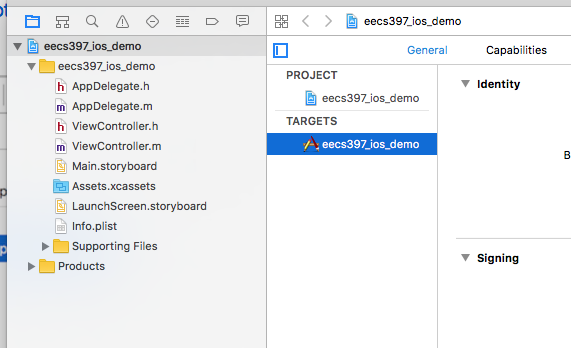
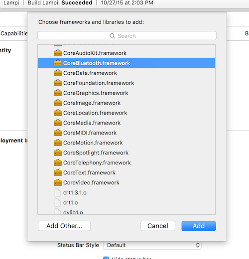
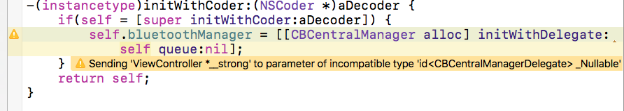
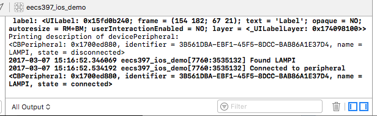

# iOS Core Bluetooth

We will build an iOS Application to work with our BTLE Service using Apple's [Core BluetoothFramework](https://developer.apple.com/library/content/documentation/NetworkingInternetWeb/Conceptual/CoreBluetooth_concepts/AboutCoreBluetooth/Introduction.html#//apple_ref/doc/uid/TP40013257-CH1-SW1).  Since we are building an application acting as a Central connecting to a Peripheral, [Performing Common Central Role Tasks](https://developer.apple.com/library/content/documentation/NetworkingInternetWeb/Conceptual/CoreBluetooth_concepts/PerformingCommonCentralRoleTasks/PerformingCommonCentralRoleTasks.html#//apple_ref/doc/uid/TP40013257-CH3-SW1) is especially relevant.

## Starting Point

The simple iOS applicaiton built in the Courseware for Chapter 08 with just a Slider and Label is our starting point.  A working XCode project of that is here: [Mobile/iOS/ios_demo/eecs397_ios_demo/eecs397_ios_demo.xcodeproj](../Mobile/iOS/ios_demo/eecs397_ios_demo/eecs397_ios_demo.xcodeproj).  Please open that project in XCode.


## Adding CoreBluetooth.framework

We'll need to import **CoreBluetooth.framework** to connect to a Bluetooth LE device. 

[For reference throughout this assignment, here is the documentation for CoreBluetooth](https://developer.apple.com/library/ios/documentation/CoreBluetooth/Reference/CoreBluetooth_Framework/). 

In the Xcode Project Navigator, click on your project (`eecs397_ios_demo`) and then your target (also `eecs397_ios_demo`):



Under **Linked Frameworks and Libraries**, click the add (**+**) button, select **CoreBluetooth.framework** and click **Add**.



Open your view controller (**ViewController.m** in the existing project). At the top of the file, import CoreBluetooth:

```Objective-C
#import <CoreBluetooth/CoreBluetooth.h>
```

## Getting User Permission for Bluetooth

In recent versions of iOS, Apple has begun to improve user privacy and security by requiring users to grant access to applications to access certain device features - Bluetooth is one of them.

For best iOS support, you will need to add to value's to your applications [Information Property List](https://developer.apple.com/documentation/bundleresources/information_property_list?language=objc) aka "info.plist

* [NSBluetoothPeripheralUsageDescription](https://developer.apple.com/documentation/bundleresources/information_property_list/nsbluetoothperipheralusagedescription) (now deprecated for iOS 13.0+)
* [NSBluetoothAlwaysUsageDescription](https://developer.apple.com/documentation/bundleresources/information_property_list/nsbluetoothalwaysusagedescription?language=objc)

Both should be strings, some like: 

"Allow the app to control LAMPI via Bluetooth"

## Scanning for Devices

The first thing our application will need to do is scan for BLTE devices.  To do that, we will use our first Core Bluetooth class, [`CBCentralManager`](https://developer.apple.com/reference/corebluetooth/cbcentralmanager) ("CB" for Core Bluetooth, "Central" because our app will be acting as a Central, not a Peripheral, and Manager because it will manage our BTLE interactions).

In the private category (under the `@interface ViewController ()`) we will create a property to hold an instance of our `CBCentralManager`, the class we use to scan for devices:

```Objective-C
@interface ViewController()

...

@property (nonatomic, strong) CBCentralManager *bluetoothManager;

@end
```

Next we will set our property in our initializer. `UIViewController` has a handful of initializers defined, but for now let's just override `initWithCoder:` since that is what will get called when created from a storyboard. Here is the bare minimum you need to override an initializer:

```Objective-C
-(instancetype)initWithCoder:(NSCoder *)aDecoder {
    if(self = [super initWithCoder:aDecoder]) {

    }
    return self;
}
```

Call the init method on super, set the result to `self`, and return `self`. Inside the `if` block is where we will put our initialization code:

```Objective-C
-(instancetype)initWithCoder:(NSCoder *)aDecoder {
    if(self = [super initWithCoder:aDecoder]) {
        self.bluetoothManager = [[CBCentralManager alloc] initWithDelegate:self queue:nil];
    }
    return self;
}
```

`initWithDelegate:queue:` takes a delegate and queue. The [delegate pattern](https://developer.apple.com/library/content/documentation/General/Conceptual/CocoaEncyclopedia/DelegatesandDataSources/DelegatesandDataSources.html) is used frequently in iOS development. In our case, our view controller will be the delegate that CBCentralManager will call methods on when it wants to notify us of something. The queue is left `nil`, which will defautl to using the main queue (i.e., the UI thread).

At this point, you should get a warning in Xcode:



It's telling us it expects an object that conforms to the [CBCentralManagerDelegate](https://developer.apple.com/library/ios/documentation/CoreBluetooth/Reference/CBCentralManagerDelegate_Protocol/) protocol. Let's implement this on our view controller now. Open **ViewController.h** and add the protocol to the class definition. We also need to move our #import for CoreBluetooth from the .m to the .h file:

```Objective-C
#import <UIKit/UIKit.h>
#import <CoreBluetooth/CoreBluetooth.h>


@interface ViewController : UIViewController<CBCentralManagerDelegate>

@end
```

We are going to be scanning for a [CBPeripheral](https://developer.apple.com/library/ios/documentation/CoreBluetooth/Reference/CBPeripheral_Class/index.html#//apple_ref/doc/c_ref/CBPeripheral) that matches our device, so let's create a property to store it when we find it. Back in the private category:

```Objective-C
@interface ViewController()

...

@property (nonatomic, strong) CBCentralManager *bluetoothManager;
@property (nonatomic, strong) CBPeripheral *devicePeripheral;

@end
```

Now in **ViewController.m**, implement the following methods from the [CBCentralManagerDelegate](https://developer.apple.com/library/ios/documentation/CoreBluetooth/Reference/CBCentralManagerDelegate_Protocol/) protocol:

```Objective-C
NSString *const DEVICE_NAME = {{YOUR BLUETOOTH DEVICE NAME}};
NSString *const OUR_SERVICE_UUID = @"7a4bbfe6-999f-4717-b63a-066e06971f59";

- (void)centralManagerDidUpdateState:(CBCentralManager *)central {
    if ([central state] == CBManagerStatePoweredOn) {
        NSArray *services = @[[CBUUID UUIDWithString:OUR_SERVICE_UUID]];
        [self.bluetoothManager scanForPeripheralsWithServices:services options:nil];
    }
}

- (void)centralManager:(CBCentralManager *)central
 didDiscoverPeripheral:(CBPeripheral *)devicePeripheral
     advertisementData:(NSDictionary *)advertisementData
                  RSSI:(NSNumber *)RSSI {

    if([devicePeripheral.name isEqualToString:DEVICE_NAME]) {
        self.devicePeripheral = devicePeripheral;
        [self.bluetoothManager connectPeripheral:self.devicePeripheral options:nil];
        NSLog(@"Found %@", DEVICE_NAME);
    }
}

- (void)centralManager:(CBCentralManager *)central
  didConnectPeripheral:(CBPeripheral *)devicePeripheral {
    NSLog(@"Connected to peripheral %@", devicePeripheral);
}

- (void)centralManager:(CBCentralManager *)central didDisconnectPeripheral:(CBPeripheral *)devicePeripheral error:(NSError *)error {
    NSLog(@"Disconnected from peripheral %@", devicePeripheral);
}

- (void)centralManager:(CBCentralManager *)central didFailToConnectPeripheral:(CBPeripheral *)devicePeripheral error:(NSError *)error {
    NSLog(@"Failed to connect to peripheral %@", devicePeripheral);
}
```

**NOTE:** Make sure to update **DEVICE_NAME** - should make it something unique to avoid confusion with other students' devices.  The value must be exactly the same in your iOS application as in your `bleno` NodeJS application!  

**NOTE:** if you change your device name, it is possible [iOS's Bluetooth Cache will hold onto the values](https://forums.developer.apple.com/thread/19381) and clearing the cache apparently requires a device reset.


**NOTE:** in a real-world application, we would likely discover all devices advertising the Service UUID of interest and allow the user to select the particular device - we are skipping that complexity and hard coding a device name.

 
So when the CBCentralManager moves to a **powered on** state, it will start attempting to scan for devices that advertise the Lamp service and match the given device name. 

With the lamp powered on and your `bleno` bluetooth service running, run the iOS app and observe the console.



Your iOS application has successfully discovered and connected to your service.

Next up: [09.6 Write a Characteristic Value](../09.6_Write_a_Characteristic_Value/README.md)

&copy; 2015-2020 LeanDog, Inc. and Nick Barendt
