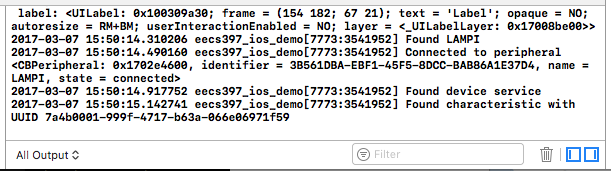

# Write a Characteristic Value

We are going to allow our iOS app to update the 'Some Number' Characteristic of our 'NumberService'.

## Finding a Characteristic

We need to find the 'Some Number' Characteristic so that we can write to it. Remember that a Peripheral exposes Services, and Services contain Characteristics. In the previous section, we found the peripheral in part by scanning for devices that advertised NumberService UUID.

First we need to receive input from the peripheral. Open **ViewController.h** and declare our view controller as implementing the [CBPeripheralDelegate](https://developer.apple.com/reference/corebluetooth/cbperipheraldelegate) protocol:

```Objective-C
#import <UIKit/UIKit.h>
#import <CoreBluetooth/CoreBluetooth.h>


@interface ViewController : UIViewController<CBCentralManagerDelegate, CBPeripheralDelegate>

@end
```

**NOTE:** putting so much responsibility (`CBCentralManagerDelegate`, `CBPeripheralDelegate`, and being a `ViewController`) into our poor ViewController is poor software design - we are lumping it all in there, though to simplify the explanation.

Now we'll provide the delegate (the view controller) to the Peripheral. Open **ViewController.m** and find the `centralManager:didConnectPeripheral:` override. Set the peripheral's delegate to self, and start discovery for the device service:

```Objective-C
- (void)centralManager:(CBCentralManager *)central
  didConnectPeripheral:(CBPeripheral *)devicePeripheral {
    NSLog(@"Connected to peripheral %@", devicePeripheral);
    devicePeripheral.delegate = self;

    [devicePeripheral discoverServices:@[[CBUUID UUIDWithString:OUR_SERVICE_UUID]]];
}
```

Let's also create a property to store the Characteristic in. In ViewController's private category:

```Objective-C
@interface ViewController()

...

@property (nonatomic, strong) CBCentralManager *bluetoothManager;
@property (nonatomic, strong) CBPeripheral *devicePeripheral;
@property (nonatomic, strong) CBCharacteristic *numberCharacteristic;

@end
```

Now let's implement the methods we need from [CBPeripheralDelegate](https://developer.apple.com/library/ios/documentation/CoreBluetooth/Reference/CBPeripheralDelegate_Protocol://developer.apple.com/library/ios/documentation/CoreBluetooth/Reference/CBPeripheralDelegate_Protocol/):

```Objective-C
NSString *const SOME_NUMBER_UUID = @"7a4b0001-999f-4717-b63a-066e06971f59";

- (void)peripheral:(CBPeripheral *)devicePeripheral didDiscoverServices:(NSError *)error {
    for (CBService *service in devicePeripheral.services) {
        if([service.UUID isEqual:[CBUUID UUIDWithString:OUR_SERVICE_UUID]]) {
                        NSLog(@"Found device service");
            [devicePeripheral discoverCharacteristics:nil forService:service];
        }
    }
}


-(void)peripheral:(CBPeripheral *)peripheral didDiscoverCharacteristicsForService:(CBService *)service error:(NSError *)error {
    for(CBCharacteristic *characteristic in service.characteristics) {
        if([characteristic.UUID isEqual:[CBUUID UUIDWithString:SOME_NUMBER_UUID]]) {
            NSLog(@"Found characteristic with UUID %@", SOME_NUMBER_UUID);
            self.numberCharacteristic = characteristic;
        }
    }
}
```

Now build and run your app on your phone (make sure your `bleno` Bluetooth Servie is running). 

You should eventually see that the phone discovers the 'Some Number' characteristic:



### Write to the Characterstic

Now let's write to the Characteristic. The 'Some Number' Characteristic takes a single byte (0x00 to 0xFF).  We will map the slider range (0.0 to 1.0) to that range.. Locate slider handler, `onSliderChanged` and update it to read like this:

```Objective-C
-(IBAction)onSliderChanged:(UISlider*)sender {
    
    self.label.text = [NSString stringWithFormat:@"%f", self.slider.value];

    if( self.numberCharacteristic != nil ) {
            uint8_t new_value = self.slider.value * 0XFF;
            NSData *d = [NSData dataWithBytes: &new_value length:sizeof(new_value)];
            [self.devicePeripheral writeValue:d forCharacteristic:self.numberCharacteristic type:CBCharacteristicWriteWithResponse];
    }
}
```

Here we'll start by making sure we've discovered the characteristic, otherwise we just update the Label and reutrn. We have to convert our floating-point slider value to a byte in a byte arrray, scaled so 0.0 equal 0x00 and 1.0 equals 0xFF (255) (or in this case, Objective-C's version of a boxed byte array, [NSData\*](https://developer.apple.com/library/mac/documentation/Cocoa/Reference/Foundation/Classes/NSData_Class/)). We then write the value to the Characteristic, noting that we want a response from the write.

Build and run the app and observe the console in Xcode. Once you see the Characteristic being found, you should be able to move the slider and see the debug output from your NodeJS Bluetooth Server respond.

## Limiting Updates

Moving the slider generates a huge number of events very quickly, far faster than our device can respond.  With a battery-powered BTLE device, that frequency of writes would use a lot of power and hurt battery life.  We can limit the update rate, while still providing a good user experience.

Apple's [GCD](https://developer.apple.com/reference/dispatch) (Grand Central Dispatch) is a framework for concurrency, implemented with dispatch queues.  It is the preferred mechanism to offload computationally expensive operations.  It has a few other uses, including running a piece of code at some point in the future.  It takes advantage of [Blocks](https://developer.apple.com/library/content/documentation/Cocoa/Conceptual/ProgrammingWithObjectiveC/WorkingwithBlocks/WorkingwithBlocks.html) - equivalent to anonymous functions and closures.  There are some subleties with using it, including reference counting (memory management).  In general, you should use weak references within a Block to long-lived objects outside the block.

Start by adding a boolean property:

```Ojbective-C
@property (nonatomic, strong) CBCentralManager *bluetoothManager;
@property (nonatomic, strong) CBPeripheral *devicePeripheral;
@property (nonatomic, strong) CBCharacteristic *numberCharacteristic;
@property (nonatomic) BOOL updatingPending;
```

Update the init method to initialize the flag to `NO` (False in Objective-C):

```Objective-C
-(instancetype)initWithCoder:(NSCoder *)aDecoder {
    if(self = [super initWithCoder:aDecoder]) {
        self.updatingPending = NO;
        self.bluetoothManager = [[CBCentralManager alloc] initWithDelegate:self queue:nil];
    }
    return self;
}
```

Then modify the `onSliderChanged:`:

```Objective-C
-(IBAction)onSliderChanged:(UISlider*)sender {
    
    self.label.text = [NSString stringWithFormat:@"%f", self.slider.value];

    if( self.numberCharacteristic != nil ) {

        if(!self.updatingPending) {
            __weak typeof(self) weakself = self;

            self.updatingPending = YES;
            dispatch_after(dispatch_time(DISPATCH_TIME_NOW,
                (int64_t)(0.1 * NSEC_PER_SEC)),
                dispatch_get_main_queue(), ^{
                    uint8_t new_value = weakself.slider.value * 0XFF;
                    NSData *d = [NSData dataWithBytes: &new_value length:sizeof(new_value)];
                    [weakself.devicePeripheral writeValue:d forCharacteristic:weakself.numberCharacteristic type:CBCharacteristicWriteWithResponse];
                    weakself.updatingPending = NO;
                    });
        }
    }
}
```
Some explanation:

* The `__weak typeof(self) weakself = self;` creates a `weakself` variable that is a weak reference to our ViewController
* The `updatePending` flag is used to make sure we have no more than one pending update at any time.
* [dispatch_after](https://developer.apple.com/reference/dispatch/1452876-dispatch_after) delays a specified time (0.1 seconds from "now") and then executes the provided block
* The `^{` starts a Block, in this case passing the Block into the `dispatch_after()` function - everything from `^{` to the closing `}` is the Block (the `);` closes the function call.
* The Block is a lexical closure - see more in [Introduction to Blocks](https://developer.apple.com/library/content/documentation/Cocoa/Conceptual/Blocks/Articles/00_Introduction.html#//apple_ref/doc/uid/TP40007502) for more information.
* We perform the Characteristic update as earlier, just that now it happens asynchronously - the `weakself` reference is captured in the closure of the Block; when the block executes, it uses the current value of the slider.

Run the application again - the slider should scroll smoothly and the NodeJS debug output should show less furious write activity. 

Next up: [09.7 Reading Characteristics and Notifications](../09.7_Reading_Characteristics_and_Notificiations/README.md)

&copy; 2015-2020 LeanDog, Inc. and Nick Barendt
