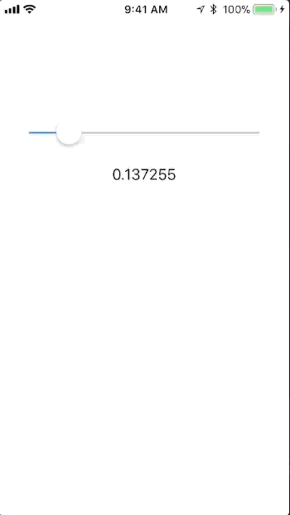

# Reading Characteristics and Notifications

So far, our application only writes to Characteristic values - we need to read them, too.  

## Reading Characteristic Values

When our application starts up, the slider is out of sync with the current value of the Characteristic.  Let's do a one-time read of the Characteristic to initialize the slider value.

Reading Characteristic Values in CoreBluetooth is a two-step operation:

1. call `readValueForCharacteristic`
1. implement `didUpdateValueForCharacteristic` to be notified when the value is available

Modify `didDiscoverCharacteristicsForService` to initiate a read of our 'Some Number' Characteristic:

```Objective-C
-(void)peripheral:(CBPeripheral *)peripheral didDiscoverCharacteristicsForService:(CBService *)service error:(NSError *)error {
    for(CBCharacteristic *characteristic in service.characteristics) {
        if([characteristic.UUID isEqual:[CBUUID UUIDWithString:SOME_NUMBER_UUID]]) {
            NSLog(@"Found characteristic with UUID %@", SOME_NUMBER_UUID);
            self.numberCharacteristic = characteristic;
            [self.devicePeripheral readValueForCharacteristic:characteristic];
        }
    }
}
```

We are invoking `readValueForCharacteristic` on our Peripheral, passing in the `characteristic` of interest.

Next, implement `didUpdateValueForCharacteristic` to unpack the unsigned 8-bit value to a floating-point value and update the slider and the label:

```Objective-C
- (void)peripheral:(CBPeripheral *)peripheral didUpdateValueForCharacteristic:(CBCharacteristic *)characteristic error:(NSError *)error {
    NSLog(@"didUpdateValueForCharacteristic error: %@", error);
    if(characteristic == self.numberCharacteristic) {
        NSData *data = [characteristic value];
        if(data) {
            NSLog(@"new value = %@", data);
            const unsigned char *bytes = [data bytes];
            self.slider.value = (double)bytes[0] / (double) UINT8_MAX;
            self.label.text = [NSString stringWithFormat:@"%f", self.slider.value];
        }
    }
    
}
```

**NOTE:** if you are dealing with multiple Characteristics, all of the read values will be reported through this one `didUpdateValueForCharacteristic` callback, so you will likely need a set of conditionals to determine which Characteristic value has been read.

Run the application - you should see the slider and label updated as soon as the peripheral is connected.


## Enabling Notifications

As we did with `LightBlue` we would like our application to be automatically notified of changes to certain Characteristic values.

We can easily enable BTLE Notifications.  Modify `didDiscoverCharacteristicsForService` to add a call to `setNotifyValue` with a value of `YES` on the 'Some Number' Characteristic,  like so:

```Objective-C
-(void)peripheral:(CBPeripheral *)peripheral didDiscoverCharacteristicsForService:(CBService *)service error:(NSError *)error {
    for(CBCharacteristic *characteristic in service.characteristics) {
        if([characteristic.UUID isEqual:[CBUUID UUIDWithString:SOME_NUMBER_UUID]]) {
            NSLog(@"Found characteristic with UUID %@", SOME_NUMBER_UUID);
            self.numberCharacteristic = characteristic;
            [self.devicePeripheral readValueForCharacteristic:characteristic];
            [self.devicePeripheral setNotifyValue:YES forCharacteristic:characteristic];
        }
    }
}
```

Conveniently, Notifications of new Characteristic Values are made via the `didUpdateValueForCharacteristic` callback that we already added support to update the slider and label based on the `Some Number` Characteristic value.

Run the application (be sure your `bleno` NodeJS application is running).

With the autoincrement happening on the 'Some Number' Characteristic (due to the `setInterval` in `peripheral.js`), the slider should slowly move left-to-right across the screen, eventually jumping back to 0.0 when the value is incremented past 255 (0xFF) and the modulus operation causes it to be reset to 0x00.



Next up: [09.8 Assignment](../09.8_Assignment/README.md)

&copy; 2015-2020 LeanDog, Inc. and Nick Barendt
